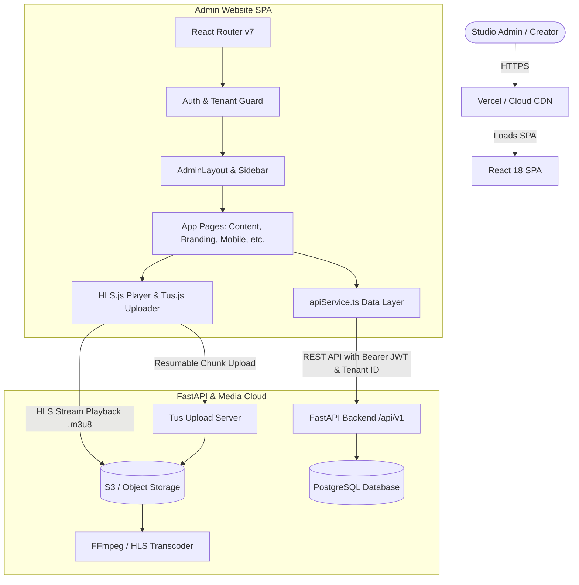

# System Architecture Document: TalentSea Studio Admin Website

## 1. Executive Summary
The **TalentSea Studio Admin Website** is a modern, enterprise-grade Single Page Application (SPA) built for multi-tenant video-on-demand (VOD), live streaming, and white-label Over-The-Top (OTT) media operations. It provides creators and platform administrators with end-to-end management of content ingestion, transcoding, paywalls, analytics, white-label branding, and mobile app store publishing.

---

## 2. Technology Stack & Frameworks

### 2.1 Core Framework & Runtime
* **Runtime / Language**: [TypeScript](https://www.typescriptlang.org/) (ES2022+ module target)
* **UI Framework**: [React 18.3.1](https://react.dev/)
* **Build System & Dev Server**: [Vite 6.4.3](https://vitejs.dev/) (Fast HMR, optimized Rollup production bundling)
* **Routing**: [React Router v7](https://reactrouter.com/) (`react-router ^7.18.4`) client-side SPA router

### 2.2 UI & Design System
* **Styling Engine**: [Tailwind CSS v4](https://tailwindcss.com/) (`tailwindcss 4.1.12`) with utility-first responsive layout architecture.
* **Component Primitives**: [Radix UI](https://www.radix-ui.com/) headless, accessible unstyled components:
  * Dialog / Modals (`@radix-ui/react-dialog`)
  * Dropdown & Context Menus (`@radix-ui/react-dropdown-menu`, `@radix-ui/react-context-menu`)
  * Tabs & Selects (`@radix-ui/react-tabs`, `@radix-ui/react-select`)
  * Tooltips, Switches, & Popovers (`@radix-ui/react-tooltip`, `@radix-ui/react-switch`, `@radix-ui/react-popover`)
* **Component Styling Utilities**: `clsx`, `tailwind-merge` (`cn()` helper), `class-variance-authority` (CVA).
* **Iconography**: [Lucide React](https://lucide.dev/) (`0.487.0`) for consistent, clean vector icons.
* **Toasts / Notifications**: [Sonner](https://sonner.emilkowal.ski/) (`2.0.3`) for stackable, non-blocking notifications.
* **Motion & Micro-interactions**: `motion` (Framer Motion v12).

### 2.3 Media & Streaming Engine
* **HLS Adaptive Bitrate Playback**: [HLS.js](https://github.com/video-dev/hls.js/) (`^1.6.16`) for client-side HTTP Live Streaming (`.m3u8` video player with quality switching and buffer telemetry).
* **Resumable Chunked Ingestion**: [Tus.js](https://tus.io/) (`tus-js-client ^4.3.1`) for fault-tolerant, pause-and-resume large video uploads direct to media storage.

### 2.4 Data Visualization & Analytics
* **Charts Engine**: [Recharts](https://recharts.org/) (`2.15.2`) powering SVGs for viewership trends, revenue metrics, retention graphs, and geographic distributions.

---

## 3. High-Level System Architecture



---

## 4. Directory & Module Structure

```
admin/website/
├── src/
│   ├── main.tsx                    # React DOM root bootstrapping & providers
│   ├── app/
│   │   ├── App.tsx                 # Root application wrapper
│   │   ├── routes.tsx              # Application route definitions (lazy & standard)
│   │   ├── components/             # Reusable UI components
│   │   │   ├── AdminLayout.tsx     # Shell layout: sidebar, top navbar, tenant switcher
│   │   │   └── ui/                 # Reusable Radix/Tailwind components (Button, Card, Dialog, Table...)
│   │   ├── pages/                  # Page-level domain modules
│   │   │   ├── Dashboard.tsx       # Studio overview, key metrics, quick actions
│   │   │   ├── ContentManagement.tsx# Videos, Shorts, Playlists, Tus upload, HLS playback
│   │   │   ├── Subscribers.tsx     # Subscriber management & tier breakdown
│   │   │   ├── SubscriptionPlans.tsx # Monetization pricing plans & billing settings
│   │   │   ├── Revenue.tsx         # Financial metrics, payouts, transaction logs
│   │   │   ├── Analytics.tsx       # Watch-time, drop-offs, geography charts
│   │   │   ├── Community.tsx       # Video comment moderation & threaded replies
│   │   │   ├── Branding.tsx        # White-label theming, color palettes, OTT preview
│   │   │   ├── Categories.tsx      # Taxonomy & content grouping
│   │   │   ├── AppPublishing.tsx   # Android/iOS store publishing & CI/CD deployment
│   │   │   ├── Settings.tsx        # Platform configuration, credentials, webhooks
│   │   │   ├── Login.tsx           # Authentication screen
│   │   │   └── SuperAdminCenter.tsx# Platform multi-tenant administration
│   │   └── services/
│   │       └── apiService.ts       # Centralized REST client, auth interceptor, data transformers
│   └── styles/                     # Tailwind directives and design system CSS
├── package.json                    # Project dependencies and script declarations
├── vite.config.ts                  # Vite build, aliases, and dev-server configuration
└── vercel.json                     # Production SPA routing rewrites
```

---

## 5. Core Architectural Subsystems

### 5.1 Authentication & Multi-Tenancy
* **State Management**: Authentication state is maintained via persistent token storage (`admin_token`, `super_admin_token`) with active tenant context (`current_tenant_id`).
* **Header Propagation**: Every request dispatched by `apiService.ts` automatically attaches:
  * `Authorization: Bearer <token>`
  * `X-Tenant-ID: <tenantId>` (or tenant subdomains) to ensure strict database multi-tenant isolation.
* **Route Protection**: Unauthenticated requests redirect to `/login`; unauthorized access to super-admin routes triggers RBAC guards.

### 5.2 Content Ingestion & Media Pipeline
1. **Initiation**: Client calls `/api/v1/admin/videos/upload/initiate` to register video metadata.
2. **Chunked Upload (`tus-js-client`)**: Videos are streamed directly to the media server in 5MB chunks. Network interruptions resume seamlessly from the last acknowledged byte offset.
3. **Transcoding Polling**: Once upload completes, the client switches to periodic status polling (`/api/v1/admin/videos/status`) until HLS transcoding produces the `.m3u8` playlist.
4. **Playback**: Embedded `HLS.js` video player attaches to native `<video>` elements, auto-negotiating resolutions (1080p, 720p, 480p, 360p) according to viewer bandwidth.

### 5.3 Mobile App & Store Publishing Architecture
* **Release Artifacts**: Surfaces compiled `.aab` (Android App Bundle) and `.ipa` builds for white-labeled client apps.
* **Dual Publishing Modes**:
  * **Manual Workflow**: 3-step guided process for downloading signed packages and submitting via Google Play Console.
  * **Automated Cloud Publish**: One-click CI/CD deployment using stored Google Play Developer API Service Account credentials.

---

## 6. Build & Deployment Architecture

* **Build Artifact**: Static bundle generated in `admin/website/dist/`.
* **SPA Routing Fallback**: Configured via `vercel.json` and Nginx server blocks:
  ```json
  {
    "rewrites": [
      { "source": "/(.*)", "destination": "/index.html" }
    ]
  }
  ```
* **Performance Optimizations**:
  * Granular code-splitting via dynamic imports.
  * Tree-shaken icons from `lucide-react`.
  * Asset optimization and gzip/brotli pre-compression through Vite.

---

## 7. Security & Compliance
* **Token Sanitization**: Sensitive credentials and service account keys are masked in UI and sent over secure HTTPS only.
* **XSS Protection**: React virtual DOM auto-escaping protects against cross-site scripting vulnerabilities.
* **CORS Policy**: Scoped API headers restricting origin requests to authorized tenant hostnames.
