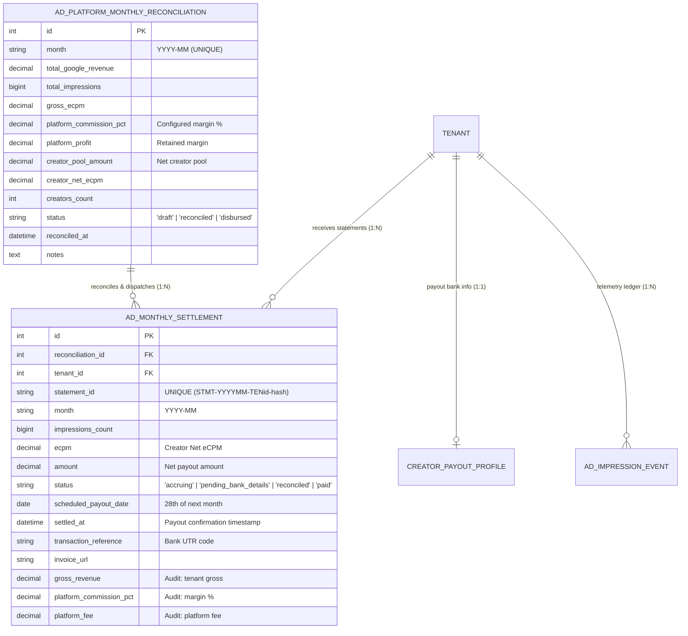
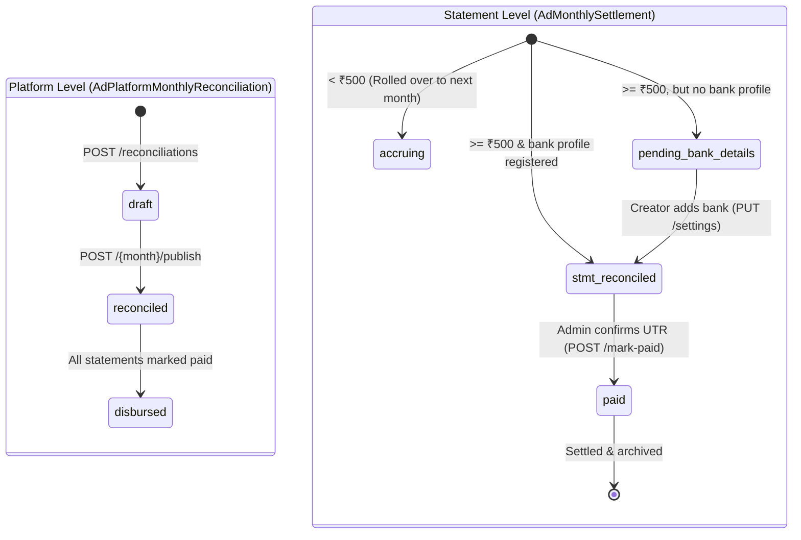

# Ad Revenue Monthly Reconciliation & Payout Settlements Specification

## 1. Executive Summary & Problem Statement

In this enterprise white-labeled OTT platform, video advertisements are rendered on mobile devices via the **Google IMA SDK** using the platform's centralized **Google Ad Manager (GAM) / VAST Network**. Creators do not have individual Google publisher accounts; ad impressions are logged into the platform's immutable telemetry ledger (`ad_impression_events`) with tenant attribution (`tenant_id`).

### The Real-World Billing Discrepancy Problem
1. **Telemetry is Instant, but Cash is Delayed**: In programmatic ad tech, ad impressions accrue in real-time, but Google/SSPs do not remit payments in real-time. Final earnings are reconciled at the end of each calendar month after deducting Invalid Traffic (IVT) and clawbacks.
2. **Gross vs. Net Margin**: The platform retains a **platform margin** (`PLATFORM_AD_COMMISSION_PERCENT`). The remaining **net creator pool** must be distributed pro-rata across active creators based on their verified ad impressions.
3. **No-CLI, 100% GUI Requirement**: Platform Super Admins must not run terminal scripts or manual SQL queries to calculate or disburse monthly payouts. The entire monthly cycle (draft generation, publishing, statement generation, bank transfer verification, and auditing) must be driven by standard REST APIs backing the Web Admin Portal.

---

## 2. Core Architectural Concepts & Doubts Resolved

### Q1: What exactly is "Monthly Reconciliation"?
**Reconciliation** is the administrative process of taking Google Ad Manager's finalized monthly publisher payout report (e.g. ₹50,000 for September 2026), calculating the platform's retained margin, and distributing the net creator pool across all active tenant studios in proportion to their verified impression counts.

---

### Q2: How is the Pro-Rata Math Calculated?
Let:
- $R_{\text{gross}}$ = Total gross revenue received from Google (e.g., ₹50,000.00)
- $M_{\text{pct}}$ = Platform margin percentage (`PLATFORM_AD_COMMISSION_PERCENT` from configuration)
- $I_{\text{total}}$ = Total verified ad impressions across all active tenants for that calendar month from `ad_impression_events`
- $I_{\text{tenant}}$ = Verified ad impressions for a specific tenant studio in that month

The mathematical breakdown:
1. **Platform Margin**:
   $$\text{Platform Margin} = R_{\text{gross}} \times \left(\frac{M_{\text{pct}}}{100}\right)$$
2. **Net Creator Pool**:
   $$\text{Creator Pool} = R_{\text{gross}} - \text{Platform Margin} = R_{\text{gross}} \times \left(1 - \frac{M_{\text{pct}}}{100}\right)$$
3. **Gross Network eCPM** (Cost per 1,000 impressions before margin deduction):
   $$\text{Gross eCPM} = \frac{R_{\text{gross}}}{I_{\text{total}}} \times 1000$$
4. **Creator Net eCPM** (Effective rate paid to creators after margin):
   $$\text{Creator Net eCPM} = \frac{\text{Creator Pool}}{I_{\text{total}}} \times 1000 = \text{Gross eCPM} \times \left(1 - \frac{M_{\text{pct}}}{100}\right)$$
5. **Tenant Net Payout**:
   $$\text{Tenant Payout} = \frac{I_{\text{tenant}} \times \text{Creator Net eCPM}}{1000}$$

> [!NOTE]
> Because Creator Net eCPM is computed directly from the Creator Pool divided by Total Impressions, the sum of all individual creator payouts will mathematically equal the Creator Pool down to the exact rupee:
> $$\sum \text{Tenant Payouts} = \text{Creator Pool}$$

---

### Q3: What happens if a creator earns less than ₹500?
- **Minimum Payout Threshold**: `MIN_PAYOUT_THRESHOLD = 500.0`.
- Wiring ₹45 or ₹120 via NEFT/IMPS is economically inefficient because bank transfer processing fees can exceed the payout itself.
- If a tenant's calculated net earnings for the month are **< ₹500**:
  - The statement status is set to **`"accruing"`**.
  - Funds are **not lost**. The amount remains marked as un-disbursed and automatically rolls forward into the subsequent billing cycle until cumulative earnings reach ₹500.

---

### Q4: What happens if a creator hasn't added their bank details?
- If a tenant's earnings are $\ge \text{₹500}$, but the tenant has not registered an IFSC code and account number in `creator_payout_profiles`:
  - The statement status is set to **`"pending_bank_details"`**.
  - The funds are locked and cannot be wired out.
  - As soon as the creator saves their bank details via `PUT /api/v1/admin/monetization/settings`, the backend repository automatically transitions all pending statements from `"pending_bank_details"` to `"reconciled"`.

---

### Q5: What happens on Payout Day (the 28th)?
1. Google wire transfers deposit into the platform's master bank account by the 20th–25th.
2. On **Payout Day (28th)**, platform financial administrators disburse bank wire transfers (NEFT/RTGS/IMPS) to creators whose statements are in `"reconciled"` status.
3. For each successful transfer, the administrator inputs the official **Bank UTR code** (e.g. `HDFCN26271890451`) into the Web Dashboard via **API 3**.
4. The statement status transitions from `"reconciled"` to **`"paid"`**, recording `settled_at = now()` and updating the creator's dashboard in real-time.

---

### Q6: What are the statement IDs and how are they structured?
Every settlement statement generates a deterministic, unique identifier:
$$\text{STMT-}\{\text{YYYYMM}\}\text{-TEN}\{\text{tenant\_id}\}\text{-}\{\text{hash}\}$$
Example: `STMT-202609-TEN1-9A3F`
- `202609`: Billing cycle month (September 2026)
- `TEN1`: Bound to Tenant ID 1
- `9A3F`: Cryptographic 4-character hex collision guard

---

### Q7: What is the 2-Step (Draft $\rightarrow$ Publish) Workflow?
To ensure financial safety, generating a monthly payout is divided into two strict stages:
1. **Draft Phase**: The Super Admin inputs the gross revenue for the month. The system generates a top-level `"draft"` calculating the master platform margin, net pool, and total creator counts. **No statements are created yet.** This allows the finance team to preview the math safely.
2. **Publish Phase**: Once the admin visually verifies the draft, they click publish. The system locks the math, changes the status to `"reconciled"`, and generates the individual `"AdMonthlySettlement"` statements for all active tenants.

---

## 3. Database Entities (Existing Schema)

No new tables are created. The APIs interact exclusively with the existing entities in `app/models/ad_monetization.py`.



---

## 4. Super Admin APIs (Detailed Specification)

### API 1: Generate Monthly Reconciliation (Draft Phase)

Generates the top-level math (Gross eCPM, Net Pool) without creating any individual creator statements. The `month` acts as the unique identifier.

* **HTTP Method**: `POST`
* **Route Path**: `/api/v1/admin/monetization/reconciliations`
* **Authorization**: Bearer JWT (`role == "super_admin"`)

#### Request Body
> **Important Note for Frontend**: The `month` payload represents the **accrued** (previous) month, not the current calendar month. For example, if you are running reconciliation in October, you are reconciling September's revenue, so the `month` submitted is `"2026-09"`.

```json
{
  "month": "2026-09",
  "gross_revenue": 50000.0,
  "notes": "Google Ad Manager September billing report finalized"
}
```

#### Response Body (`200 OK`)
Notice that the status is `"draft"` and no nested statements are returned.
```json
{
  "id": 1,
  "month": "2026-09",
  "total_google_revenue": 50000.00,
  "total_impressions": 500000,
  "gross_ecpm": 100.00,
  "platform_commission_pct": 30.0,
  "platform_profit": 15000.00,
  "creator_pool_amount": 35000.00,
  "creator_net_ecpm": 70.00,
  "creators_count": 2,
  "currency": "INR",
  "status": "draft",
  "notes": "Google Ad Manager September billing report finalized",
  "statements": [
    {
      "tenant_id": 1,
      "tenant_name": "Content Talent Studio",
      "impressions_count": 450000,
      "net_ecpm": 70.00,
      "net_amount": 31500.00,
      "gross_revenue": 45000.00,
      "platform_fee": 13500.00
    },
    {
      "tenant_id": 2,
      "tenant_name": "Indie Cinema Network",
      "impressions_count": 50000,
      "net_ecpm": 70.00,
      "net_amount": 3500.00,
      "gross_revenue": 5000.00,
      "platform_fee": 1500.00
    }
  ]
}
```
**Errors**:
- `400 Bad Request`: Invalid month format.
- `409 Conflict`: Month has already been reconciled and published.

---

### API 2: Publish Reconciliation (Generate Statements)

Locks the draft, officially transitions the status to `"reconciled"`, and iterates through the active tenants to generate all `AdMonthlySettlement` statements. Creators can now see their earnings.

* **HTTP Method**: `POST`
* **Route Path**: `/api/v1/admin/monetization/reconciliations/{month}/publish`
* **Authorization**: Bearer JWT (`role == "super_admin"`)

#### Path Parameters
- `month`: The target billing cycle (e.g. `2026-09`).

#### Response Body (`200 OK`)
Returns the finalized reconciliation payload, including the newly generated `statements` array representing individual tenant payouts.
```json
{
  "id": 1,
  "month": "2026-09",
  "total_google_revenue": 50000.00,
  "status": "reconciled",
  "currency": "INR",
  "creator_pool_amount": 35000.00,
  "platform_profit": 15000.00,
  "reconciled_at": "2026-10-01T10:05:00Z",
  "statements": [
    {
      "tenant_id": 1,
      "tenant_name": "Content Talent Studio",
      "statement_id": "STMT-202609-TEN1-9A3F",
      "impressions_count": 450000,
      "net_ecpm": 70.00,
      "net_amount": 31500.00,
      "gross_revenue": 45000.00,
      "platform_fee": 13500.00,
      "status": "reconciled",
      "scheduled_payout_date": "2026-10-28"
    },
    {
      "tenant_id": 2,
      "tenant_name": "Indie Cinema Network",
      "statement_id": "STMT-202609-TEN2-4B2E",
      "impressions_count": 50000,
      "net_ecpm": 70.00,
      "net_amount": 3500.00,
      "gross_revenue": 5000.00,
      "platform_fee": 1500.00,
      "status": "pending_bank_details",
      "scheduled_payout_date": "2026-10-28"
    }
  ]
}
```
**Errors**:
- `400 Bad Request`: Reconciliation for this month is not in `"draft"` status.
- `404 Not Found`: No draft found for this month.

---

### API 3: Confirm Bank Wire Transfer (Mark Statement Paid with UTR)

After executing bank transfers on the 28th, the Super Admin submits the official Bank UTR code. This marks the individual creator's statement as `"paid"`.

* **HTTP Method**: `POST`
* **Route Path**: `/api/v1/admin/monetization/settlements/{statement_id}/mark-paid`
* **Authorization**: Bearer JWT (`role == "super_admin"`)

#### Path Parameters
- `statement_id`: The unique statement ID (e.g. `STMT-202609-TEN1-9A3F`).

#### Request Body
```json
{
  "transaction_reference": "HDFCN26271890451",
  "invoice_url": "https://ctcdnin.b-cdn.net/invoices/202609_TEN1.pdf"
}
```

#### Response Body (`200 OK`)
```json
{
  "statement_id": "STMT-202609-TEN1-9A3F",
  "tenant_id": 1,
  "month": "2026-09",
  "amount": 31500.00,
  "currency": "INR",
  "status": "paid",
  "transaction_reference": "HDFCN26271890451",
  "settled_at": "2026-10-28T14:35:22Z"
}
```

---

### API 4: Master Platform Financial History & Audit Ledger

Retrieves the paginated list of all platform-wide reconciliations (including drafts and fully disbursed months).

* **HTTP Method**: `GET`
* **Route Path**: `/api/v1/admin/monetization/reconciliations`
* **Query Parameters**: `?page=1&limit=12`

#### Response Body (`200 OK`)
```json
{
  "total": 2,
  "page": 1,
  "limit": 12,
  "total_pages": 1,
  "items": [
    {
      "id": 2,
      "month": "2026-09",
      "total_google_revenue": 50000.00,
      "platform_profit": 15000.00,
      "creator_pool_amount": 35000.00,
      "currency": "INR",
      "status": "draft",
      "reconciled_at": "2026-10-01T10:00:00Z"
    },
    {
      "id": 1,
      "month": "2026-08",
      "total_google_revenue": 42000.00,
      "platform_profit": 12600.00,
      "creator_pool_amount": 29400.00,
      "currency": "INR",
      "status": "disbursed",
      "reconciled_at": "2026-09-01T10:00:00Z"
    }
  ]
}
```

---

## 5. Summary State Transition Matrix


