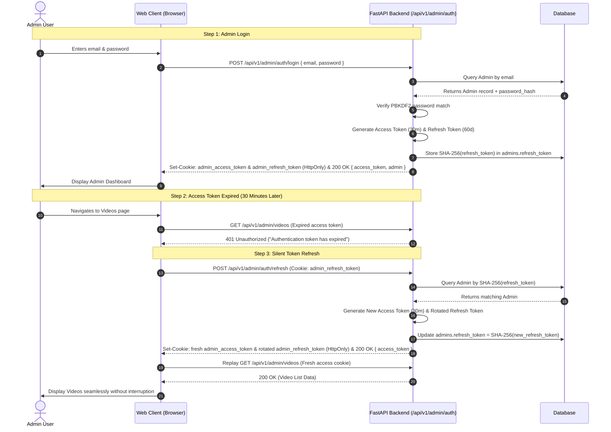
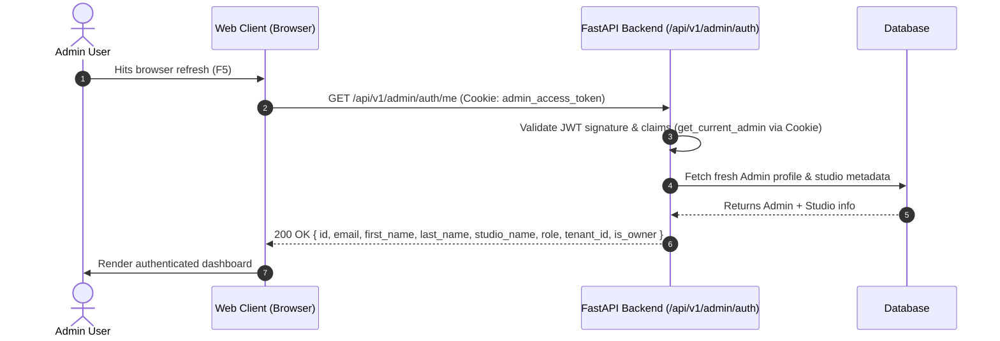

# Creator Admin Authentication & Identity Lifecycle API Specification

This specification defines the complete authentication, credential management, token lifecycle, and account provisioning architecture for the **Creator Admin Web Portal** (`/api/v1/admin/auth/*`).

---

## 1. System Architecture & Design Principles

### 1.1 Multi-Tenant B2B SaaS Provisioning

The platform operates as a specialized **White-Labeled Creator OTT Platform**. Unlike public consumer applications, the Creator Admin Studio is strictly accessible to verified, paying creators provisioned by platform operators.

- **Zero Public Registration (`/register`)**: There is intentionally **NO public sign-up endpoint** on the Creator Admin portal. Public visitors cannot create admin accounts.
- **Controlled Account Provisioning via Super Admin GUI**: Creator accounts, tenant studio spaces, default branding themes, and subscription plans are provisioned directly by Platform Super Admins via the **Super Admin Management GUI** (`POST /api/v1/admin/tenants`).
- **Attack Surface Elimination**: Removing public registration eliminates bot account spam, credential stuffing, orphaned tenant database records, and unauthorized dashboard access attempts.

```
┌──────────────────────────────────────────────────────────────────────────────────────────────────────────────────┐
│ PLATFORM SUPER ADMIN (Web Client)                                                                                │
│ POST /api/v1/admin/tenants  ──► { name: "Studio", admin_email: "creator@studio.com", admin_password: "..." }      │
└────────────────────────────────────────────────────────┬─────────────────────────────────────────────────────────┘
                                                         │
                                        Atomic Database Transaction
                                                         │
                        ┌────────────────────────────────┼────────────────────────────────┐
                        ▼                                ▼                                ▼
               ┌─────────────────┐              ┌─────────────────┐              ┌────────────────┐
               │  Tenant Record  │              │  Admin Record   │              │ 2 Fixed Plans  │
               │(Studio Identity)│              │(Owner, tenant_id)│             │with_ads & no_ads│
               └────────┬────────┘              └────────┬────────┘              └────────────────┘
                        │                                │
                        └─────────────────┬──────────────┘
                                          │
                        │ Login Credentials Delivered via Secure Channel (Email / Dashboard)
                        ▼
┌──────────────────────────────────────────────────────────────────────────────────────────────────────────────────┐
│ CREATOR / TENANT ADMIN (Web Client)                                                                              │
│ 1. POST /api/v1/admin/auth/login   ──► Receives Access Token (30m) & HttpOnly Refresh Cookie (60d)               │
│ 2. GET  /api/v1/admin/auth/me      ──► Rehydrates profile & verifies active token                                │
│ 3. POST /api/v1/admin/auth/refresh ──► Silently renews expired access token                                      │
│ 4. POST /api/v1/admin/auth/logout  ──► Server-side revocation of refresh session                                 │
└──────────────────────────────────────────────────────────────────────────────────────────────────────────────────┘
```

---

### 1.2 Dual-Token Session Security Standard & Theft Mitigation

To eliminate session compromise and Cross-Site Scripting (XSS) risks, the system enforces an industry-standard **Dual HttpOnly Cookie Architecture** coupled with a **Dual-Extraction Strategy** for API tooling:

| Token Type        | Lifespan       | Primary Transport (Browser)                                                                         | Fallback Transport (Tooling)         | Security & Theft Protection                                                                                                                                         |
| :---------------- | :------------- | :-------------------------------------------------------------------------------------------------- | :----------------------------------- | :------------------------------------------------------------------------------------------------------------------------------------------------------------------ |
| **Access Token**  | **30 Minutes** | **`HttpOnly; Secure; SameSite=None` Cookie** (`admin_access_token`) on path `/api/v1/admin`          | HTTP `Authorization: Bearer <token>` | **100% immune to JavaScript XSS exfiltration**. Never written to `localStorage`. Short lifespan limits stolen token window. Cryptographically signed JWT (`HS256`). |
| **Refresh Token** | **60 Days**    | **`HttpOnly; Secure; SameSite=None` Cookie** (`admin_refresh_token`) on path `/api/v1/admin/auth` | _None_ (Cookie only)                 | **Completely inaccessible to JavaScript / XSS**. Stored in DB strictly as a **SHA-256 one-way hash**. Scoped strictly to auth routes.                               |

#### How We Prevent & Handle Token Compromise:

1. **Complete XSS Immunity via `HttpOnly` Cookies**:
   - Storing either the access token or refresh token in `localStorage` leaves them vulnerable to malicious JavaScript, compromised third-party npm dependencies, or XSS vectors.
   - By transmitting **both** tokens inside **`HttpOnly` Cookies**, browser JavaScript cannot read `document.cookie`. Even if an attacker executes arbitrary JavaScript on the page, the tokens **cannot be scraped or exfiltrated**.

2. **Dual-Extraction Strategy in `get_current_admin` (`app/dependencies.py`)**:
   Admin route protection utilizes a layered token extraction pattern:

   ```python
   def get_current_admin(
       cookie_token: str | None = Cookie(default=None, alias="admin_access_token"),
       header_token: str | None = Depends(oauth2_scheme_optional),
   ) -> dict:
       token = cookie_token or header_token
       if not token:
           raise HTTPException(
               status_code=status.HTTP_401_UNAUTHORIZED,
               detail="Authentication required: No access token provided",
               headers={"WWW-Authenticate": "Bearer"},
           )
       payload = decode_access_token(token)
       ...
   ```

   - **Why Cookie First?** In production web browser sessions, the browser automatically attaches the `admin_access_token` cookie. The client JavaScript never needs to store, read, or manually inject the JWT into headers.
   - **Why Retain Header Fallback (`oauth2_scheme_optional`)?**
     1. **Swagger UI / OpenAPI (`/docs`)**: The interactive FastAPI Swagger documentation relies on the OAuth2 "Authorize" modal, which injects tokens via `Authorization: Bearer <token>`. Retaining the fallback allows developers to test admin endpoints directly in `/docs`.
     2. **Postman & API Tooling**: Developers and QA engineers can test endpoints in Postman, Thunder Client, or via `curl` by supplying standard Bearer headers without complex cookie jar mocking.
     3. **Automated CI/CD Test Suites**: Pytest suites and integration tests can execute against admin routes using standard header injection.
   - **Zero Security Degradation**: The presence of the header fallback does not weaken browser security. Browsers with `HttpOnly` cookies do not expose the token to client scripts, and tokens are never stored in `localStorage`.

3. **Cross-Origin Capability via `SameSite=None`**:
   - Both tokens are marked `SameSite=None` (with `Secure=True`) to allow the React frontend to communicate with the FastAPI backend across different base domains (e.g., `b-cdn.net` and `bunny.run`).

4. **Single-Use Refresh Token Rotation (RTR)**:
   - Every time `POST /api/v1/admin/auth/refresh` is called, the incoming refresh token is **immediately burned** and replaced with a newly minted refresh token and fresh access token.

5. **Single Active Session & Multi-Device Isolation**:
   - Because `admins.refresh_token` is stored as a single column on the `admins` table, each creator account maintains **one active refresh session at a time**.
   - When an admin logs in on a newer device (Device B), Device B's new refresh token hash overwrites `admins.refresh_token`.
   - **Non-Destructive Mismatch Handling (Clean Multi-Device Experience)**:
     - When Device A (previously closed without explicit logout) reopens and attempts a silent token refresh (`POST /api/v1/admin/auth/refresh`), its incoming cookie hash will not match the newly stored hash for Device B.
     - The backend returns `401 Unauthorized` with detail: `"Session expired or active on another device; please re-login"`.
     - **Crucial Rule**: The server **DOES NOT set `admins.refresh_token = NULL`**.
     - **Result**: Device B's active session remains completely intact and undisturbed. Device A receives the 401 and prompts the user to re-login. Device A's stale request never inadvertently logs out Device B.

6. **Instant Server-Side Revocation (`POST /logout`)**:
   - Calling `POST /api/v1/admin/auth/logout` explicitly sets `admins.refresh_token = NULL` in the database and clears **both** browser cookies (`Max-Age=0`), terminating the active session immediately.

---

### 1.3 Strict IDOR Security & Context Extraction

- No `user_id` or `admin_id` parameter is accepted in request bodies or query parameters across any admin route.
- The authenticated creator identity (`user_id`), active `tenant_id`, user `role` (`"super_admin"` vs `"admin"`), and `is_owner` status are extracted strictly from the validated JWT token claims on the backend via the FastAPI dependency:
  ```python
  admin_ctx = Depends(get_current_admin)
  # admin_ctx["user_id"]   -> Admin account PK
  # admin_ctx["tenant_id"] -> Active Tenant Studio PK (isolated across all queries)
  # admin_ctx["role"]      -> "super_admin" or "admin"
  # admin_ctx["is_owner"]  -> True if studio owner
  ```
- Any attempt by an ordinary mobile app subscriber to present a subscriber token to an admin route results in an immediate `403 Forbidden` response.

---

### 1.4 Multi-Tenant Role Hierarchy and Super Admin Context Switching

1. **Platform Super Admin (`role = "super_admin"`, `tenant_id = NULL`)**:
   - Seeded on server startup via `seed_super_admin()` using `.env` credentials (`SUPER_ADMIN_EMAIL`, `SUPER_ADMIN_PASSWORD`).
   - Has global visibility over all tenants on the platform.
   - Can dynamically switch tenant operational context by passing the `X-Tenant-Id: <id>` HTTP request header.
   - If the `X-Tenant-Id` header is omitted, the backend **automatically defaults to the first active tenant** on the platform.

2. **Tenant Admin (`role = "admin"`, `tenant_id = <id>`)**:
   - Scoped strictly to their assigned `tenant_id`. Any `X-Tenant-Id` header sent by a regular admin is safely ignored.
   - The backend actively verifies that the tenant is active (`is_active == True`). If the tenant is suspended, requests are rejected with `403 Forbidden` (`"Tenant studio is currently suspended"`).
   - `is_owner == True` indicates the primary studio owner who registered the tenant. Owner accounts cannot be deleted or deactivated by staff members.

---

### 1.5 Unified Access Token Generation & Role Payloads

Across the entire platform (Admin Web Portal and Mobile App), the backend uses **one single, unified function** (`create_access_token`) to generate all JWT Access Tokens. The payload structure is identical, but the claims (`role`, `tenant_id`) change depending on the user's origin.

#### Core Token Payload Structure
Every JWT access token contains the following standard claims:
```json
{
  "sub": "<user_id_as_string>",
  "user_id": <user_id_as_integer>,
  "role": "<role_string>",
  "username": "<name_or_email>",
  "tenant_id": <tenant_id_integer_or_null>,
  "exp": <expiration_timestamp>
}
```

#### Role-Specific Examples

**1. Platform Super Admin**
- **Role**: `"super_admin"`
- **Tenant**: `null` (Oversees all studios)
```json
{
  "sub": "99",
  "user_id": 99,
  "role": "super_admin",
  "username": "Platform Admin",
  "tenant_id": null,
  "exp": 1798530000
}
```

**2. Tenant Admin (Creator / Staff)**
- **Role**: `"admin"`
- **Tenant**: Bound strictly to their studio's integer ID.
```json
{
  "sub": "5",
  "user_id": 5,
  "role": "admin",
  "username": "Jane Doe",
  "tenant_id": 1,
  "exp": 1798530000
}
```

**3. Mobile App Subscriber**
- **Role**: `"subscriber"`
- **Tenant**: Bound to the specific white-labeled studio app they downloaded.
```json
{
  "sub": "1500",
  "user_id": 1500,
  "role": "subscriber",
  "username": "John Smith",
  "tenant_id": 1,
  "exp": 1798535400
}
```

**4. Mobile App Guest**
- **Role**: `"guest"`
- **Tenant**: Bound to the specific white-labeled studio app they downloaded.
```json
{
  "sub": "8432",
  "user_id": 8432,
  "role": "guest",
  "username": "Guest",
  "tenant_id": 1,
  "exp": 1798535400
}
```

**Security Implication**: Because the token structure is unified, backend dependencies can easily block unauthorized access. If a mobile `"subscriber"` attempts to hit an admin dashboard API endpoint, the backend intercepts the token, reads `role = "subscriber"`, and instantly rejects the request with `403 Forbidden` before it reaches the controller logic.

---

## 2. Cryptographic & Database Standards

### 2.1 Password Storage: PBKDF2-HMAC-SHA256

Passwords are NEVER stored in plaintext. Passwords are stored in the `Admin.password_hash` column using standard library `hashlib.pbkdf2_hmac` with the following parameters (NIST SP 800-132 compliant):

- **Algorithm**: `PBKDF2-HMAC-SHA256`
- **Iterations**: `600,000`
- **Salt**: 16 bytes of cryptographically secure random bytes generated via `secrets.token_bytes(16)`
- **Stored Format**: `pbkdf2_sha256$600000$<salt_hex>$<hash_hex>`
- **Comparison**: Constant-time string comparison using `secrets.compare_digest` to prevent timing attacks.

### 2.2 Refresh Token Hashing

Raw refresh tokens are sent only to the authenticated client. The backend stores:
$$\text{refresh\_token\_hash} = \text{SHA-256}(\text{raw\_refresh\_token})$$
If the database is read or dumped, attackers cannot use the stored hash values to generate valid sessions.

### 2.3 Updated `admins` Database Table Schema

```sql
CREATE TABLE admins (
    id SERIAL PRIMARY KEY,
    tenant_id INTEGER NULL REFERENCES tenants(id) ON DELETE CASCADE,
    email VARCHAR(255) UNIQUE NOT NULL,
    password_hash VARCHAR(255) NULL,
    first_name VARCHAR(100) NOT NULL,
    last_name VARCHAR(100) NOT NULL,
    phone VARCHAR(50) NULL,
    location VARCHAR(255) NULL,
    bio TEXT NULL,
    website VARCHAR(255) NULL,
    avatar_url VARCHAR(500) NULL,
    twitter_url VARCHAR(255) NULL,
    youtube_url VARCHAR(255) NULL,
    instagram_url VARCHAR(255) NULL,
    role VARCHAR(30) NOT NULL DEFAULT 'admin',
    is_owner BOOLEAN NOT NULL DEFAULT FALSE,
    refresh_token TEXT NULL,
    is_active BOOLEAN NOT NULL DEFAULT TRUE,
    created_at TIMESTAMP WITH TIME ZONE DEFAULT CURRENT_TIMESTAMP,
    updated_at TIMESTAMP WITH TIME ZONE DEFAULT CURRENT_TIMESTAMP
);

CREATE INDEX idx_admins_email ON admins(email);
CREATE INDEX idx_admins_tenant_id ON admins(tenant_id);
CREATE INDEX idx_admins_is_active ON admins(is_active);
```

> [!NOTE]
> **Super Admin vs. Tenant Studio Admin Account Profiles**:
> - **Platform Super Admin (`role = 'super_admin'`)**: Holds **only** core platform credentials and identity: `email`, `password_hash`, `first_name`, and `last_name`. A Super Admin is unbound to any single studio (`tenant_id = NULL`, `is_owner = FALSE`). All creator profile and studio branding attributes (`phone`, `location`, `bio`, `website`, `avatar_url`, social links) are strictly `NULL`.
> - **Tenant Studio Admins (`role = 'admin'`)**: Bound to a specific studio (`tenant_id REFERENCES tenants(id)`). The primary creator has `is_owner = TRUE`, while invited team members have `is_owner = FALSE`. Tenant admins can manage personal profile details (`avatar_url`, `bio`, `website`, etc.) via the Settings ➔ Profile screen.

---

## 3. Standard HTTP Error Responses

All error responses across all admin authentication endpoints adhere to the unified FastAPI JSON error envelope:

#### 1. `400 Bad Request` — Missing or Invalid Payload

```json
{
  "detail": "Email and password are required"
}
```

#### 2. `401 Unauthorized` — Invalid Credentials, Expired Token, or Active on Another Device

```json
{
  "detail": "Invalid email or password"
}
```

_When token has expired:_

```json
{
  "detail": "Authentication token has expired"
}
```

_When refresh token was superseded by a newer device login:_

```json
{
  "detail": "Session expired or active on another device; please re-login"
}
```

#### 3. `403 Forbidden` — Insufficient Privileges (Non-Admin Token)

```json
{
  "detail": "Admin portal authorization required"
}
```

#### 4. `422 Unprocessable Entity` — Schema Validation Failure

```json
{
  "detail": [
    {
      "loc": ["body", "email"],
      "msg": "value is not a valid email address",
      "type": "value_error.email"
    }
  ]
}
```

#### 5. `500 Internal Server Error` — Database / Server Failure

```json
{
  "detail": "Internal server error during authentication"
}
```

---

## 4. API Endpoints Specification

Base Route Prefix:

```http
/api/v1/admin/auth
```

---

### 4.1 `POST /api/v1/admin/auth/login` — Creator Admin Login

Authenticates a creator with their registered email and password, returning a short-lived access token, a long-lived refresh token, and a summary profile for dashboard hydration.

#### Request Headers

```http
Content-Type: application/json
```

#### Request Body

```json
{
  "email": "creator@example.com",
  "password": "SecurePassword123!"
}
```

#### Request Validation Rules

- `email`: String, required, valid email format, automatically trimmed and lowercased.
- `password`: String, required, minimum 8 characters.

#### Response Headers

```http
Set-Cookie: admin_access_token=eyJhbGciOiJIUzI1NiIsInR5cCI6IkpXVCJ9...; HttpOnly; Secure; SameSite=None; Path=/api/v1/admin; Max-Age=1800
Set-Cookie: admin_refresh_token=a4f8902c3e451b67d890123456789abcdef0123456789abcdef0123456789abc; HttpOnly; Secure; SameSite=None; Path=/api/v1/admin/auth; Max-Age=5184000
```

#### Response Specifications (`200 OK`) — Three Distinct Scenarios

##### Scenario 1: Tenant Studio Owner Login (`role: "admin"`, `is_owner: true`)
The primary creator / organization owner. The returned `admin` object provides full studio ownership attributes:

```json
{
  "access_token": "eyJhbGciOiJIUzI1NiIsInR5cCI6IkpXVCJ9.eyJzdWIiOiIxIiwidXNlcl9pZCI6MSwidXNlcm5hbWUiOiJvd25lckBhY21lc3R1ZGlvLmNvbSIsImV4cCI6MTc5ODUzMDAwMH0.abcdef...",
  "token_type": "bearer",
  "expires_in": 1800,
  "admin": {
    "id": 1,
    "email": "owner@acmestudio.com",
    "first_name": "Jane",
    "last_name": "Doe",
    "studio_name": "Acme Media Studio",
    "avatar_url": "https://talent-sea987.b-cdn.net/assets/avatars/avatar_1_1785055000.jpg",
    "role": "admin",
    "tenant_id": 1,
    "is_owner": true
  }
}
```

##### Scenario 2: Tenant Studio Staff Admin Login (`role: "admin"`, `is_owner: false`)
An invited staff member managing content within the studio. The frontend uses `is_owner = false` to lock out bank payout profiles and staff member administration:

```json
{
  "access_token": "eyJhbGciOiJIUzI1NiIsInR5cCI6IkpXVCJ9.eyJzdWIiOiI1IiwidXNlcl9pZCI6NSwidXNlcm5hbWUiOiJlZGl0b3JAYWNtZXN0dWRpby5jb20iLCJleHAiOjE3OTg1MzAwMDB9.abcdef...",
  "token_type": "bearer",
  "expires_in": 1800,
  "admin": {
    "id": 5,
    "email": "editor@acmestudio.com",
    "first_name": "Alex",
    "last_name": "Smith",
    "studio_name": "Acme Media Studio",
    "avatar_url": "https://talent-sea987.b-cdn.net/assets/avatars/avatar_5_1785055100.jpg",
    "role": "admin",
    "tenant_id": 1,
    "is_owner": false
  }
}
```

##### Scenario 3: Platform Super Admin Login (`role: "super_admin"`, `is_owner: false`, `tenant_id: null`)
Platform-wide administrator. Super Admin has **only** email, password, first name, and last name. They have no tenant studio binding (`tenant_id = null`), no studio branding (`studio_name = null`), no personal avatar (`avatar_url = null`), and `is_owner = false`:

```json
{
  "access_token": "eyJhbGciOiJIUzI1NiIsInR5cCI6IkpXVCJ9.eyJzdWIiOiI5OSIsInVzZXJfaWQiOjk5LCJ1c2VybmFtZSI6InN1cGVyYWRtaW5AcGxhdGZvcm0uY29tIiwiZXhwIjoxNzk4NTMwMDAwfQ.abcdef...",
  "token_type": "bearer",
  "expires_in": 1800,
  "admin": {
    "id": 99,
    "email": "superadmin@platform.com",
    "first_name": "Super",
    "last_name": "Admin",
    "studio_name": null,
    "avatar_url": null,
    "role": "super_admin",
    "tenant_id": null,
    "is_owner": false
  }
}
```

#### Response Fields:

- `access_token` (string): Signed JWT valid for 30 minutes (`1800` seconds). Transmitted securely via the `admin_access_token` HttpOnly cookie for web browser sessions, and also provided in the response body as a fallback for API tooling (Swagger UI / Postman).
- `token_type` (string): Fixed value `"bearer"`.
- `expires_in` (integer): Access token lifespan in seconds (`1800` seconds = 30 minutes).
- `admin` (object): Core identity attributes for dashboard hydration and navigation routing.
  - `id` (integer): Unique admin user ID.
  - `email` (string): Account login email.
  - `first_name` (string | null): Admin's first name.
  - `last_name` (string | null): Admin's last name.
  - `studio_name` (string | null): Associated Tenant Studio brand name (strictly `null` for Platform Super Admins).
  - `avatar_url` (string | null): CDN URL to profile photo asset (strictly `null` for Platform Super Admins).
  - `role` (string): User privilege level: `"admin"` (Tenant Studio Admin) or `"super_admin"` (Platform Super Admin).
  - `tenant_id` (integer | null): Bound Tenant Studio ID (`null` for Platform Super Admins).
  - `is_owner` (boolean): `true` if the admin is the creator / owner of the tenant studio; `false` for invited staff members and Super Admins.

_(Note: Both the 30-minute `access_token` and 60-day `refresh_token` are transmitted strictly via secure `Set-Cookie` response headers with `HttpOnly`, ensuring zero vulnerability to JavaScript-based XSS attacks)._

---

### 4.2 `POST /api/v1/admin/auth/refresh` — Silent Token Refresh

Exchanges a valid 60-day refresh token for a newly minted 30-minute access token. Performs automatic single-use token rotation while preserving active sessions on newer devices during concurrent device switches.

#### Request Headers

```http
Cookie: admin_refresh_token=<token_from_httponly_cookie>
```

_(No request body is needed; the browser automatically transmits the HttpOnly cookie with `withCredentials: true`)._

#### Processing Logic & Multi-Device Handling:

1. **Token Extraction**: Reads `admin_refresh_token` from incoming `HttpOnly` Cookie. If missing, returns `401 Unauthorized` (`"Refresh token missing"`).
2. **Hash & Verification**: Hashes incoming token with SHA-256 and queries the `admins` table.
3. **Session Matching & Non-Destructive Invalidation**:
   - If `admins.refresh_token` does not match the incoming token hash (e.g., the creator logged in on another device or the session was rotated):
     - The server returns `401 Unauthorized` with `{"detail": "Session expired or active on another device; please re-login"}`.
     - **IMPORTANT**: The server **DOES NOT wipe `admins.refresh_token` in the database**. Leaving the current database hash intact ensures the active device (Device B) remains logged in, while the stale device (Device A) is cleanly prompted to re-login.
4. **Token Rotation**: If the hash matches:
   - Generates a new 30-minute access token and a brand-new 60-day refresh token.
   - Burns the old token in the database by updating `admins.refresh_token = SHA-256(new_refresh_token)`.
5. **Cookie Update**: Emits fresh `Set-Cookie` headers for both the rotated refresh token (`Max-Age=5184000`) and the fresh access token (`Max-Age=1800`).

#### Response Headers

```http
Set-Cookie: admin_access_token=eyJhbGciOiJIUzI1NiIsInR5cCI6IkpXVCJ9...; HttpOnly; Secure; SameSite=None; Path=/api/v1/admin; Max-Age=1800
Set-Cookie: admin_refresh_token=b5e9013d4f562c78e90123456789abcdef0123456789abcdef0123456789def; HttpOnly; Secure; SameSite=None; Path=/api/v1/admin/auth; Max-Age=5184000
```

#### Response Specification (`200 OK`)

```json
{
  "access_token": "eyJhbGciOiJIUzI1NiIsInR5cCI6IkpXVCJ9.eyJzdWIiOiIxIiwidXNlcl9pZCI6MSwidXNlcm5hbWUiOiJDcmVhdG9yIEFkbWluIiwiZXhwIjoxNzk4NTMxODAwfQ.xyz...",
  "token_type": "bearer",
  "expires_in": 1800
}
```

---

### 4.3 `GET /api/v1/admin/auth/me` — Session Identity & Rehydration

Retrieves the current authenticated creator's core session identity and studio branding status. Used by the Web Admin SPA on page load, browser refresh (F5), or route changes to repopulate global navbar/layout state and verify that the stored access token remains active and valid.

#### Request Headers

```http
Cookie: admin_access_token=<jwt_cookie>
```

_(Alternatively supported via header fallback: `Authorization: Bearer <admin_access_token>` for Swagger / Postman tooling)._

#### Processing Logic:

1. Validates caller authentication via `get_current_admin` (extracts from `admin_access_token` cookie or Bearer header).
2. Reads the admin record from the `admins` table.
3. Retrieves the associated `tenants` studio name.
4. Returns the lean `AdminSummaryResponse` (matching the `admin` object returned upon login with 100% symmetry).

#### Response Specifications (`200 OK`) — Three Distinct Scenarios

##### Scenario 1: Tenant Studio Owner (`role: "admin"`, `is_owner: true`)
The primary creator / organization owner. Has full access to content management, analytics, staff admin invitations, bank payout profiles, and studio configuration:

```json
{
  "id": 1,
  "email": "owner@acmestudio.com",
  "first_name": "Jane",
  "last_name": "Doe",
  "studio_name": "Acme Media Studio",
  "avatar_url": "https://talent-sea987.b-cdn.net/assets/avatars/avatar_1_1785055000.jpg",
  "role": "admin",
  "tenant_id": 1,
  "is_owner": true
}
```

##### Scenario 2: Tenant Studio Staff Admin (`role: "admin"`, `is_owner: false`)
An invited staff member managing content (videos, playlists, categories, comments) within the studio. The frontend uses `is_owner = false` to hide/lock bank details, staff administration, and studio deletion controls:

```json
{
  "id": 5,
  "email": "editor@acmestudio.com",
  "first_name": "Alex",
  "last_name": "Smith",
  "studio_name": "Acme Media Studio",
  "avatar_url": "https://talent-sea987.b-cdn.net/assets/avatars/avatar_5_1785055100.jpg",
  "role": "admin",
  "tenant_id": 1,
  "is_owner": false
}
```

##### Scenario 3: Platform Super Admin (`role: "super_admin"`, `is_owner: false`, `tenant_id: null`)
Platform-wide administrator overseeing all tenant studios, monthly ad revenue reconciliations, and tenant provisioning. Super Admin accounts hold **only** email, password, first name, and last name. They have no tenant studio binding (`tenant_id = null`), no studio branding (`studio_name = null`), no personal avatar (`avatar_url = null`), and `is_owner = false`. Super Admins switch studio context dynamically via the `X-Tenant-Id` header:

```json
{
  "id": 99,
  "email": "superadmin@platform.com",
  "first_name": "Super",
  "last_name": "Admin",
  "studio_name": null,
  "avatar_url": null,
  "role": "super_admin",
  "tenant_id": null,
  "is_owner": false
}
```

#### Response Fields:

- `id` (integer): Unique admin user ID.
- `email` (string): Account login email address.
- `first_name` (string | null): Admin user's first name.
- `last_name` (string | null): Admin user's last name.
- `studio_name` (string | null): Associated Tenant Studio brand name (strictly `null` for Platform Super Admins).
- `avatar_url` (string | null): CDN URL to personal profile photo asset (strictly `null` for Platform Super Admins).
- `role` (string): User privilege level: `"admin"` (Tenant Studio Admin) or `"super_admin"` (Platform Super Admin).
- `tenant_id` (integer | null): Bound Tenant Studio ID (`null` for Platform Super Admins).
- `is_owner` (boolean): `true` if the admin is the creator / owner of the tenant studio; `false` for invited staff members and Super Admins.

_(Note: Heavy form-editing fields such as `bio`, `website`, `phone`, `location`, and `social_links` are decoupled from global session rehydration and served strictly by `GET /api/v1/admin/profile` when loading the Settings ➔ Profile edit screen)._

#### Endpoint Purpose:

1. **Session Symmetry with Login**: Returns the exact same `AdminSummaryResponse` structure as returned in the login payload, allowing web clients to rehydrate authenticated state on page reload without re-authenticating.
2. **Session Verification**: Verifies active session token validity; returns `401 Unauthorized` if expired or revoked, signaling client to initiate token refresh or re-login.
3. **Identity Scoping**: Delivers essential identity, role, and studio context metadata, decoupled from heavy profile editing fields (which are served by `GET /api/v1/admin/profile`).

---

### 4.4 `POST /api/v1/admin/auth/logout` — Revoke Refresh Session

Invalidates the active session on the backend by erasing the stored refresh token hash in the database and clearing both the access token and refresh token cookies in the browser.

#### Request Headers

```http
Cookie: admin_access_token=<jwt_cookie>; admin_refresh_token=<refresh_cookie>
```

_(Alternatively supported via header fallback: `Authorization: Bearer <admin_access_token>` for tooling clients)._

#### Processing Logic:

1. Resolves caller's `user_id` via `get_current_admin`.
2. Updates `admins` table setting `refresh_token = NULL` for this creator.
3. Clears both the browser's `admin_access_token` and `admin_refresh_token` cookies by sending `Set-Cookie` with `Max-Age=0`.
4. Any subsequent calls to `POST /api/v1/admin/auth/refresh` or protected admin routes will immediately fail.

#### Response Headers

```http
Set-Cookie: admin_access_token=; HttpOnly; Secure; SameSite=None; Path=/api/v1/admin; Max-Age=0
Set-Cookie: admin_refresh_token=; HttpOnly; Secure; SameSite=None; Path=/api/v1/admin/auth; Max-Age=0
```

#### Response Specification (`200 OK`)

```json
{
  "message": "Successfully logged out"
}
```

---

### 4.5 `POST /api/v1/admin/auth/change-password` — Change Password (Admin & Super Admin)

Updates the password for the currently authenticated administrator (both Tenant Admins and Platform Super Admins). Requires verification of the existing password before applying the new password.

#### Security & Access Rules:
- **Authentication**: `CurrentAdmin` (Cookie `admin_access_token` or Bearer Header).
- **IDOR Protection**: The target account is strictly resolved from `current_admin["user_id"]` in the JWT context.
- **Role Parity**: Functions identically for both Creator Admins (`role = "admin"`) and Platform Super Admins (`role = "super_admin"`).
- **Password Strength**: Minimum 8 characters. The new password must not match the current password.
- **Session Continuity**: Upon updating the password hash, the backend rotates the refresh token session in the database and sends updated `HttpOnly` cookies, ensuring the active browser remains seamlessly logged in while invalidating any stale sessions on other devices.

#### Request Headers:

```http
Cookie: admin_access_token=<jwt_cookie>
Content-Type: application/json
```

_(Or header fallback: `Authorization: Bearer <admin_access_token>`)_

#### Request Body Specification:

```json
{
  "current_password": "OldPassword123!",
  "new_password": "NewSecurePassword456!"
}
```

| Field              | Type     | Required | Validation Rules                  | Description                               |
| :----------------- | :------- | :------: | :-------------------------------- | :---------------------------------------- |
| `current_password` | `string` | **Yes**  | Min 1 char                        | Existing account password for verification|
| `new_password`     | `string` | **Yes**  | Min 8 chars, distinct from current| New account password to be hashed         |

#### Error Responses:
- `400 Bad Request`: `"Current password does not match"`
- `400 Bad Request`: `"New password cannot be identical to current password"`
- `401 Unauthorized`: `"Authentication required: No access token provided"`

#### Response Specification (`200 OK`):

```json
{
  "status": "success"
}
```

---

## 5. Super Admin Tenant & Creator Onboarding API (`POST /api/v1/admin/tenants`)

Creator admin accounts are never registered publicly; they are provisioned by Platform Super Admins via the tenant onboarding endpoint.

### 5.1 Request Specification

#### Request Headers:
```http
POST /api/v1/admin/tenants HTTP/1.1
Host: api.talentsea.com
Authorization: Bearer <super_admin_jwt>
Content-Type: application/json
```

#### Request Payload:
```json
{
  "name": "Acme Media Studio",
  "tagline": "Independent Film & Documentaries",
  "description": "The premier independent film catalog...",
  "admin_email": "jane@acmestudio.com",
  "admin_password": "SuperSecretPass123!",
  "admin_first_name": "Jane",
  "admin_last_name": "Doe"
}
```

#### Request Validation Rules:
- `name` (string, required): Organization / studio display name (max 255 chars). URL-safe `slug` is auto-derived by the backend.
- `tagline` (string, optional): Studio tagline.
- `description` (string, optional): Studio description.
- `admin_email` (string, required): Valid email address for the studio owner account. Must not conflict with existing admins.
- `admin_password` (string, required): Minimum 8 characters. Hashed server-side via PBKDF2.
- `admin_first_name` (string, required): Owner's first name.
- `admin_last_name` (string, required): Owner's last name.

---

### 5.2 Atomic Database Provisioning Invariant

When the Super Admin clicks **"Provision Tenant"**, the backend executes an **atomic database transaction**:

1. **Email & Slug Conflict Verification**: Verifies that `jane@acmestudio.com` does not already exist in `admins` and that the slug is unique in `tenants`.
2. **Password Validation & Hashing**:
   - Enforces minimum 8-character password length.
   - Computes NIST SP 800-132 compliant `PBKDF2-HMAC-SHA256` hash (600,000 iterations with cryptographically random salt).
3. **Tenant Studio Creation**: Inserts the new record into the `tenants` table with `is_active = True`.
4. **Owner Admin Account Creation**: Inserts new row into `admins` table bound directly to the tenant:
   - `tenant_id`: `tenant.id`
   - `role`: `"admin"`
   - `is_owner`: `True`
   - `email`: `"jane@acmestudio.com"`
   - `first_name`: `"Jane"`, `last_name`: `"Doe"`
   - `password_hash`: `<pbkdf2_hash>`
5. **Atomic 2-Plan Provisioning**: Automatically provisions the two mandatory subscription tiers bound to `tenant.id`:
   - **Plan 1 (`plan_type = "with_ads"`)**: ₹99/month ("Standard with Ads")
   - **Plan 2 (`plan_type = "no_ads"`)**: ₹199/month ("Premium Ad-Free")

#### Immediate Readiness:
- The new tenant appears instantly in the Super Admin table with real-time counters (`admins_count: 1`, `videos_count: 0`, `subscribers_count: 0`).
- The studio owner can immediately log in at `/login`, customize branding themes, upload videos, and invite additional staff members.
- The Super Admin can toggle tenant active/suspended status at any time (`PATCH /api/v1/admin/tenants/{id}/status`).

---

## 6. Sequence Diagrams

### 6.1 Admin Login & Silent Refresh Flow



---

### 6.2 Session Rehydration (`GET /me`) on Page Reload (F5)



---

## 7. Admin Authentication Endpoints Summary

| Method | Endpoint | Description | Authentication | Request Body / Cookie | Primary Response (`200 OK`) |
| :--- | :--- | :--- | :--- | :--- | :--- |
| `POST` | `/api/v1/admin/auth/login` | Authenticate creator admin or super admin | None (Public) | JSON (`email`, `password`) | `AdminLoginResponse` + 2 `HttpOnly` Cookies |
| `POST` | `/api/v1/admin/auth/refresh` | Silently renew access token with token rotation | Cookie: `admin_refresh_token` | Empty body | `AdminTokenResponse` + 2 rotated Cookies |
| `GET` | `/api/v1/admin/auth/me` | Rehydrate identity & studio context for session | Cookie: `admin_access_token` or Bearer Header | None | `AdminSummaryResponse` |
| `POST` | `/api/v1/admin/auth/logout` | Revoke session in DB & erase auth cookies | Cookie: `admin_access_token` or Bearer Header | None | `{"message": "Successfully logged out"}` + Expired Cookies |
| `POST` | `/api/v1/admin/auth/change-password` | Change password with current password verification (Admin & Super Admin) | Cookie: `admin_access_token` or Bearer Header | JSON (`current_password`, `new_password`) | `ActionSuccessResponse` (`status="success"`) |


