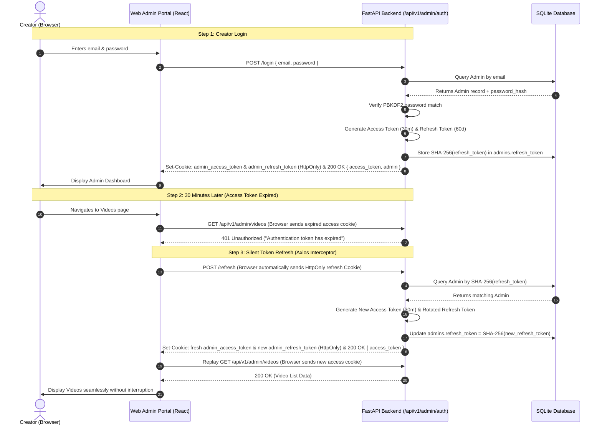
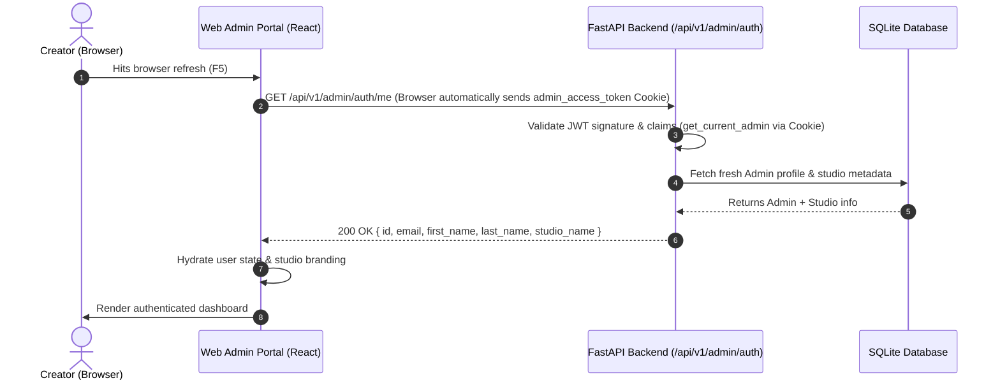

# Creator Admin Authentication & Identity Lifecycle API Specification

This specification defines the complete authentication, credential management, token lifecycle, and account provisioning architecture for the **Creator Admin Web Portal** (`/api/v1/admin/auth/*`).

---

## 1. System Architecture & Design Principles

### 1.1 Multi-Tenant B2B SaaS Provisioning

The platform operates as a specialized **White-Labeled Creator OTT Platform**. Unlike public consumer applications, the Creator Admin Studio is strictly accessible to verified, paying creators provisioned by platform operators.

- **Zero Public Registration (`/register`)**: There is intentionally **NO public sign-up endpoint** on the Creator Admin portal. Public visitors cannot create admin accounts.
- **Controlled Account Provisioning**: Creator accounts, studio spaces, default branding themes, and subscription plans are provisioned atomically by platform administrators via an internal CLI utility (`app.scripts.create_creator`) or secure provider orchestration.
- **Attack Surface Elimination**: Removing public registration eliminates bot account spam, credential stuffing, orphaned tenant database records, and unauthorized dashboard access attempts.

```
┌──────────────────────────────────────────────────────────────────────────────────────────────────────────────────┐
│ PLATFORM OPERATOR / CLI PROVISIONING                                                                             │
│ python -m app.scripts.create_creator --email creator@studio.com --password "Secret123!" --studio-name "Studio"  │
└────────────────────────────────────────────────────────┬─────────────────────────────────────────────────────────┘
                                                         │
                                        Atomic Database Transaction
                                                         │
                        ┌────────────────────────────────┼────────────────────────────────┐
                        ▼                                ▼                                ▼
               ┌─────────────────┐              ┌─────────────────┐              ┌────────────────┐
               │  Admin Record   │              │ Branding Record │              │ 2 Fixed Plans  │
               │ (Hashed Pwd)    │              │(Studio Identity)│              │with_ads & no_ads│
               └────────┬────────┘              └─────────────────┘              └────────────────┘
                        │
                        │ Login Credentials Delivered via Secure Channel (Email / SMS)
                        ▼
┌──────────────────────────────────────────────────────────────────────────────────────────────────────────────────┐
│ CREATOR ADMIN WEB PORTAL (React / Vite SPA)                                                                      │
│ 1. POST /api/v1/admin/auth/login   ──► Receives Access Token (30m) & HttpOnly Refresh Cookie (60d)│
│ 2. GET  /api/v1/admin/auth/me      ──► Rehydrates profile & verifies active token                                │
│ 3. POST /api/v1/admin/auth/refresh ──► Silently renews expired access token                                      │
│ 4. POST /api/v1/admin/auth/logout  ──► Server-side revocation of refresh session                                 │
└──────────────────────────────────────────────────────────────────────────────────────────────────────────────────┘
```

---

### 1.2 Dual-Token Session Security Standard & Theft Mitigation

To eliminate session compromise and Cross-Site Scripting (XSS) risks, the system enforces an industry-standard **Dual HttpOnly Cookie Architecture** coupled with a **Dual-Extraction Strategy** for API tooling:

| Token Type        | Lifespan       | Primary Transport (Browser)                                                                         | Fallback Transport (Tooling)         | Security & Theft Protection                                                                                                                                         |
| :---------------- | :------------- | :-------------------------------------------------------------------------------------------------- | :----------------------------------- | :------------------------------------------------------------------------------------------------------------------------------------------------------------------ |
| **Access Token**  | **30 Minutes** | **`HttpOnly; Secure; SameSite=Lax` Cookie** (`admin_access_token`) on path `/api/v1/admin`          | HTTP `Authorization: Bearer <token>` | **100% immune to JavaScript XSS exfiltration**. Never written to `localStorage`. Short lifespan limits stolen token window. Cryptographically signed JWT (`HS256`). |
| **Refresh Token** | **60 Days**    | **`HttpOnly; Secure; SameSite=Strict` Cookie** (`admin_refresh_token`) on path `/api/v1/admin/auth` | _None_ (Cookie only)                 | **Completely inaccessible to JavaScript / XSS**. Stored in DB strictly as a **SHA-256 one-way hash**. Scoped strictly to auth routes.                               |

#### How We Prevent & Handle Token Compromise:

1. **Complete XSS Immunity via `HttpOnly` Cookies**:
   - Storing either the access token or refresh token in `localStorage` leaves them vulnerable to malicious JavaScript, compromised third-party npm dependencies, or XSS vectors.
   - By transmitting **both** tokens inside **`HttpOnly` Cookies**, browser JavaScript cannot read `document.cookie`. Even if an attacker executes arbitrary JavaScript on the page, the tokens **cannot be scraped or exfiltrated**.

2. **Dual-Extraction Strategy in `get_current_admin` (`app/dependencies.py`)**:
   Admin route protection utilizes a layered token extraction pattern:

   ```python
   def get_current_admin(
       cookie_token: str | None = Cookie(default=None, alias="admin_access_token"),
       header_token: str | None = Depends(oauth2_scheme_optional),
   ) -> dict:
       token = cookie_token or header_token
       if not token:
           raise HTTPException(
               status_code=status.HTTP_401_UNAUTHORIZED,
               detail="Authentication required: No access token provided",
               headers={"WWW-Authenticate": "Bearer"},
           )
       payload = decode_access_token(token)
       ...
   ```

   - **Why Cookie First?** In production web browser sessions, the browser automatically attaches the `admin_access_token` cookie. The client JavaScript never needs to store, read, or manually inject the JWT into headers.
   - **Why Retain Header Fallback (`oauth2_scheme_optional`)?**
     1. **Swagger UI / OpenAPI (`/docs`)**: The interactive FastAPI Swagger documentation relies on the OAuth2 "Authorize" modal, which injects tokens via `Authorization: Bearer <token>`. Retaining the fallback allows developers to test admin endpoints directly in `/docs`.
     2. **Postman & API Tooling**: Developers and QA engineers can test endpoints in Postman, Thunder Client, or via `curl` by supplying standard Bearer headers without complex cookie jar mocking.
     3. **Automated CI/CD Test Suites**: Pytest suites and integration tests can execute against admin routes using standard header injection.
   - **Zero Security Degradation**: The presence of the header fallback does not weaken browser security. Browsers with `HttpOnly` cookies do not expose the token to client scripts, and the frontend client never stores it in `localStorage`.

3. **CSRF Protection via `SameSite=Strict` & `SameSite=Lax`**:
   - The refresh token is marked `SameSite=Strict` and scoped strictly to `Path=/api/v1/admin/auth`. Cross-origin websites cannot trigger silent refresh calls on behalf of the creator.
   - The access token is marked `SameSite=Lax` and scoped to `Path=/api/v1/admin`, ensuring smooth top-level navigation while rejecting cross-site state-modifying requests.

4. **Single-Use Refresh Token Rotation (RTR)**:
   - Every time `POST /api/v1/admin/auth/refresh` is called, the incoming refresh token is **immediately burned** and replaced with a newly minted refresh token and fresh access token.

5. **Single Active Session & Multi-Device Isolation**:
   - Because `admins.refresh_token` is stored as a single column on the `admins` table, each creator account maintains **one active refresh session at a time**.
   - When an admin logs in on a newer device (Device B), Device B's new refresh token hash overwrites `admins.refresh_token`.
   - **Non-Destructive Mismatch Handling (Clean Multi-Device Experience)**:
     - When Device A (previously closed without explicit logout) reopens and attempts a silent token refresh (`POST /api/v1/admin/auth/refresh`), its incoming cookie hash will not match the newly stored hash for Device B.
     - The backend returns `401 Unauthorized` with detail: `"Session expired or active on another device; please re-login"`.
     - **Crucial Rule**: The server **DOES NOT set `admins.refresh_token = NULL`**.
     - **Result**: Device B's active session remains completely intact and undisturbed. Device A's frontend cleanly intercepts the 401 and redirects the user to `/login`. Device A's stale request never inadvertently logs out Device B.

6. **Instant Server-Side Revocation (`POST /logout`)**:
   - Calling `POST /api/v1/admin/auth/logout` explicitly sets `admins.refresh_token = NULL` in the database and clears **both** browser cookies (`Max-Age=0`), terminating the active session immediately.

---

### 1.3 Strict IDOR Security & Context Extraction

- No `user_id` or `admin_id` parameter is accepted in request bodies or query parameters across any admin route.
- The authenticated creator identity (`user_id`) is extracted strictly from the validated JWT token claims on the backend via the FastAPI dependency:
  ```python
  admin_ctx = Depends(get_current_admin)
  # admin_ctx["user_id"] -> securely isolates all studio operations
  ```
- Any attempt by an ordinary mobile app subscriber to present a subscriber token to an admin route results in an immediate `403 Forbidden` response.

---

## 2. Cryptographic & Database Standards

### 2.1 Password Storage: PBKDF2-HMAC-SHA256

Passwords are NEVER stored in plaintext. Passwords are stored in the `Admin.password_hash` column using standard library `hashlib.pbkdf2_hmac` with the following parameters (NIST SP 800-132 compliant):

- **Algorithm**: `PBKDF2-HMAC-SHA256`
- **Iterations**: `600,000`
- **Salt**: 16 bytes of cryptographically secure random bytes generated via `secrets.token_bytes(16)`
- **Stored Format**: `pbkdf2_sha256$600000$<salt_hex>$<hash_hex>`
- **Comparison**: Constant-time string comparison using `secrets.compare_digest` to prevent timing attacks.

### 2.2 Refresh Token Hashing

Raw refresh tokens are sent only to the authenticated client. The backend stores:
$$\text{refresh\_token\_hash} = \text{SHA-256}(\text{raw\_refresh\_token})$$
If the database is read or dumped, attackers cannot use the stored hash values to generate valid sessions.

### 2.3 Updated `admins` Database Table Schema

```sql
CREATE TABLE admins (
    id SERIAL PRIMARY KEY,
    email VARCHAR(255) UNIQUE NOT NULL,
    password_hash VARCHAR(255) NULL,
    first_name VARCHAR(100) NULL,
    last_name VARCHAR(100) NULL,
    phone VARCHAR(50) NULL,
    location VARCHAR(255) NULL,
    bio TEXT NULL,
    website VARCHAR(255) NULL,
    avatar_url VARCHAR(500) NULL,
    twitter_url VARCHAR(255) NULL,
    youtube_url VARCHAR(255) NULL,
    instagram_url VARCHAR(255) NULL,
    refresh_token TEXT NULL,
    created_at TIMESTAMP WITH TIME ZONE DEFAULT CURRENT_TIMESTAMP,
    updated_at TIMESTAMP WITH TIME ZONE DEFAULT CURRENT_TIMESTAMP
);

CREATE INDEX idx_admins_email ON admins(email);
```

---

## 3. Standard HTTP Error Responses

All error responses across all admin authentication endpoints adhere to the unified FastAPI JSON error envelope:

#### 1. `400 Bad Request` — Missing or Invalid Payload

```json
{
  "detail": "Email and password are required"
}
```

#### 2. `401 Unauthorized` — Invalid Credentials, Expired Token, or Active on Another Device

```json
{
  "detail": "Invalid email or password"
}
```

_When token has expired:_

```json
{
  "detail": "Authentication token has expired"
}
```

_When refresh token was superseded by a newer device login:_

```json
{
  "detail": "Session expired or active on another device; please re-login"
}
```

#### 3. `403 Forbidden` — Insufficient Privileges (Non-Admin Token)

```json
{
  "detail": "Admin portal authorization required"
}
```

#### 4. `422 Unprocessable Entity` — Schema Validation Failure

```json
{
  "detail": [
    {
      "loc": ["body", "email"],
      "msg": "value is not a valid email address",
      "type": "value_error.email"
    }
  ]
}
```

#### 5. `500 Internal Server Error` — Database / Server Failure

```json
{
  "detail": "Internal server error during authentication"
}
```

---

## 4. API Endpoints Specification

Base Route Prefix:

```http
/api/v1/admin/auth
```

---

### 4.1 `POST /api/v1/admin/auth/login` — Creator Admin Login

Authenticates a creator with their registered email and password, returning a short-lived access token, a long-lived refresh token, and a summary profile for dashboard hydration.

#### Request Headers

```http
Content-Type: application/json
```

#### Request Body

```json
{
  "email": "creator@example.com",
  "password": "SecurePassword123!"
}
```

#### Request Validation Rules

- `email`: String, required, valid email format, automatically trimmed and lowercased.
- `password`: String, required, minimum 8 characters.

#### Response Headers

```http
Set-Cookie: admin_access_token=eyJhbGciOiJIUzI1NiIsInR5cCI6IkpXVCJ9...; HttpOnly; Secure; SameSite=Lax; Path=/api/v1/admin; Max-Age=1800
Set-Cookie: admin_refresh_token=a4f8902c3e451b67d890123456789abcdef0123456789abcdef0123456789abc; HttpOnly; Secure; SameSite=Strict; Path=/api/v1/admin/auth; Max-Age=5184000
```

#### Response Specification (`200 OK`)

```json
{
  "access_token": "eyJhbGciOiJIUzI1NiIsInR5cCI6IkpXVCJ9.eyJzdWIiOiIxIiwidXNlcl9pZCI6MSwidXNlcm5hbWUiOiJDcmVhdG9yIEFkbWluIiwiZXhwIjoxNzk4NTMwMDAwfQ.abcdef...",
  "token_type": "bearer",
  "expires_in": 1800,
  "admin": {
    "id": 1,
    "email": "creator@example.com",
    "first_name": "Creator",
    "last_name": "Admin",
    "studio_name": "Creator OTT Studio",
    "avatar_url": "https://talent-sea987.b-cdn.net/assets/avatars/avatar_1_1785055000.jpg"
  }
}
```

#### Response Fields:

- `access_token` (string): Signed JWT valid for 30 minutes (`1800` seconds). Transmitted securely via the `admin_access_token` HttpOnly cookie for web browser sessions, and also provided in the response body as a fallback for API tooling (Swagger UI / Postman).
- `token_type` (string): Fixed value `"bearer"`.
- `expires_in` (integer): Access token lifespan in seconds (`1800` seconds = 30 minutes).
- `admin` (object): Core creator identity attributes for dashboard hydration and navigation routing.
  - `id` (integer): Unique creator admin ID.
  - `email` (string): Account login email.
  - `first_name` (string): Creator's first name.
  - `last_name` (string): Creator's last name.
  - `studio_name` (string): Public channel / OTT studio brand name.
  - `avatar_url` (string | null): CDN URL to profile photo asset.

_(Note: Both the 30-minute `access_token` and 60-day `refresh_token` are transmitted strictly via secure `Set-Cookie` response headers with `HttpOnly`, ensuring zero vulnerability to JavaScript-based XSS attacks)._

---

### 4.2 `POST /api/v1/admin/auth/refresh` — Silent Token Refresh

Exchanges a valid 60-day refresh token for a newly minted 30-minute access token. Performs automatic single-use token rotation while preserving active sessions on newer devices during concurrent device switches.

#### Request Headers

```http
Cookie: admin_refresh_token=<token_from_httponly_cookie>
```

_(No request body is needed; the browser automatically transmits the HttpOnly cookie with `withCredentials: true`)._

#### Processing Logic & Multi-Device Handling:

1. **Token Extraction**: Reads `admin_refresh_token` from incoming `HttpOnly` Cookie. If missing, returns `401 Unauthorized` (`"Refresh token missing"`).
2. **Hash & Verification**: Hashes incoming token with SHA-256 and queries the `admins` table.
3. **Session Matching & Non-Destructive Invalidation**:
   - If `admins.refresh_token` does not match the incoming token hash (e.g., the creator logged in on another device or the session was rotated):
     - The server returns `401 Unauthorized` with `{"detail": "Session expired or active on another device; please re-login"}`.
     - **IMPORTANT**: The server **DOES NOT wipe `admins.refresh_token` in the database**. Leaving the current database hash intact ensures the active device (Device B) remains logged in, while the stale device (Device A) is cleanly prompted to re-login.
4. **Token Rotation**: If the hash matches:
   - Generates a new 30-minute access token and a brand-new 60-day refresh token.
   - Burns the old token in the database by updating `admins.refresh_token = SHA-256(new_refresh_token)`.
5. **Cookie Update**: Emits fresh `Set-Cookie` headers for both the rotated refresh token (`Max-Age=5184000`) and the fresh access token (`Max-Age=1800`).

#### Response Headers

```http
Set-Cookie: admin_access_token=eyJhbGciOiJIUzI1NiIsInR5cCI6IkpXVCJ9...; HttpOnly; Secure; SameSite=Lax; Path=/api/v1/admin; Max-Age=1800
Set-Cookie: admin_refresh_token=b5e9013d4f562c78e90123456789abcdef0123456789abcdef0123456789def; HttpOnly; Secure; SameSite=Strict; Path=/api/v1/admin/auth; Max-Age=5184000
```

#### Response Specification (`200 OK`)

```json
{
  "access_token": "eyJhbGciOiJIUzI1NiIsInR5cCI6IkpXVCJ9.eyJzdWIiOiIxIiwidXNlcl9pZCI6MSwidXNlcm5hbWUiOiJDcmVhdG9yIEFkbWluIiwiZXhwIjoxNzk4NTMxODAwfQ.xyz...",
  "token_type": "bearer",
  "expires_in": 1800
}
```

---

### 4.3 `GET /api/v1/admin/auth/me` — Session Identity & Rehydration

Retrieves the current authenticated creator's core session identity and studio branding status. Used by the Web Admin SPA on page load, browser refresh (F5), or route changes to repopulate global navbar/layout state and verify that the stored access token remains active and valid.

#### Request Headers

```http
Cookie: admin_access_token=<jwt_cookie>
```

_(Alternatively supported via header fallback: `Authorization: Bearer <admin_access_token>` for Swagger / Postman tooling)._

#### Processing Logic:

1. Validates caller authentication via `get_current_admin` (extracts from `admin_access_token` cookie or Bearer header).
2. Reads the creator record from the `admins` table.
3. Retrieves the associated `branding` studio name.
4. Returns the lean `AdminSummaryResponse` (matching the `admin` object returned upon login with 100% symmetry).

#### Response Specification (`200 OK`)

```json
{
  "id": 1,
  "email": "creator@example.com",
  "first_name": "Creator",
  "last_name": "Admin",
  "studio_name": "Creator OTT Studio",
  "avatar_url": "https://talent-sea987.b-cdn.net/assets/avatars/avatar_1_1785055000.jpg"
}
```

#### Response Fields:

- `id` (integer): Unique creator admin ID.
- `email` (string): Account login email.
- `first_name` (string | null): Creator's first name.
- `last_name` (string | null): Creator's last name.
- `studio_name` (string | null): Public channel / OTT studio brand name.
- `avatar_url` (string | null): CDN URL to profile photo asset.

_(Note: Heavy form-editing fields such as `bio`, `website`, `phone`, `location`, and `social_links` are decoupled from global session rehydration and served strictly by `GET /api/v1/admin/profile` when loading the Settings ➔ Profile edit screen)._

#### Why `/api/v1/admin/auth/me` is Essential:

1. **SPA Page Refresh & Perfect Symmetry**: When a creator refreshes the page (F5), client-side memory is wiped. The frontend calls `/me` with the access token cookie automatically attached, receiving the exact same `AdminSummaryResponse` structure as returned on `/login`.
2. **Route Guarding**: If the token has expired, `/me` returns `401 Unauthorized`, prompting the frontend to trigger a silent cookie refresh (`POST /refresh`) or redirect to the login page.
3. **Zero Redundancy**: Layout and header components receive only the identity metadata they need to render, eliminating payload bloat on every page reload.

---

### 4.4 `POST /api/v1/admin/auth/logout` — Revoke Refresh Session

Invalidates the active session on the backend by erasing the stored refresh token hash in the database and clearing both the access token and refresh token cookies in the browser.

#### Request Headers

```http
Cookie: admin_access_token=<jwt_cookie>; admin_refresh_token=<refresh_cookie>
```

_(Alternatively supported via header fallback: `Authorization: Bearer <admin_access_token>` for tooling clients)._

#### Processing Logic:

1. Resolves caller's `user_id` via `get_current_admin`.
2. Updates `admins` table setting `refresh_token = NULL` for this creator.
3. Clears both the browser's `admin_access_token` and `admin_refresh_token` cookies by sending `Set-Cookie` with `Max-Age=0`.
4. Any subsequent calls to `POST /api/v1/admin/auth/refresh` or protected admin routes will immediately fail.

#### Response Headers

```http
Set-Cookie: admin_access_token=; HttpOnly; Secure; SameSite=Lax; Path=/api/v1/admin; Max-Age=0
Set-Cookie: admin_refresh_token=; HttpOnly; Secure; SameSite=Strict; Path=/api/v1/admin/auth; Max-Age=0
```

#### Response Specification (`200 OK`)

```json
{
  "message": "Successfully logged out"
}
```

---

## 5. Creator Provisioning CLI Specification

Since there is **NO public registration**, platform operators provision new creator accounts via a secure internal CLI script (`app.scripts.create_creator`).

### 5.1 CLI Command Syntax & Options

The command accepts command-line flags or prompts interactively for sensitive fields:

```bash
# Option A: Direct execution with command-line flags:
python -m app.scripts.create_creator \
    --email creator@example.com \
    --password "SuperSecretPass123!" \
    --first-name "John" \
    --last-name "Doe" \
    --studio-name "John Doe Studio"

# Option B: Secure interactive execution (password hidden without terminal echo):
python -m app.scripts.create_creator --email creator@example.com --studio-name "John Doe Studio"
# Prompt: Enter creator password (min 8 chars): [hidden]
# Prompt: Confirm creator password: [hidden]
```

#### CLI Options Reference

| Argument        | Type   | Required | Default                                                    | Description                                                                                                                                                          |
| :-------------- | :----- | :------: | :--------------------------------------------------------- | :------------------------------------------------------------------------------------------------------------------------------------------------------------------- |
| `--email`       | String | **YES**  | None                                                       | Creator's primary login email. Case-insensitive, automatically trimmed.                                                                                              |
| `--password`    | String | **YES**  | Interactive Prompt                                         | Initial login password (minimum 8 characters). If omitted from the command line, prompts interactively using `getpass` to avoid logging secrets in terminal history. |
| `--first-name`  | String |    NO    | `None`                                                     | Creator's first name.                                                                                                                                                |
| `--last-name`   | String |    NO    | `None`                                                     | Creator's last name.                                                                                                                                                 |
| `--studio-name` | String |    NO    | `f"{first_name} {last_name} Studio"` or `"Creator Studio"` | Public channel / OTT studio brand name.                                                                                                                              |

---

### 5.2 Atomic Provisioning Steps (Complete Eager Provisioning)

To maintain strict tenant data consistency in a B2B SaaS environment, every newly onboarded creator is **100% fully initialized** in an **atomic database transaction**:

1. **Email Conflict Verification**: Checks `Admin.get_or_none(Admin.email == email)`. If an account already exists, execution aborts with `Error: Admin with email <email> already exists`.
2. **Password Validation & Hashing**:
   - Validates that the password length is at least 8 characters.
   - Generates 16 bytes of cryptographically secure random salt via `secrets.token_bytes(16)`.
   - Hashes password using NIST SP 800-132 compliant `PBKDF2-HMAC-SHA256` with 600,000 iterations.
   - Output string: `pbkdf2_sha256$600000$<salt_hex>$<hash_hex>`.
3. **Admin User Creation**: Inserts new row into `admins` table:
   - `email`: `creator@example.com`
   - `password_hash`: `<pbkdf2_hash>`
   - `first_name`: `"John"`
   - `last_name`: `"Doe"`
4. **Branding Studio Provisioning (Eager 1:1 Invariant)**: Inserts the studio identity record into `branding` table linked to `user_id`:
   - `user_id`: `admin.id` (Foreign key to `admins.id`)
   - `studio_name`: Provided `--studio-name` (or defaults to `f"{first_name} {last_name} Studio"` / `"Creator Studio"`)
   - `tagline`: `NULL` (creator fills this in via Admin Studio UI)
   - `description`: `NULL` (creator fills this in via Admin Studio UI)
   - `banner_url`: `NULL` (uploaded later via `POST /api/v1/admin/branding/banner`)
   - `logo_url`: `NULL` (uploaded later via `POST /api/v1/admin/branding/logo`)
5. **Atomic 2-Plan Provisioning**: Inserts the **two mandatory subscription tiers** linked to `user_id`:
   - **Plan 1 (`plan_type = "with_ads"`)**:
     - `name`: `"Standard with Ads"`
     - `description`: `"Access to our full catalog with occasional commercial breaks."`
     - `base_price`: `99.0` (₹99/month)
     - `billing_period_value`: `1`
     - `billing_period_unit`: `"months"`
   - **Plan 2 (`plan_type = "no_ads"`)**:
     - `name`: `"Premium Ad-Free"`
     - `description`: `"Unlimited streaming with zero ads and maximum quality."`
     - `base_price`: `199.0` (₹199/month)
     - `billing_period_value`: `1`
     - `billing_period_unit`: `"months"`

#### Why Eager Provisioning is the Professional Standard for this Platform:

- **Guaranteed 1:1 Relationship**: An Admin _is_ a Creator Studio. A creator never exists in a "half-born" or orphaned state.
- **Immediate Mobile App Readiness**: When a mobile subscriber app connects using this `creator_id`, `GET /api/v1/branding` immediately returns the valid studio name instead of `null` or a 404 error.
- **Query Performance & Cleanliness**: All internal services, analytics pipelines, and reporting scripts can reliably `INNER JOIN` `admins` and `branding` without defensive `LEFT JOIN`s or null-coalescing workarounds.

Once completed, the operator delivers the login credentials to the creator, and the creator logs into the Admin Studio.

---

## 6. Frontend Integration Architecture (React / Vite SPA)

### 6.1 State Management & Interceptor Architecture

The web application uses an Axios HTTP interceptor with `withCredentials: true` to handle transparent token renewal without ever exposing the refresh token to JavaScript:

```
                  ┌───────────────────────────────────┐
                  │ Creator Performs Dashboard Action │
                  └─────────────────┬─────────────────┘
                                    │
                                    ▼
                      HTTP Request with Access Token
                                    │
                  ┌─────────────────┴─────────────────┐
                  │ Backend Returns Status Code       │
                  └─────────────────┬─────────────────┘
                                    │
                   ┌────────────────┴────────────────┐
                   │                                 │
             Status == 200                     Status == 401
                   │                       (Access Token Expired)
                   ▼                                 │
           Return Data to UI                         ▼
                                         Call POST /auth/refresh
                                         (Browser sends HttpOnly Cookie)
                                                     │
                                        ┌────────────┴────────────┐
                                        │                         │
                                  Success (New Token)        Failure (Revoked)
                                        │                         │
                                        ▼                         ▼
                               Update In-Memory Token     Redirect to /login
                               & Replay Failed Request
```

### 6.2 Implementation Reference (Axios Client with Dual HttpOnly Cookies)

Because **both** the `admin_access_token` and `admin_refresh_token` are set as `HttpOnly` cookies, the frontend JavaScript client never needs to store tokens in `localStorage` or manually inject `Authorization: Bearer` headers for web browser sessions. Setting `withCredentials: true` ensures the browser natively handles token transmission.

```javascript
import axios from "axios";

// 1. Create centralized Axios instance with credentials enabled
const api = axios.create({
  baseURL: "/api/v1",
  withCredentials: true, // Guarantees both HttpOnly cookies (access & refresh) are transmitted
});

// 2. Intercept 401 Unauthorized responses & silently refresh via HttpOnly refresh cookie
api.interceptors.response.use(
  (response) => response,
  async (error) => {
    const originalRequest = error.config;
    if (error.response?.status === 401 && !originalRequest._retry) {
      originalRequest._retry = true;

      try {
        // Browser automatically attaches HttpOnly 'admin_refresh_token' cookie
        // Backend responds with rotated 'admin_refresh_token' and fresh 'admin_access_token' cookies
        await axios.post(
          "/api/v1/admin/auth/refresh",
          {},
          { withCredentials: true },
        );

        // Replay original request (browser automatically transmits the newly set access cookie)
        return api(originalRequest);
      } catch (refreshError) {
        // Refresh token expired, mismatched, or revoked -> redirect to login
        window.location.href = "/login";
      }
    }
    return Promise.reject(error);
  },
);

export default api;
```

---

## 7. Sequence Diagrams

### 7.1 Admin Login & Silent Refresh Flow



---

### 7.2 Session Rehydration (`GET /me`) on Page Reload (F5)



---

## 8. Summary Checklist of Next Implementation Steps

| Step | Component                      | Action Required                                                                                                | Status    |
| :--- | :----------------------------- | :------------------------------------------------------------------------------------------------------------- | :-------- |
| 1    | **Database Model**             | Add `password_hash = CharField(max_length=255, null=True)` to `app/models/admin.py`                            | Pending   |
| 2    | **Security Utils**             | Implement `hash_password(password)` and `verify_password(plain, hashed)` in `app/utils/auth.py`                | Pending   |
| 3    | **Provisioning CLI**           | Implement `app/scripts/create_creator.py` (atomic creation of Admin with hashed password + Branding + 2 Plans) | Pending   |
| 4    | **Pydantic Schemas**           | Create `app/schemas/admin/auth_schemas.py` (`AdminLoginRequest`, `AdminTokenResponse`, `AdminProfileResponse`) | Pending   |
| 5    | **Auth Routes**                | Implement `app/routes/admin/auth_routes.py` (`/login`, `/refresh`, `/me`, `/logout`)                           | Pending   |
| 6    | **Main Router**                | Register `auth_routes` in `app/main.py` under prefix `/api/v1/admin/auth`                                      | Pending   |
| 7    | **Two-Tier Plans Refactoring** | Refactor `SubscriptionPlan` model, service, and routes to strictly support `"with_ads"` and `"no_ads"`         | Next Task |
