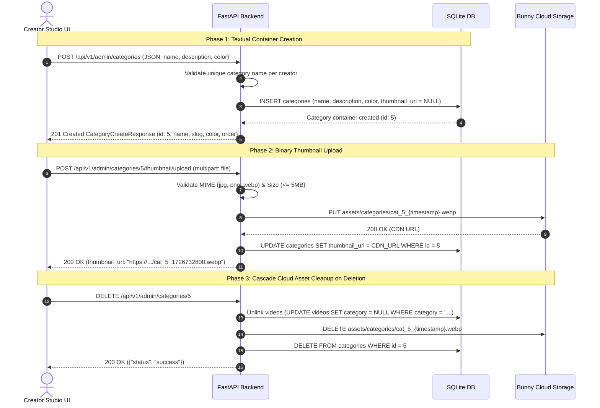

# Creator Admin — Categories Management API Specification

## 1. System Architecture & Security Standards

### Authentication & Authorization Standard

All endpoints in this specification require a valid JWT Bearer access token passed in the HTTP request header:

```http
Authorization: Bearer <creator_access_token>
```

Identity and tenant ownership are strictly derived from the validated JWT token (`get_current_admin`). Under no circumstances is `tenant_id` or `user_id` accepted as an HTTP query parameter or request body parameter, eliminating Insecure Direct Object Reference (IDOR) vulnerabilities. For Platform Super Admins, the active tenant studio context is resolved from the `X-Tenant-Id` request header (defaulting to the first active tenant if omitted).

### Standard HTTP Error Responses

All error responses across all endpoints follow the standard FastAPI JSON error envelope:

#### 1. `400 Bad Request` — Invalid Request Payload

```json
{
  "detail": "Category name already exists for this creator account."
}
```

#### 2. `401 Unauthorized` — Missing or Expired JWT Token

```json
{
  "detail": "Could not validate credentials"
}
```

#### 3. `404 Not Found` — Resource Not Found or Forbidden Ownership

```json
{
  "detail": "Category with ID 5 not found"
}
```

#### 4. `422 Unprocessable Entity` — Schema Validation Failure

```json
{
  "detail": [
    {
      "loc": ["body", "name"],
      "msg": "field required",
      "type": "value_error.missing"
    }
  ]
}
```

#### 5. `500 Internal Server Error` — Internal Failure

```json
{
  "detail": "Internal server error occurred while processing category operation"
}
```

---

## Database Schema Specification (`categories` Table)

```sql
CREATE TABLE IF NOT EXISTS categories (
    id INTEGER PRIMARY KEY AUTOINCREMENT,
    user_id INTEGER NOT NULL,
    name VARCHAR(100) NOT NULL,
    slug VARCHAR(120) NOT NULL,
    description TEXT NULL,
    thumbnail_url VARCHAR(500) NULL,
    color VARCHAR(30) NULL DEFAULT '#3b82f6',
    display_order INTEGER NOT NULL DEFAULT 0,
    created_at DATETIME NOT NULL DEFAULT CURRENT_TIMESTAMP,
    updated_at DATETIME NOT NULL DEFAULT CURRENT_TIMESTAMP,
    FOREIGN KEY (user_id) REFERENCES admin(id) ON DELETE CASCADE,
    UNIQUE (user_id, name)
);
```

---

## 2. Category Lifecycle & Media Upload Architectural Flow

Following the exact architectural standards established for **Playlists** and **Videos**, category creation is designed as a **two-step decoupled lifecycle**:



### Architectural Principles:

1. **Text First, ID Allocation**:
   - Creating the textual metadata first (`POST /api/v1/admin/categories`) produces the immutable database primary key `category_id`.
   - This `category_id` is then deterministically embedded into the storage path (`assets/categories/cat_{category_id}_{timestamp}.webp`), guaranteeing clean multi-tenant isolation and zero storage collisions.

2. **Decoupled Creation Response (`CategoryCreateResponse`)**:
   - Following the exact pattern of `PlaylistCreateResponse`, `POST /api/v1/admin/categories` creates the container and returns pure metadata (`id`, `name`, `slug`, `color`, `order`, `created_at`).
   - The creation response intentionally does **not** include `thumbnail_url`, avoiding misleading `null` states in API responses.

3. **Guaranteed Non-Null `thumbnail_url: string`**:
   - The agreed creator studio UI flow requires selecting and uploading the thumbnail immediately after container allocation (`POST /api/v1/admin/categories/{id}/thumbnail/upload`).
   - In all category query and feed endpoints (`GET /api/v1/admin/categories`, `GET /api/v1/mobile/categories`), `thumbnail_url` is strictly a non-null string (`thumbnail_url: str`), satisfying the frontend contract.

4. **Zero-Orphan Cloud Storage Lifecycle**:
   - **On Replace**: When a creator uploads a new thumbnail, the backend extracts the old storage path from `cat.thumbnail_url` and sends a `DELETE` request to Bunny Storage before saving the new URL.
   - **On Delete**: When `DELETE /api/v1/admin/categories/{id}` is invoked, the backend purges the physical file from Bunny Cloud Storage, eliminating cloud storage waste and fees.

---

## Categories Management Endpoints

### 1. `GET /api/v1/admin/categories` — List All Creator Categories

Retrieves all categories owned by the authenticated creator account, ordered by `display_order` (ascending). Dynamically computes `content_count` (total published videos in each category) or returns a lightweight dropdown list if `simple=true`.

#### Request Headers

```http
Authorization: Bearer <creator_access_token>
```

#### Query Parameters

- `simple` (boolean, optional, default: `false`): When set to `true`, skips the SQL `Video` count join and returns a lightweight array of category dropdown options (`id`, `name`, `slug`).

#### Internal Backend Workflow

1. Extracts `user_id` from creator JWT bearer token context.
2. If `simple=true`:
   - Queries `Category` table for `id`, `name`, `slug` filtering by `user == user_id`, ordered by `display_order.asc()`. Skips SQL `Video` count join.
3. If `simple=false` (default):
   - Executes dynamic SQL aggregation between `Category` and `Video` tables to aggregate `content_count` on-the-fly, strictly counting standard catalog videos (`video_type == "standard"`):
   ```python
   query = Category.select(
       Category,
       fn.COUNT(Video.id).alias("content_count")
   ).join(
       Video, on=(fn.LOWER(Category.name) == fn.LOWER(Video.category)), join_type="LEFT OUTER"
   ).where(
       (Category.user == user_id) &
       (Video.video_type == "standard") &  # Shorts have no category and are excluded
       (fn.LOWER(Video.status).in_(["published", "ready"])) &
       (Video.is_playable == True)
   ).group_by(Category.id).order_by(Category.display_order.asc())
   ```

> [!NOTE]
> **Strict Exclusion of Shorts:** Categories exclusively organize standard OTT widescreen catalog videos (`video_type == "standard"`). Vertical short videos (`video_type == "shorts"`) have no category (`category: null`) and are excluded from category aggregations.

#### Response Specification (`200 OK`)

##### Scenario A: Full Category List (`simple=false` / default)

```json
{
  "data": [
    {
      "id": 1,
      "name": "Programming",
      "slug": "programming",
      "description": "Software development and engineering tutorials",
      "thumbnail_url": "https://talent-sea987.b-cdn.net/assets/categories/cat_1_1726732800.webp",
      "color": "#3b82f6",
      "content_count": 42,
      "order": 1,
      "created_at": "2024-01-15T08:00:00Z",
      "updated_at": "2024-06-20T10:30:00Z"
    },
    {
      "id": 2,
      "name": "Design & UI/UX",
      "slug": "design-ui-ux",
      "description": "Figma, mobile UI, and visual design courses",
      "thumbnail_url": "https://talent-sea987.b-cdn.net/assets/categories/cat_2_1726732800.webp",
      "color": "#ec4899",
      "content_count": 18,
      "order": 2,
      "created_at": "2024-02-01T12:00:00Z",
      "updated_at": "2024-06-20T10:30:00Z"
    }
  ]
}
```

##### Scenario B: Lightweight Dropdown Options List (`simple=true`)

```json
{
  "data": [
    {
      "id": 1,
      "name": "Programming",
      "slug": "programming"
    },
    {
      "id": 2,
      "name": "Design & UI/UX",
      "slug": "design-ui-ux"
    }
  ]
}
```

---

### 2. `POST /api/v1/admin/categories` — Create Category

Creates a new content category for the authenticated creator account.

#### Request Headers

```http
Authorization: Bearer <creator_access_token>
Content-Type: application/json
```

#### Request Body

```json
{
  "name": "Mobile Development",
  "description": "Flutter, React Native, and iOS Native tutorials",
  "color": "#10b981"
}
```

#### Validation Rules

- `name`: Required string (1 to 100 characters). Must be unique per creator account.
- `description`: Optional string (max 500 characters).
- `color`: Optional hex color string (default: `"#3b82f6"`).

#### Internal Backend Workflow

1. Verifies no category with the same name exists for `user_id`.
2. Generates URL-friendly `slug` from category name (`mobile-development`).
3. Auto-calculates `display_order = max(display_order) + 1`.
4. Commits new `Category` container record to database.
5. Returns `CategoryCreateResponse` without `thumbnail_url` (container ready for immediate thumbnail upload).

#### Response Specification (`201 Created`)

```json
{
  "id": 3,
  "name": "Mobile Development",
  "slug": "mobile-development",
  "description": "Flutter, React Native, and iOS Native tutorials",
  "color": "#10b981",
  "order": 3,
  "created_at": "2026-08-12T00:00:00Z"
}
```

---

### 3. `PUT /api/v1/admin/categories/{category_id}` — Edit Category

Updates textual fields (`name`, `description`, `color`) for an existing category.

> [!NOTE]
> To update or upload the category thumbnail image, use the dedicated upload endpoint: `POST /api/v1/admin/categories/{category_id}/thumbnail/upload`.

#### Request Headers

```http
Authorization: Bearer <creator_access_token>
Content-Type: application/json
```

#### Path Parameters

- `category_id` (integer, required): Database primary key ID of target category.

#### Request Body

```json
{
  "name": "Mobile & Cross Platform",
  "description": "Updated mobile engineering tutorials",
  "color": "#059669"
}
```

#### Response Specification (`200 OK`)

```json
{
  "id": 3,
  "name": "Mobile & Cross Platform",
  "slug": "mobile-cross-platform",
  "description": "Updated mobile engineering tutorials",
  "thumbnail_url": "https://talent-sea987.b-cdn.net/assets/categories/cat_3_1726732800.webp",
  "color": "#059669",
  "content_count": 0,
  "order": 3,
  "created_at": "2026-08-12T00:00:00Z",
  "updated_at": "2026-08-12T00:00:00Z"
}
```

---

### 4. `POST /api/v1/admin/categories/{category_id}/thumbnail/upload` — Upload Category Thumbnail

Uploads a category logo/thumbnail image to Bunny Cloud Storage and associates the resulting CDN URL with the category.

#### Request Headers

```http
Authorization: Bearer <creator_access_token>
Content-Type: multipart/form-data
```

#### Path Parameters

- `category_id` (integer, required): Database primary key ID of target category.

#### Request Body (Multipart Form-Data)

- `file` (binary, required): Image file (`.jpg`, `.jpeg`, `.png`, `.webp`, `.svg`, max 5 MB).

#### Internal Backend Workflow

1. Verifies category exists and belongs to authenticated admin creator (`user_id`).
2. Validates image extension and MIME type against allowed image formats.
3. Enforces file size ceiling (`MAX_THUMBNAIL_SIZE_MB`, 5 MB).
4. Auto-deletes existing thumbnail image from Bunny Storage if replacing an existing asset.
5. Uploads image to Bunny Cloud Storage at path `assets/categories/cat_{category_id}_{timestamp}.webp`.
6. Updates `Category.thumbnail_url` in database.
7. Returns CDN cache-busted URL.

#### Response Specification (`200 OK`)

```json
{
  "thumbnail_url": "https://talent-sea987.b-cdn.net/assets/categories/cat_3_1726732800.webp"
}
```

---

### 5. `DELETE /api/v1/admin/categories/{category_id}` — Delete Category

Deletes a category asset, safely unassigns (`category = null`) videos linked to it, and cleans up the thumbnail file from Bunny Storage.

#### Request Headers

```http
Authorization: Bearer <creator_access_token>
```

#### Path Parameters

- `category_id` (integer, required): Database primary key ID of category to delete.

#### Internal Backend Workflow

1. Verifies ownership (`Category.user == user_id`).
2. If `Category.thumbnail_url` exists, deletes the binary file from Bunny Cloud Storage to avoid orphaned cloud assets.
3. Updates associated videos (`Video.category = null`) so video assets remain intact.
4. Deletes `Category` record from database.

#### Response Specification (`200 OK`)

```json
{
  "status": "success"
}
```

---

### 6. `PUT /api/v1/admin/categories/reorder` — Reorder Categories (Drag & Drop)

Persists new category display ordering after drag-and-drop actions in the Admin Portal UI.

#### Request Headers

```http
Authorization: Bearer <creator_access_token>
Content-Type: application/json
```

#### Request Body

```json
{
  "ids": [3, 1, 2]
}
```

#### Internal Backend Workflow

1. Receives an ordered array of category primary key IDs.
2. Iterates through array, updating `Category.display_order = index + 1` for each category owned by `user_id` inside an atomic transaction.

#### Response Specification (`200 OK`)

```json
{
  "status": "success"
}
```
