# Complete Database Architecture & Field-by-Field Schema Specification

This document provides a permanent visual, architectural, and **field-by-field schema specification** for all **23 Database Tables** in the **Content Talent Backend API**.

---

## 🗺️ Entity Relationship Diagram (ERD)

```mermaid
erDiagram
    TENANT ||--o{ ADMIN : "has admins (1:N)"
    TENANT ||--o| CREATOR_PAYOUT_PROFILE : "registers payout bank (1:1)"
    TENANT ||--o{ CATEGORY : "owns (1:N)"
    TENANT ||--o{ VIDEO : "publishes (1:N)"
    TENANT ||--o{ PLAYLIST : "curates (1:N)"
    TENANT ||--o{ FEATURED_VIDEO : "curates home carousel (1:N)"
    TENANT ||--o{ SUBSCRIPTION_PLAN : "offers (1:N)"
    TENANT ||--o{ SUBSCRIBER : "hosts members (1:N)"
    TENANT ||--o{ PAYMENT : "receives transactions (1:N)"
    TENANT ||--o{ USER_SUBSCRIPTION : "grants entitlements (1:N)"
    TENANT ||--o{ VIDEO_VIEW_EVENT : "aggregates telemetry (1:N)"
    TENANT ||--o{ AD_IMPRESSION_EVENT : "earns from (1:N)"
    TENANT ||--o{ AD_MONTHLY_SETTLEMENT : "receives settlements (1:N)"

    ADMIN ||--o{ VIDEO : "creates / uploads (1:N)"
    ADMIN ||--o{ PLAYLIST : "creates (1:N)"

    AD_PLATFORM_MONTHLY_RECONCILIATION ||--o{ AD_MONTHLY_SETTLEMENT : "reconciles & dispatches (1:N)"

    SUBSCRIBER ||--o{ REFRESH_TOKEN : "owns active sessions (1:N)"
    SUBSCRIBER ||--o{ VIDEO_LIKE : "likes (1:N)"
    SUBSCRIBER ||--o{ VIDEO_SAVE : "saves to watchlist (1:N)"
    SUBSCRIBER ||--o{ PLAYLIST_SAVE : "bookmarks playlist (1:N)"
    SUBSCRIBER ||--o{ WATCH_HISTORY : "tracks watch progress (1:N)"
    SUBSCRIBER ||--o{ COMMENT : "authors subscriber comments (1:N)"
    SUBSCRIBER ||--o{ COMMENT_LIKE : "likes comment (1:N)"
    SUBSCRIBER ||--o{ PAYMENT : "originates transactions (1:N)"
    SUBSCRIBER ||--o{ USER_SUBSCRIPTION : "holds subscriptions (1:N)"
    SUBSCRIBER ||--o{ VIDEO_VIEW_EVENT : "generates views (1:N)"
    SUBSCRIBER ||--o{ AD_IMPRESSION_EVENT : "watches video ads (1:N)"

    SUBSCRIPTION_PLAN ||--o{ PAYMENT : "billed tier (1:N)"
    SUBSCRIPTION_PLAN ||--o{ USER_SUBSCRIPTION : "assigned tier (1:N)"

    PAYMENT ||--o| USER_SUBSCRIPTION : "fulfills entitlement (1:1)"

    VIDEO ||--o{ VIDEO_LIKE : "has likes (1:N)"
    VIDEO ||--o{ VIDEO_SAVE : "has saved bookmarks (1:N)"
    VIDEO ||--o{ WATCH_HISTORY : "has watch histories (1:N)"
    VIDEO ||--o{ PLAYLIST_VIDEO : "included in playlists (1:N)"
    VIDEO ||--o{ FEATURED_VIDEO : "featured in home carousel (1:N)"
    VIDEO ||--o{ COMMENT : "has comments (1:N)"
    VIDEO ||--o{ VIDEO_VIEW_EVENT : "has view events (1:N)"
    VIDEO ||--o{ AD_IMPRESSION_EVENT : "serves video ads (1:N)"

    PLAYLIST ||--o{ PLAYLIST_VIDEO : "contains ordered videos (1:N)"
    PLAYLIST ||--o{ PLAYLIST_SAVE : "saved by subscribers (1:N)"
    COMMENT ||--o{ COMMENT : "parent/child reply thread (1:N)"
    COMMENT ||--o{ COMMENT_LIKE : "has likes (1:N)"
```

---

## 🔗 Multi-Tenant Isolation & Identity Architecture

### How Tenants and Admins Are Structured:

In this multi-tenant SaaS OTT platform:

1. **Unified `tenants` Entity (Studio Brand & Organization Root)**:
   All branding and organizational attributes (`name`, `slug`, `tagline`, `description`, `logo_url`, `banner_url`, `is_active`) reside directly on the `Tenant` model. This avoids a redundant 1:1 join with a separate branding table while providing clean multi-tenant isolation.

2. **Platform Super Admin vs Tenant Admins**:
   The `admins` table houses both platform-level administrators and studio-level creator administrators:
   - **Platform Super Admin**: `tenant_id = NULL`, `role = "super_admin"`, `is_owner = False`. Can manage tenants, switch context dynamically via the `X-Tenant-Id` header (defaulting to the first active tenant when omitted), and oversee platform-wide operations.
   - **Tenant Admin (Owner)**: `tenant_id = <tenant_id>`, `role = "admin"`, `is_owner = True`. Owns the specific tenant studio and can invite staff admins.
   - **Tenant Admin (Staff)**: `tenant_id = <tenant_id>`, `role = "admin"`, `is_owner = False`. Staff member invited to manage content within the tenant.

3. **Mandatory Foreign Key (`tenant_id` on all Scoped Tables)**:
   Every scoped entity (`videos`, `playlists`, `categories`, `subscription_plans`, `subscribers`, `featured_videos`, `payments`, `user_subscriptions`, `video_view_events`, `ad_impression_events`, `ad_monthly_settlements`, `creator_payout_profiles`) links directly to `tenants.id` via `tenant_id` with `CASCADE` deletion (or `RESTRICT` on financial records).

4. **Strict Domain Scoping (`tenant_id` Single Source of Truth)**:
   The system enforces a clean, unified multi-tenant naming convention across all tiers. Every database foreign key, service layer parameter, repository query, Pydantic DTO schema, and JWT claim explicitly uses `tenant_id` to refer to tenant organization boundaries.
   - Database foreign keys consistently use `column_name="tenant_id"` targeting `tenants.id`.
   - JWT tokens encode `tenant_id` directly as the canonical tenant identifier claim.

---

## 🔬 Architectural Review: Pure Minimalist `comments` Schema

### How Creator Comments vs Subscriber Comments Are Identified:

1. **`user_id` Presence (`NULL` vs `Not NULL`)**:
   - **Subscriber Comment**: `user_id` is populated (`user = subscriber.id`). On read, author name and avatar are joined dynamically from `Subscriber` table (`is_creator = False`).
   - **Creator Admin Comment**: `user_id` is `NULL`. On read, author name and avatar are joined dynamically from the video's tenant studio or creator admin (`is_creator = True`).

2. **`is_hearted_by_creator` Flag**:
   - Creator hearts are stored as a simple `is_hearted_by_creator = BooleanField(default=False)` on the `Comment` model, allowing mobile apps to render a **"❤️ Hearted by Creator"** badge instantly.

---

## 📋 Exhaustive Field-by-Field Table Specifications

---

### 1. `tenants` Table (Studio Organization, White-Label Brand & App Identity)

- **Model File**: [`app/models/tenant.py`](../app/models/tenant.py)
- **Table Name**: `tenants`

| Column Name           | Data Type      | Key / Constraint        | Nullable | Default Value   | Description                                       |
| :-------------------- | :------------- | :---------------------- | :------: | :-------------- | :------------------------------------------------ |
| `id`                  | `INTEGER`      | **PK (Auto Increment)** |    NO    | Auto            | Primary key ID of the tenant organization         |
| `name`                | `VARCHAR(255)` | **UNIQUE, INDEX**       |    NO    | None            | Studio / channel / company display name           |
| `slug`                | `VARCHAR(255)` | **UNIQUE, INDEX**       |    NO    | None            | URL-safe unique slug identifier                   |
| `tagline`             | `VARCHAR(255)` | Standard                |   YES    | `NULL`          | Public studio app tagline                         |
| `description`         | `TEXT`         | Standard                |   YES    | `NULL`          | Public channel / studio description               |
| `logo_url`            | `VARCHAR(500)` | Standard                |   YES    | `NULL`          | Public CDN URL to white-label app logo asset      |
| `banner_url`          | `VARCHAR(500)` | Standard                |   YES    | `NULL`          | Public CDN URL to hero cover banner asset         |
| `is_active`           | `BOOLEAN`      | **INDEX**               |    NO    | `True`          | Master activation toggle for the tenant studio    |
| `deactivation_reason` | `TEXT`         | Standard                |   YES    | `NULL`          | Reason / note recorded when tenant is deactivated |
| `deactivated_at`      | `DATETIME`     | Standard                |   YES    | `NULL`          | Timestamp of tenant deactivation                  |
| `created_at`          | `DATETIME`     | Standard                |    NO    | `UTC timestamp` | Tenant provisioning timestamp                     |
| `updated_at`          | `DATETIME`     | Standard                |    NO    | `UTC timestamp` | Last modification timestamp                       |

---

### 2. `admins` Table (Platform Super Admins & Tenant Studio Administrators)

- **Model File**: [`app/models/admin.py`](../app/models/admin.py)
- **Table Name**: `admins`

| Column Name     | Data Type      | Key / Constraint                       | Nullable | Default Value   | Description                                              |
| :-------------- | :------------- | :------------------------------------- | :------: | :-------------- | :------------------------------------------------------- |
| `id`            | `INTEGER`      | **PK (Auto Increment)**                |    NO    | Auto            | Primary key ID of the admin account                      |
| `tenant_id`     | `INTEGER`      | **FK ➔ `tenants.id` (CASCADE, INDEX)** |   YES    | `NULL`          | Tenant studio binding (`NULL` for Platform Super Admins) |
| `email`         | `VARCHAR(255)` | **UNIQUE, INDEX**                      |    NO    | None            | Unique email address for login & identity                |
| `password_hash` | `VARCHAR(255)` | Standard                               |   YES    | `NULL`          | PBKDF2-HMAC-SHA256 (600k iterations) password hash       |
| `first_name`    | `VARCHAR(100)` | Standard                               |    NO    | None            | Admin's first name                                       |
| `last_name`     | `VARCHAR(100)` | Standard                               |    NO    | None            | Admin's last name                                        |
| `phone`         | `VARCHAR(50)`  | Standard                               |   YES    | `NULL`          | Contact phone number                                     |
| `location`      | `VARCHAR(255)` | Standard                               |   YES    | `NULL`          | Location (City, Country)                                 |
| `bio`           | `TEXT`         | Standard                               |   YES    | `NULL`          | Biography and professional background                    |
| `website`       | `VARCHAR(255)` | Standard                               |   YES    | `NULL`          | Personal or studio website URL                           |
| `avatar_url`    | `VARCHAR(500)` | Standard                               |   YES    | `NULL`          | CDN URL to personal profile photo asset                  |
| `twitter_url`   | `VARCHAR(255)` | Standard                               |   YES    | `NULL`          | Twitter / X profile handle URL                           |
| `youtube_url`   | `VARCHAR(255)` | Standard                               |   YES    | `NULL`          | YouTube channel URL                                      |
| `instagram_url` | `VARCHAR(255)` | Standard                               |   YES    | `NULL`          | Instagram profile URL                                    |
| `role`          | `VARCHAR(30)`  | Standard                               |    NO    | `"admin"`       | User role (`"super_admin"` or `"admin"`)                 |
| `is_owner`      | `BOOLEAN`      | Standard                               |    NO    | `False`         | True if this admin is the tenant creator/owner           |
| `refresh_token` | `TEXT`         | Standard                               |   YES    | `NULL`          | Hashed session refresh token for web admin portal        |
| `is_active`     | `BOOLEAN`      | **INDEX**                              |    NO    | `True`          | Account active flag                                      |
| `created_at`    | `DATETIME`     | Standard                               |    NO    | `UTC timestamp` | Account registration timestamp                           |
| `updated_at`    | `DATETIME`     | Standard                               |    NO    | `UTC timestamp` | Last modification timestamp                              |

> [!NOTE]
> **Super Admin vs. Tenant Studio Admin Account Profiles**:
> - **Platform Super Admin (`role = 'super_admin'`)**: Holds **only** core platform authentication attributes: `email`, `password_hash`, `first_name`, and `last_name`. Unbound to any tenant (`tenant_id = NULL`, `is_owner = FALSE`). All creator profile and studio attributes (`phone`, `location`, `bio`, `website`, `avatar_url`, social links) are strictly `NULL`.
> - **Tenant Studio Admins (`role = 'admin'`)**: Associated with a specific tenant (`tenant_id REFERENCES tenants(id)`). Can be Studio Owners (`is_owner = TRUE`) or Staff Admins (`is_owner = FALSE`), and manage personal creator profiles via Settings.

---

### 3. `subscribers` Table (Mobile App End-Users)

- **Model File**: [`app/models/subscriber.py`](../app/models/subscriber.py)
- **Table Name**: `subscribers`

| Column Name   | Data Type      | Key / Constraint                       | Nullable | Default Value    | Description                                         |
| :------------ | :------------- | :------------------------------------- | :------: | :--------------- | :-------------------------------------------------- |
| `id`          | `INTEGER`      | **PK (Auto Increment)**                |    NO    | Auto             | Primary key ID of the mobile subscriber             |
| `tenant_id`   | `INTEGER`      | **FK ➔ `tenants.id` (CASCADE, INDEX)** |    NO    | None (Mandatory) | Tenant Studio hosting this subscriber               |
| `email`       | `VARCHAR(255)` | **INDEX**                              |   YES    | `NULL`           | Subscriber email address (null for guests)          |
| `name`        | `VARCHAR(255)` | Standard                               |   YES    | `NULL`           | Display name (Google/Facebook/Guest name)           |
| `avatar_url`  | `VARCHAR(500)` | Standard                               |   YES    | `NULL`           | Social profile picture URL                          |
| `provider`    | `VARCHAR(50)`  | Standard                               |    NO    | `"google"`       | Auth provider (`"google"`, `"facebook"`, `"guest"`) |
| `provider_id` | `VARCHAR(255)` | **INDEX**                              |    NO    | None             | Provider ID (Google `sub`, FB `id`, or `device_id`) |
| `role`        | `VARCHAR(50)`  | Standard                               |    NO    | `"subscriber"`   | Access role (`"subscriber"` or `"guest"`)           |
| `is_active`   | `BOOLEAN`      | Standard                               |    NO    | `True`           | Account active flag                                 |
| `created_at`  | `DATETIME`     | Standard                               |    NO    | `UTC timestamp`  | Account registration timestamp                      |
| `updated_at`  | `DATETIME`     | Standard                               |    NO    | `UTC timestamp`  | Account last update timestamp                       |

- **Unique Composite Index**: `(("tenant", "provider", "provider_id"), True)` — Enforces 1 unique subscriber account per auth provider per tenant studio.

---

### 4. `refresh_tokens` Table (Mobile Subscriber Sessions)

- **Model File**: [`app/models/refresh_token.py`](../app/models/refresh_token.py)
- **Table Name**: `refresh_tokens`

| Column Name   | Data Type      | Key / Constraint                    | Nullable | Default Value   | Description                            |
| :------------ | :------------- | :---------------------------------- | :------: | :-------------- | :------------------------------------- |
| `id`          | `INTEGER`      | **PK (Auto Increment)**             |    NO    | Auto            | Primary key ID                         |
| `user_id`     | `INTEGER`      | **FK ➔ `subscribers.id` (CASCADE)** |    NO    | None            | Subscriber who owns this refresh token |
| `token_hash`  | `VARCHAR(255)` | **UNIQUE, INDEX**                   |    NO    | None            | SHA-256 hash of the JWT refresh token  |
| `device_info` | `VARCHAR(255)` | Standard                            |   YES    | `NULL`          | Device user-agent info                 |
| `expires_at`  | `DATETIME`     | **INDEX**                           |    NO    | None            | Expiration timestamp (60 days)         |
| `is_revoked`  | `BOOLEAN`      | Standard                            |    NO    | `False`         | Revocation flag (set True on logout)   |
| `created_at`  | `DATETIME`     | Standard                            |    NO    | `UTC timestamp` | Token issue timestamp                  |

---

### 5. `categories` Table (Video Taxonomy)

- **Model File**: [`app/models/category.py`](../app/models/category.py)
- **Table Name**: `categories`

| Column Name     | Data Type      | Key / Constraint                       | Nullable | Default Value   | Description                                |
| :-------------- | :------------- | :------------------------------------- | :------: | :-------------- | :----------------------------------------- |
| `id`            | `INTEGER`      | **PK (Auto Increment)**                |    NO    | Auto            | Primary key ID of the category             |
| `tenant_id`     | `INTEGER`      | **FK ➔ `tenants.id` (CASCADE, INDEX)** |    NO    | None            | Tenant Studio owning this category         |
| `name`          | `VARCHAR(100)` | Standard                               |    NO    | None            | Category display name (e.g. "Tutorials")   |
| `slug`          | `VARCHAR(120)` | Standard                               |    NO    | None            | URL-safe slugified category name           |
| `description`   | `TEXT`         | Standard                               |   YES    | `NULL`          | Optional category description              |
| `thumbnail_url` | `VARCHAR(500)` | Standard                               |   YES    | `NULL`          | CDN URL to category thumbnail / logo image |
| `color`         | `VARCHAR(30)`  | Standard                               |    NO    | `"#3b82f6"`     | UI hex color code                          |
| `display_order` | `INTEGER`      | Standard                               |    NO    | `0`             | Sequence order for horizontal chip bar     |
| `created_at`    | `DATETIME`     | Standard                               |    NO    | `UTC timestamp` | Creation timestamp                         |
| `updated_at`    | `DATETIME`     | Standard                               |    NO    | `UTC timestamp` | Modification timestamp                     |

- **Unique Composite Index**: `(("tenant", "name"), True)` — Unique category name per tenant studio.

---

### 6. `videos` Table (Uploaded Video Assets)

- **Model File**: [`app/models/video.py`](../app/models/video.py)
- **Table Name**: `videos`

| Column Name             | Data Type      | Key / Constraint                       | Nullable | Default Value   | Description                                                               |
| :---------------------- | :------------- | :------------------------------------- | :------: | :-------------- | :------------------------------------------------------------------------ |
| `id`                    | `INTEGER`      | **PK (Auto Increment)**                |    NO    | Auto            | Primary key ID of the video asset                                         |
| `tenant_id`             | `INTEGER`      | **FK ➔ `tenants.id` (CASCADE, INDEX)** |    NO    | None            | Tenant Studio owning this video asset                                     |
| `created_by`            | `INTEGER`      | **FK ➔ `admins.id` (SET NULL)**        |   YES    | `NULL`          | Admin user who uploaded this video                                        |
| `bunny_video_id`        | `VARCHAR(255)` | **UNIQUE**                             |    NO    | None            | Bunny Stream GUID container identifier                                    |
| `title`                 | `VARCHAR(255)` | Standard                               |    NO    | None            | Mandatory video title                                                     |
| `description`           | `TEXT`         | Standard                               |    NO    | None            | Mandatory video description                                               |
| `category`              | `VARCHAR(100)` | Standard                               |   YES    | `NULL`          | Category name association                                                 |
| `status`                | `VARCHAR(20)`  | Standard                               |    NO    | `"processing"`  | Video visibility status (`processing`, `draft`, `scheduled`, `published`) |
| `publish_intent`        | `VARCHAR(20)`  | Standard                               |    NO    | `"draft"`       | Upfront creator publishing intent (`draft`, `publish`, `schedule`)        |
| `encode_progress`       | `INTEGER`      | Standard                               |    NO    | `0`             | Transcoding progress percentage (0-100)                                   |
| `is_playable`           | `BOOLEAN`      | Standard                               |    NO    | `False`         | Playable state flag (True when 240p+ ready)                               |
| `main_thumbnail_url`    | `VARCHAR(500)` | Standard                               |   YES    | `NULL`          | Primary CDN thumbnail URL (Slot 0)                                        |
| `captions_data`         | `JSON`         | Standard                               |    NO    | `[]`            | List of WebVTT caption track objects                                      |
| `available_resolutions` | `JSON`         | Standard                               |    NO    | `[]`            | List of encoded resolutions (e.g. `["720p", "1080p"]`)                    |
| `tags`                  | `JSON`         | Standard                               |    NO    | `[]`            | List of search keywords/tags                                              |
| `alt_thumbnail_urls`    | `JSON`         | Standard                               |    NO    | `[]`            | List of alternative thumbnail URLs (Slots 1 & 2)                          |
| `scheduled_at`          | `DATETIME`     | Standard                               |   YES    | `NULL`          | Normalized UTC scheduled publication date/time                            |
| `published_at`          | `DATETIME`     | Standard                               |   YES    | `NULL`          | Actual publication date/time                                              |
| `views`                 | `INTEGER`      | Standard                               |    NO    | `0`             | Total play view counter                                                   |
| `popularity_score`      | `INTEGER`      | **INDEX**                              |    NO    | `0`             | Precomputed score formula: `views + (3 * likes)`                          |
| `duration`              | `VARCHAR(50)`  | Standard                               |   YES    | `NULL`          | Video duration string (e.g. `"12:45"`)                                    |
| `created_at`            | `DATETIME`     | Standard                               |    NO    | `UTC timestamp` | Upload creation timestamp                                                 |

---

### 7. `playlists` Table (Custom Video Collections)

- **Model File**: [`app/models/playlist.py`](../app/models/playlist.py)
- **Table Name**: `playlists`

| Column Name     | Data Type      | Key / Constraint                       | Nullable | Default Value   | Description                         |
| :-------------- | :------------- | :------------------------------------- | :------: | :-------------- | :---------------------------------- |
| `id`            | `INTEGER`      | **PK (Auto Increment)**                |    NO    | Auto            | Primary key ID of the playlist      |
| `tenant_id`     | `INTEGER`      | **FK ➔ `tenants.id` (CASCADE, INDEX)** |    NO    | None            | Tenant Studio owning this playlist  |
| `created_by`    | `INTEGER`      | **FK ➔ `admins.id` (SET NULL)**        |   YES    | `NULL`          | Admin user who created the playlist |
| `name`          | `VARCHAR(255)` | Standard                               |    NO    | None            | Playlist title                      |
| `description`   | `TEXT`         | Standard                               |   YES    | `NULL`          | Playlist description                |
| `thumbnail_url` | `VARCHAR(500)` | Standard                               |   YES    | `NULL`          | CDN URL to playlist cover image     |
| `created_at`    | `DATETIME`     | Standard                               |    NO    | `UTC timestamp` | Creation timestamp                  |
| `updated_at`    | `DATETIME`     | Standard                               |    NO    | `UTC timestamp` | Modification timestamp              |

---

### 8. `playlist_videos` Table (Playlist Order Junction)

- **Model File**: [`app/models/playlist.py`](../app/models/playlist.py)
- **Table Name**: `playlist_videos`

| Column Name   | Data Type  | Key / Constraint                  | Nullable | Default Value   | Description                                |
| :------------ | :--------- | :-------------------------------- | :------: | :-------------- | :----------------------------------------- |
| `playlist_id` | `INTEGER`  | **FK ➔ `playlists.id` (CASCADE)** |    NO    | None            | Part 1 of Composite PK                     |
| `video_id`    | `INTEGER`  | **FK ➔ `videos.id` (CASCADE)**    |    NO    | None            | Part 2 of Composite PK                     |
| `order`       | `INTEGER`  | Standard                          |    NO    | `0`             | 1-based display sequence order in playlist |
| `added_at`    | `DATETIME` | Standard                          |    NO    | `UTC timestamp` | Timestamp when video was added to playlist |

---

### 9. `playlist_saves` Table (Subscriber Playlist Bookmarks)

- **Model File**: [`app/models/playlist.py`](../app/models/playlist.py)
- **Table Name**: `playlist_saves`

| Column Name     | Data Type  | Key / Constraint                    | Nullable | Default Value   | Description                            |
| :-------------- | :--------- | :---------------------------------- | :------: | :-------------- | :------------------------------------- |
| `id`            | `INTEGER`  | **PK (Auto Increment)**             |    NO    | Auto            | Primary key ID                         |
| `playlist_id`   | `INTEGER`  | **FK ➔ `playlists.id` (CASCADE)**   |    NO    | None            | Playlist bookmarked by subscriber      |
| `subscriber_id` | `INTEGER`  | **FK ➔ `subscribers.id` (CASCADE)** |    NO    | None            | Subscriber who bookmarked the playlist |
| `created_at`    | `DATETIME` | Standard                            |    NO    | `UTC timestamp` | Bookmark timestamp                     |

- **Indexes**: Composite unique index on `("playlist_id", "subscriber_id")`.

---

### 10. `video_likes` Table (Subscriber Video Likes)

- **Model File**: [`app/models/video.py`](../app/models/video.py)
- **Table Name**: `video_likes`

| Column Name     | Data Type  | Key / Constraint                    | Nullable | Default Value   | Description                    |
| :-------------- | :--------- | :---------------------------------- | :------: | :-------------- | :----------------------------- |
| `id`            | `INTEGER`  | **PK (Auto Increment)**             |    NO    | Auto            | Primary key ID                 |
| `video_id`      | `INTEGER`  | **FK ➔ `videos.id` (CASCADE)**      |    NO    | None            | Video liked by subscriber      |
| `subscriber_id` | `INTEGER`  | **FK ➔ `subscribers.id` (CASCADE)** |    NO    | None            | Subscriber who liked the video |
| `created_at`    | `DATETIME` | Standard                            |    NO    | `UTC timestamp` | Like timestamp                 |

---

### 11. `video_saves` Table (Subscriber Watchlist Bookmarks)

- **Model File**: [`app/models/video.py`](../app/models/video.py)
- **Table Name**: `video_saves`

| Column Name     | Data Type  | Key / Constraint                    | Nullable | Default Value   | Description                         |
| :-------------- | :--------- | :---------------------------------- | :------: | :-------------- | :---------------------------------- |
| `id`            | `INTEGER`  | **PK (Auto Increment)**             |    NO    | Auto            | Primary key ID                      |
| `video_id`      | `INTEGER`  | **FK ➔ `videos.id` (CASCADE)**      |    NO    | None            | Saved video asset                   |
| `subscriber_id` | `INTEGER`  | **FK ➔ `subscribers.id` (CASCADE)** |    NO    | None            | Subscriber who bookmarked the video |
| `created_at`    | `DATETIME` | Standard                            |    NO    | `UTC timestamp` | Save timestamp                      |

---

### 12. `watch_history` Table (Playback Progress & Continue Watching)

- **Model File**: [`app/models/video.py`](../app/models/video.py)
- **Table Name**: `watch_history`

| Column Name             | Data Type  | Key / Constraint                    | Nullable | Default Value   | Description                          |
| :---------------------- | :--------- | :---------------------------------- | :------: | :-------------- | :----------------------------------- |
| `id`                    | `INTEGER`  | **PK (Auto Increment)**             |    NO    | Auto            | Primary key ID                       |
| `video_id`              | `INTEGER`  | **FK ➔ `videos.id` (CASCADE)**      |    NO    | None            | Watched video asset                  |
| `subscriber_id`         | `INTEGER`  | **FK ➔ `subscribers.id` (CASCADE)** |    NO    | None            | Subscriber watching the video        |
| `last_position_seconds` | `INTEGER`  | Standard                            |    NO    | `0`             | Playhead resume position in seconds  |
| `completed`             | `BOOLEAN`  | Standard                            |    NO    | `False`         | True if progress >= 95% of duration  |
| `last_watched_at`       | `DATETIME` | Standard                            |    NO    | `UTC timestamp` | Heartbeat progress update timestamp  |
| `created_at`            | `DATETIME` | Standard                            |    NO    | `UTC timestamp` | First watch initialization timestamp |

---

### 13. `comments` Table (Video Comments & Thread Replies)

- **Model File**: [`app/models/comment.py`](../app/models/comment.py)
- **Table Name**: `comments`

| Column Name             | Data Type  | Key / Constraint                    | Nullable | Default Value   | Description                                         |
| :---------------------- | :--------- | :---------------------------------- | :------: | :-------------- | :-------------------------------------------------- |
| `id`                    | `INTEGER`  | **PK (Auto Increment)**             |    NO    | Auto            | Primary key ID of comment                           |
| `video_id`              | `INTEGER`  | **FK ➔ `videos.id` (CASCADE)**      |    NO    | None            | Video commented on                                  |
| `user_id`               | `INTEGER`  | **FK ➔ `subscribers.id` (CASCADE)** |   YES    | `NULL`          | Subscriber author (NULL for Creator Admin comments) |
| `text`                  | `TEXT`     | Standard                            |    NO    | None            | Comment text content                                |
| `likes`                 | `INTEGER`  | Standard                            |    NO    | `0`             | Total heart/like counter                            |
| `is_hearted_by_creator` | `BOOLEAN`  | Standard                            |    NO    | `False`         | ❤️ Creator Heart badge flag                         |
| `parent_id`             | `INTEGER`  | **FK ➔ `comments.id` (CASCADE)**    |   YES    | `NULL`          | Parent comment ID for nested replies                |
| `created_at`            | `DATETIME` | Standard                            |    NO    | `UTC timestamp` | Comment post timestamp                              |

---

### 14. `comment_likes` Table (Subscriber Comment Hearts / Likes)

- **Model File**: [`app/models/comment.py`](../app/models/comment.py)
- **Table Name**: `comment_likes`

| Column Name  | Data Type  | Key / Constraint                    | Nullable | Default Value   | Description                      |
| :----------- | :--------- | :---------------------------------- | :------: | :-------------- | :------------------------------- |
| `id`         | `INTEGER`  | **PK (Auto Increment)**             |    NO    | Auto            | Primary key ID                   |
| `user_id`    | `INTEGER`  | **FK ➔ `subscribers.id` (CASCADE)** |    NO    | None            | Subscriber who liked the comment |
| `comment_id` | `INTEGER`  | **FK ➔ `comments.id` (CASCADE)**    |    NO    | None            | Comment liked                    |
| `created_at` | `DATETIME` | Standard                            |    NO    | `UTC timestamp` | Like timestamp                   |

---

### 15. `featured_videos` Table (Tenant Home Screen Carousel Curation)

- **Model File**: [`app/models/featured_video.py`](../app/models/featured_video.py)
- **Table Name**: `featured_videos`

| Column Name  | Data Type  | Key / Constraint                       | Nullable | Default Value   | Description                              |
| :----------- | :--------- | :------------------------------------- | :------: | :-------------- | :--------------------------------------- |
| `id`         | `INTEGER`  | **PK (Auto Increment)**                |    NO    | Auto            | Primary key ID                           |
| `tenant_id`  | `INTEGER`  | **FK ➔ `tenants.id` (CASCADE, INDEX)** |    NO    | None            | Tenant Studio featuring the video        |
| `video_id`   | `INTEGER`  | **FK ➔ `videos.id` (CASCADE, INDEX)**  |    NO    | None            | Featured video asset                     |
| `position`   | `INTEGER`  | Standard (Index)                       |    NO    | `0`             | 1-indexed display order on home carousel |
| `created_at` | `DATETIME` | Standard                               |    NO    | `UTC timestamp` | Timestamp when video was featured        |

- **Unique Composite Index**: `(("tenant", "video"), True)` — Enforces 1 unique featured entry per video per tenant studio.

---

### 16. `subscription_plans` Table (Tenant Subscription Tiers & Pricing)

- **Model File**: [`app/models/subscription_plan.py`](../app/models/subscription_plan.py)
- **Table Name**: `subscription_plans`

| Column Name            | Data Type      | Key / Constraint                       | Nullable | Default Value   | Description                                         |
| :--------------------- | :------------- | :------------------------------------- | :------: | :-------------- | :-------------------------------------------------- |
| `id`                   | `INTEGER`      | **PK (Auto Increment)**                |    NO    | Auto            | Primary key ID of plan tier                         |
| `tenant_id`            | `INTEGER`      | **FK ➔ `tenants.id` (CASCADE, INDEX)** |    NO    | None            | Tenant Studio owning this plan                      |
| `plan_type`            | `VARCHAR(20)`  | Standard                               |    NO    | None            | Fixed tier identity: `'with_ads'` or `'no_ads'`     |
| `name`                 | `VARCHAR(100)` | Standard                               |    NO    | None            | Display title for plan                              |
| `description`          | `TEXT`         | Standard                               |   YES    | `NULL`          | Custom tagline / summary text                       |
| `base_price`           | `FLOAT`        | Standard                               |    NO    | `0.0`           | Base non-discounted price in ₹                      |
| `discount_percentage`  | `FLOAT`        | Standard                               |    NO    | `0.0`           | Discount percentage (0 to 100)                      |
| `final_price`          | `FLOAT`        | Standard                               |    NO    | `0.0`           | Computed charge price in ₹ after discount           |
| `currency`             | `VARCHAR(10)`  | Standard                               |    NO    | `"INR"`         | Currency ISO code (`"INR"`)                         |
| `billing_period_value` | `INTEGER`      | Standard                               |    NO    | `1`             | Interval quantity (`1`)                             |
| `billing_period_unit`  | `VARCHAR(20)`  | Standard                               |    NO    | `"months"`      | Interval unit (`"months"`)                          |
| `badge_text`           | `VARCHAR(50)`  | Standard                               |   YES    | `NULL`          | Marketing tag (e.g. `"Popular"`, `"Best Value"`)    |
| `display_order`        | `INTEGER`      | Standard                               |    NO    | `1`             | Display sequence (`1` for with-ads, `2` for no-ads) |
| `active_subscribers`   | `INTEGER`      | Standard                               |    NO    | `0`             | Counter cache of active subscribers enrolled        |
| `created_at`           | `DATETIME`     | Standard                               |    NO    | `UTC timestamp` | Creation timestamp                                  |
| `updated_at`           | `DATETIME`     | Standard                               |    NO    | `UTC timestamp` | Last updated timestamp                              |

---

### 17. `payments` Table (Financial Transaction History)

- **Model File**: [`app/models/payment.py`](../app/models/payment.py)
- **Table Name**: `payments`

| Column Name           | Data Type      | Key / Constraint                            | Nullable | Default Value   | Description                                               |
| :-------------------- | :------------- | :------------------------------------------ | :------: | :-------------- | :-------------------------------------------------------- |
| `id`                  | `INTEGER`      | **PK (Auto Increment)**                     |    NO    | Auto            | Primary key ID of payment transaction                     |
| `user_id`             | `INTEGER`      | **FK ➔ `subscribers.id` (CASCADE)**         |    NO    | None            | Subscriber who initiated transaction                      |
| `tenant_id`           | `INTEGER`      | **FK ➔ `tenants.id` (CASCADE, INDEX)**      |    NO    | None            | Tenant Studio receiving the payment                       |
| `plan_id`             | `INTEGER`      | **FK ➔ `subscription_plans.id` (RESTRICT)** |    NO    | None            | Plan tier being purchased                                 |
| `razorpay_order_id`   | `VARCHAR(100)` | Standard (INDEX)                            |    NO    | None            | Razorpay order ID (`order_...`)                           |
| `razorpay_payment_id` | `VARCHAR(100)` | Standard (INDEX)                            |   YES    | `NULL`          | Razorpay payment ID (`pay_...`)                           |
| `razorpay_signature`  | `VARCHAR(255)` | Standard                                    |   YES    | `NULL`          | HMAC-SHA256 signature from client verification            |
| `amount`              | `FLOAT`        | Standard                                    |    NO    | None            | Charged amount in ₹ INR                                   |
| `currency`            | `VARCHAR(10)`  | Standard                                    |    NO    | `"INR"`         | Currency ISO code (`"INR"`)                               |
| `status`              | `VARCHAR(30)`  | Standard (INDEX)                            |    NO    | `"created"`     | Transaction state (`"created"`, `"captured"`, `"failed"`) |
| `error_code`          | `VARCHAR(100)` | Standard                                    |   YES    | `NULL`          | Gateway decline/error code                                |
| `error_description`   | `TEXT`         | Standard                                    |   YES    | `NULL`          | Gateway decline reason                                    |
| `created_at`          | `DATETIME`     | Standard                                    |    NO    | `UTC timestamp` | Transaction order creation timestamp                      |
| `updated_at`          | `DATETIME`     | Standard                                    |    NO    | `UTC timestamp` | Last status update timestamp                              |

---

### 18. `user_subscriptions` Table (Active Member Entitlements & Access Grants)

- **Model File**: [`app/models/user_subscription.py`](../app/models/user_subscription.py)
- **Table Name**: `user_subscriptions`

| Column Name  | Data Type     | Key / Constraint                            | Nullable | Default Value   | Description                             |
| :----------- | :------------ | :------------------------------------------ | :------: | :-------------- | :-------------------------------------- |
| `id`         | `INTEGER`     | **PK (Auto Increment)**                     |    NO    | Auto            | Primary key ID of user subscription     |
| `user_id`    | `INTEGER`     | **FK ➔ `subscribers.id` (CASCADE)**         |    NO    | None            | Subscriber with premium access          |
| `tenant_id`  | `INTEGER`     | **FK ➔ `tenants.id` (CASCADE, INDEX)**      |    NO    | None            | Tenant Studio granting content access   |
| `plan_id`    | `INTEGER`     | **FK ➔ `subscription_plans.id` (RESTRICT)** |    NO    | None            | Subscribed plan tier                    |
| `payment_id` | `INTEGER`     | **FK ➔ `payments.id` (SET NULL)**           |   YES    | `NULL`          | Originating payment transaction         |
| `start_date` | `DATETIME`    | Standard                                    |    NO    | `UTC timestamp` | Membership validity start datetime      |
| `end_date`   | `DATETIME`    | Standard (INDEX)                            |    NO    | None            | Expiration datetime                     |
| `status`     | `VARCHAR(30)` | Standard (INDEX)                            |    NO    | `"active"`      | Access status (`"active"`, `"expired"`) |
| `created_at` | `DATETIME`    | Standard                                    |    NO    | `UTC timestamp` | Entitlement creation timestamp          |
| `updated_at` | `DATETIME`    | Standard                                    |    NO    | `UTC timestamp` | Last status update timestamp            |

---

### 19. `video_view_events` Table (Immutable Telemetry & Analytics Event Ledger)

- **Model File**: [`app/models/video.py`](../app/models/video.py)
- **Table Name**: `video_view_events`

| Column Name     | Data Type  | Key / Constraint                       | Nullable | Default Value   | Description                                                |
| :-------------- | :--------- | :------------------------------------- | :------: | :-------------- | :--------------------------------------------------------- |
| `id`            | `INTEGER`  | **PK (Auto Increment)**                |    NO    | Auto            | Primary key ID of view event                               |
| `video_id`      | `INTEGER`  | **FK ➔ `videos.id` (CASCADE)**         |    NO    | None            | Video asset that was streamed                              |
| `tenant_id`     | `INTEGER`  | **FK ➔ `tenants.id` (CASCADE, INDEX)** |    NO    | None            | Tenant Studio owning the video asset                       |
| `subscriber_id` | `INTEGER`  | **FK ➔ `subscribers.id` (CASCADE)**    |    NO    | None            | Authenticated subscriber who completed $\ge 30\%$ playback |
| `created_at`    | `DATETIME` | Standard                               |    NO    | `UTC timestamp` | Playback view event registration timestamp                 |

#### Indexes

- **Composite Index `(tenant_id, created_at)`**: Powers instantaneous Admin Dashboard windowed telemetry queries in sub-2ms.
- **Composite Index `(video_id, created_at)`**: Powers fast per-video historical performance analytics.
- **Composite Index `(video_id, subscriber_id, created_at)`**: Powers anti-spam verification (30-min debounce and 24-hour daily capping).

---

### 20. `ad_impression_events` Table (Immutable Video Ad Impression Telemetry)

- **Model File**: [`app/models/ad_monetization.py`](../app/models/ad_monetization.py)
- **Table Name**: `ad_impression_events`

| Column Name     | Data Type  | Key / Constraint                       | Nullable | Default Value   | Description                                           |
| :-------------- | :--------- | :------------------------------------- | :------: | :-------------- | :---------------------------------------------------- |
| `id`            | `INTEGER`  | **PK (Auto Increment)**                |    NO    | Auto            | Primary key ID of ad impression event                 |
| `tenant_id`     | `INTEGER`  | **FK ➔ `tenants.id` (CASCADE, INDEX)** |    NO    | None            | Tenant Studio earning ad revenue from this impression |
| `video_id`      | `INTEGER`  | **FK ➔ `videos.id` (CASCADE)**         |    NO    | None            | Video asset where the ad rendered                     |
| `subscriber_id` | `INTEGER`  | **FK ➔ `subscribers.id` (CASCADE)**    |    NO    | None            | Viewer (authenticated subscriber or guest)            |
| `created_at`    | `DATETIME` | Standard                               |    NO    | `UTC timestamp` | Ad impression beacon registration timestamp           |

---

### 21. `ad_platform_monthly_reconciliations` Table (Master Platform Revenue & Commission Ledger)

- **Model File**: [`app/models/ad_monetization.py`](../app/models/ad_monetization.py)
- **Table Name**: `ad_platform_monthly_reconciliations`

| Column Name               | Data Type       | Key / Constraint        | Nullable | Default Value   | Description                                                                      |
| :------------------------ | :-------------- | :---------------------- | :------: | :-------------- | :------------------------------------------------------------------------------- |
| `id`                      | `INTEGER`       | **PK (Auto Increment)** |    NO    | Auto            | Primary key ID of master reconciliation run                                      |
| `month`                   | `VARCHAR(7)`    | **UNIQUE (INDEX)**      |    NO    | None            | Billing cycle formatted as `YYYY-MM` (e.g. `2026-09`)                            |
| `total_google_revenue`    | `DECIMAL(12,2)` | Standard                |    NO    | `0.00`          | Audited gross ad earnings received from Google Ad Manager                        |
| `total_impressions`       | `BIGINT`        | Standard                |    NO    | `0`             | Sum of all verified impressions across all tenants for the month                 |
| `gross_ecpm`              | `DECIMAL(10,4)` | Standard                |    NO    | `0.0000`        | Realized gross platform eCPM $(\text{revenue} / \text{impressions} \times 1000)$ |
| `platform_commission_pct` | `DECIMAL(5,2)`  | Standard                |    NO    | `30.00`         | Platform commission rate applied (from configuration)                            |
| `platform_profit`         | `DECIMAL(12,2)` | Standard                |    NO    | `0.00`          | Platform retained profit cut $(30\%)$                                            |
| `creator_pool_amount`     | `DECIMAL(12,2)` | Standard                |    NO    | `0.00`          | Total net creator payout pool distributed to creators $(70\%)$                   |
| `creator_net_ecpm`        | `DECIMAL(10,4)` | Standard                |    NO    | `0.0000`        | Effective creator eCPM $(\text{gross\_ecpm} \times (1 - \text{commission}/100))$ |
| `creators_count`          | `INTEGER`       | Standard                |    NO    | `0`             | Count of tenants who earned ad revenue this month                                |
| `currency`                | `VARCHAR(10)`   | Standard                |    NO    | `"INR"`         | 3-letter currency code                                                           |
| `status`                  | `VARCHAR(20)`   | Standard (INDEX)        |    NO    | `"reconciled"`  | Master ledger state: `"draft"`, `"reconciled"`, `"disbursed"`                    |
| `reconciled_at`           | `DATETIME`      | Standard                |    NO    | `UTC timestamp` | Timestamp when the reconciliation was executed via the Admin Portal              |
| `notes`                   | `TEXT`          | Standard                |   YES    | `NULL`          | Optional audit notes                                                             |

---

### 22. `ad_monthly_settlements` Table (Tenant Monthly Payout Statements & UTR Ledger)

- **Model File**: [`app/models/ad_monetization.py`](../app/models/ad_monetization.py)
- **Table Name**: `ad_monthly_settlements`

| Column Name               | Data Type       | Key / Constraint                                            | Nullable | Default Value   | Description                                                    |
| :------------------------ | :-------------- | :---------------------------------------------------------- | :------: | :-------------- | :------------------------------------------------------------- |
| `id`                      | `INTEGER`       | **PK (Auto Increment)**                                     |    NO    | Auto            | Primary key ID of settlement record                            |
| `reconciliation_id`       | `INTEGER`       | **FK ➔ `ad_platform_monthly_reconciliations.id` (CASCADE)** |   YES    | `NULL`          | Parent link to platform monthly reconciliation                 |
| `tenant_id`               | `INTEGER`       | **FK ➔ `tenants.id` (CASCADE, INDEX)**                      |    NO    | None            | Tenant Studio receiving the monthly payout                     |
| `statement_id`            | `VARCHAR(50)`   | **UNIQUE (INDEX)**                                          |    NO    | None            | Official business statement ID (e.g. `STMT-202609-TEN42-8F9B`) |
| `month`                   | `VARCHAR(7)`    | Standard (INDEX)                                            |    NO    | None            | Billing cycle formatted as `YYYY-MM`                           |
| `impressions_count`       | `BIGINT`        | Standard                                                    |    NO    | `0`             | Verified billable ad impressions served                        |
| `ecpm`                    | `DECIMAL(10,4)` | Standard                                                    |    NO    | `0.0000`        | Effective creator take-home CPM rate                           |
| `amount`                  | `DECIMAL(12,2)` | Standard                                                    |    NO    | `0.00`          | Final net payout amount transferred to bank                    |
| `currency`                | `VARCHAR(10)`   | Standard                                                    |    NO    | `"INR"`         | Currency ISO code                                              |
| `status`                  | `VARCHAR(20)`   | Standard (INDEX)                                            |    NO    | `"accruing"`    | Settlement state: `"accruing"`, `"reconciled"`, `"paid"`       |
| `scheduled_payout_date`   | `DATE`          | Standard                                                    |   YES    | `NULL`          | Scheduled disbursement transfer date                           |
| `settled_at`              | `DATETIME`      | Standard                                                    |   YES    | `NULL`          | Exact timestamp when bank disbursement completed               |
| `transaction_reference`   | `VARCHAR(100)`  | Standard                                                    |   YES    | `NULL`          | Official Bank UTR reference number                             |
| `invoice_url`             | `VARCHAR(500)`  | Standard                                                    |   YES    | `NULL`          | Secure CDN link to downloadable PDF statement                  |
| `gross_revenue`           | `DECIMAL(12,2)` | Standard                                                    |    NO    | `0.00`          | _Internal audit:_ Gross amount from Google                     |
| `platform_commission_pct` | `DECIMAL(5,2)`  | Standard                                                    |    NO    | `30.00`         | _Internal audit:_ Commission % applied                         |
| `platform_fee`            | `DECIMAL(12,2)` | Standard                                                    |    NO    | `0.00`          | _Internal audit:_ Platform cut retained                        |
| `created_at`              | `DATETIME`      | Standard                                                    |    NO    | `UTC timestamp` | Record creation timestamp                                      |
| `updated_at`              | `DATETIME`      | Standard                                                    |    NO    | `UTC timestamp` | Last modification timestamp                                    |

---

### 23. `creator_payout_profiles` Table (Tenant Creator Bank Payout Profile)

- **Model File**: [`app/models/ad_monetization.py`](../app/models/ad_monetization.py)
- **Table Name**: `creator_payout_profiles`

| Column Name           | Data Type      | Key / Constraint                               | Nullable | Default Value   | Description                                        |
| :-------------------- | :------------- | :--------------------------------------------- | :------: | :-------------- | :------------------------------------------------- |
| `id`                  | `INTEGER`      | **PK (Auto Increment)**                        |    NO    | Auto            | Primary key ID of payout profile                   |
| `tenant_id`           | `INTEGER`      | **FK ➔ `tenants.id` (CASCADE, UNIQUE, INDEX)** |    NO    | None            | 1-to-1 link to Tenant Studio                       |
| `account_holder_name` | `VARCHAR(100)` | Standard                                       |   YES    | `NULL`          | Official name registered with the bank             |
| `account_number`      | `VARCHAR(50)`  | Standard                                       |   YES    | `NULL`          | Full bank account number (masked in GET responses) |
| `ifsc_code`           | `VARCHAR(20)`  | Standard                                       |   YES    | `NULL`          | Indian Financial System Code (e.g. `HDFC0000128`)  |
| `bank_name`           | `VARCHAR(100)` | Standard                                       |   YES    | `NULL`          | Bank name auto-resolved from IFSC                  |
| `created_at`          | `DATETIME`     | Standard                                       |    NO    | `UTC timestamp` | Registration timestamp                             |
| `updated_at`          | `DATETIME`     | Standard                                       |    NO    | `UTC timestamp` | Last update timestamp                              |
