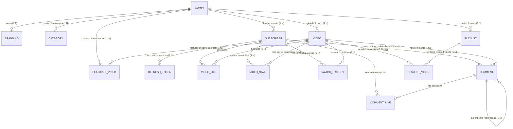

# Complete Database Architecture & Field-by-Field Schema Specification

This document provides a permanent visual, architectural, and **field-by-field schema specification** for all **14 Database Tables** in the **Content Talent Backend API**.

---

## 🗺️ Entity Relationship Diagram (ERD)



---

## 🔗 Subscriber-to-Admin Creator Linking Architecture

### How Mobile Subscribers Are Bound to a Specific Admin Creator:

In a Multi-Tenant SaaS platform hosting multiple creators:

1. **Mandatory Foreign Key (`creator_id` on `subscribers` Table)**:
   A strict, non-null foreign key `creator` is added to the `subscribers` table:
   ```python
   creator = ForeignKeyField(Admin, column_name="creator_id", on_delete="CASCADE", index=True)
   ```
   **Security Enforcement**: No default value is set (`default=None`). Every subscriber record MUST be explicitly linked to a valid Admin Creator upon registration to guarantee 100% tenant isolation!

2. **Mobile Registration & Auth Flow**:
   When a subscriber opens the mobile app and logs in (Google, Facebook, or Guest), the mobile app passes `creator_id`.
   If `creator_id` is missing or invalid, the auth endpoint raises `HTTP 400 Bad Request` (`"creator_id is required"`).

3. **JWT Bearer Token Embedding**:
   The backend encodes `"creator_id": 1` inside the cryptographically signed JWT token:
   ```json
   {
     "user_id": 42,
     "creator_id": 1,
     "role": "subscriber"
   }
   ```

4. **Automatic Request Isolation**:
   Every mobile endpoint extracts `current_subscriber["creator_id"]` from memory (< 1ms) and filters catalog queries (`Category.select().where(...)`, `Video.select().where(...)`, `Branding.get(...)`) to that creator's content exclusively!

---

## 🔬 Architectural Review: Pure Minimalist `comments` Schema

### How Creator Comments vs Subscriber Comments Are Identified:

1. **`user_id` Presence (`NULL` vs `Not NULL`)**:
   - **Subscriber Comment**: `user_id` is populated (`user = subscriber.id`). On read, author name and avatar are joined dynamically from `Subscriber` table (`is_creator = False`).
   - **Creator Admin Comment**: `user_id` is `NULL`. On read, author name (`first_name` + `last_name`) and avatar are joined dynamically from the video's creator in `Admin` table (`is_creator = True`).

2. **`is_hearted_by_creator` Flag**:
   - Creator hearts are stored as a simple `is_hearted_by_creator = BooleanField(default=False)` on the `Comment` model, allowing mobile apps to render a **"❤️ Hearted by Creator"** badge instantly.

---

## 📋 Exhaustive Field-by-Field Table Specifications

---

### 1. `admins` Table (Web Admin Creator Profile)
* **Model File**: [`app/models/admin.py`](file:///c:/TECHNICS_TRAINING/WhiteLabeledApp/content-talent-backend/app/models/admin.py)
* **Table Name**: `admins`

| Column Name | Data Type | Key / Constraint | Nullable | Default Value | Description |
| :--- | :--- | :--- | :---: | :--- | :--- |
| `id` | `INTEGER` | **PK (Auto Increment)** | NO | Auto | Primary key ID of the admin creator account |
| `email` | `VARCHAR(255)` | **UNIQUE, INDEX** | NO | None | Unique email address for authentication & identity |
| `first_name` | `VARCHAR(100)` | Standard | YES | `NULL` | Creator's first name |
| `last_name` | `VARCHAR(100)` | Standard | YES | `NULL` | Creator's last name |
| `phone` | `VARCHAR(50)` | Standard | YES | `NULL` | Contact phone number |
| `location` | `VARCHAR(255)` | Standard | YES | `NULL` | Creator location (City, Country) |
| `bio` | `TEXT` | Standard | YES | `NULL` | Biography and professional background description |
| `website` | `VARCHAR(255)` | Standard | YES | `NULL` | Personal or business website URL |
| `avatar_url` | `VARCHAR(500)` | Standard | YES | `NULL` | CDN URL to profile photo asset |
| `twitter_url` | `VARCHAR(255)` | Standard | YES | `NULL` | Twitter / X profile handle URL |
| `youtube_url` | `VARCHAR(255)` | Standard | YES | `NULL` | YouTube channel URL |
| `instagram_url` | `VARCHAR(255)` | Standard | YES | `NULL` | Instagram profile URL |
| `refresh_token` | `TEXT` | Standard | YES | `NULL` | Hashed session refresh token for admin portal |
| `created_at` | `DATETIME` | Standard | NO | `UTC timestamp` | Record creation timestamp |
| `updated_at` | `DATETIME` | Standard | NO | `UTC timestamp` | Record last modification timestamp |

---

### 2. `branding` Table (Studio White-Label Customization)
* **Model File**: [`app/models/branding.py`](file:///c:/TECHNICS_TRAINING/WhiteLabeledApp/content-talent-backend/app/models/branding.py)
* **Table Name**: `branding`

| Column Name | Data Type | Key / Constraint | Nullable | Default Value | Description |
| :--- | :--- | :--- | :---: | :--- | :--- |
| `id` | `INTEGER` | **PK (Auto Increment)** | NO | Auto | Primary key ID of the branding record |
| `user_id` | `INTEGER` | **FK ➔ `admins.id` (UNIQUE, CASCADE)** | NO | None | Admin creator who owns this studio branding |
| `creator_name` | `VARCHAR(255)` | Standard | YES | `NULL` | Public studio display name |
| `tagline` | `VARCHAR(255)` | Standard | YES | `NULL` | Studio app tagline |
| `description` | `TEXT` | Standard | YES | `NULL` | Studio channel description |
| `banner_url` | `VARCHAR(500)` | Standard | YES | `NULL` | CDN cover banner URL |
| `logo_url` | `VARCHAR(500)` | Standard | YES | `NULL` | CDN white-label app logo URL |
| `created_at` | `DATETIME` | Standard | NO | `UTC timestamp` | Record creation timestamp |
| `updated_at` | `DATETIME` | Standard | NO | `UTC timestamp` | Record last modification timestamp |

---

### 3. `subscribers` Table (Mobile App End-Users)
* **Model File**: [`app/models/subscriber.py`](file:///c:/TECHNICS_TRAINING/WhiteLabeledApp/content-talent-backend/app/models/subscriber.py)
* **Table Name**: `subscribers`

| Column Name | Data Type | Key / Constraint | Nullable | Default Value | Description |
| :--- | :--- | :--- | :---: | :--- | :--- |
| `id` | `INTEGER` | **PK (Auto Increment)** | NO | Auto | Primary key ID of the mobile subscriber |
| `creator_id` | `INTEGER` | **FK ➔ `admins.id` (CASCADE, INDEX)** | NO | **None (Mandatory)** | Admin Creator who hosts this subscriber |
| `email` | `VARCHAR(255)` | **INDEX** | YES | `NULL` | Subscriber email address (null for guests) |
| `name` | `VARCHAR(255)` | Standard | YES | `NULL` | Display name (Google/Facebook/Guest name) |
| `avatar_url` | `VARCHAR(500)` | Standard | YES | `NULL` | Social profile picture URL |
| `provider` | `VARCHAR(50)` | Standard | NO | `"google"` | Auth provider (`"google"`, `"facebook"`, `"guest"`) |
| `provider_id` | `VARCHAR(255)` | **INDEX** | NO | None | Provider ID (Google `sub`, FB `id`, or `device_id`) |
| `role` | `VARCHAR(50)` | Standard | NO | `"subscriber"` | Access role (`"subscriber"` or `"guest"`) |
| `is_active` | `BOOLEAN` | Standard | NO | `True` | Account active flag |
| `created_at` | `DATETIME` | Standard | NO | `UTC timestamp` | Account registration timestamp |
| `updated_at` | `DATETIME` | Standard | NO | `UTC timestamp` | Account last update timestamp |

---

### 4. `refresh_tokens` Table (Mobile Subscriber Sessions)
* **Model File**: [`app/models/refresh_token.py`](file:///c:/TECHNICS_TRAINING/WhiteLabeledApp/content-talent-backend/app/models/refresh_token.py)
* **Table Name**: `refresh_tokens`

| Column Name | Data Type | Key / Constraint | Nullable | Default Value | Description |
| :--- | :--- | :--- | :---: | :--- | :--- |
| `id` | `INTEGER` | **PK (Auto Increment)** | NO | Auto | Primary key ID |
| `user_id` | `INTEGER` | **FK ➔ `subscribers.id` (CASCADE)** | NO | None | Subscriber who owns this refresh token |
| `token_hash` | `VARCHAR(255)` | **UNIQUE, INDEX** | NO | None | SHA-256 hash of the JWT refresh token |
| `device_info` | `VARCHAR(255)` | Standard | YES | `NULL` | Device user-agent info |
| `expires_at` | `DATETIME` | **INDEX** | NO | None | Expiration timestamp (60 days) |
| `is_revoked` | `BOOLEAN` | Standard | NO | `False` | Revocation flag (set True on logout) |
| `created_at` | `DATETIME` | Standard | NO | `UTC timestamp` | Token issue timestamp |

---

### 5. `categories` Table (Video Taxonomy)
* **Model File**: [`app/models/category.py`](file:///c:/TECHNICS_TRAINING/WhiteLabeledApp/content-talent-backend/app/models/category.py)
* **Table Name**: `categories`

| Column Name | Data Type | Key / Constraint | Nullable | Default Value | Description |
| :--- | :--- | :--- | :---: | :--- | :--- |
| `id` | `INTEGER` | **PK (Auto Increment)** | NO | Auto | Primary key ID of the category |
| `user_id` | `INTEGER` | **FK ➔ `admins.id` (CASCADE)** | NO | None | Creator who created this category |
| `name` | `VARCHAR(100)` | Standard | NO | None | Category display name (e.g. "Tutorials") |
| `slug` | `VARCHAR(120)` | Standard | NO | None | URL-safe slugified category name |
| `description` | `TEXT` | Standard | YES | `NULL` | Optional category description |
| `icon` | `VARCHAR(50)` | Standard | NO | `"📁"` | Category emoji or icon identifier |
| `color` | `VARCHAR(30)` | Standard | NO | `"#3b82f6"` | UI hex color code |
| `display_order` | `INTEGER` | Standard | NO | `0` | Sequence order for horizontal chip bar |
| `created_at` | `DATETIME` | Standard | NO | `UTC timestamp` | Creation timestamp |
| `updated_at` | `DATETIME` | Standard | NO | `UTC timestamp` | Modification timestamp |

---

### 6. `videos` Table (Uploaded Video Assets)
* **Model File**: [`app/models/video.py`](file:///c:/TECHNICS_TRAINING/WhiteLabeledApp/content-talent-backend/app/models/video.py)
* **Table Name**: `videos`

| Column Name | Data Type | Key / Constraint | Nullable | Default Value | Description |
| :--- | :--- | :--- | :---: | :--- | :--- |
| `id` | `INTEGER` | **PK (Auto Increment)** | NO | Auto | Primary key ID of the video asset |
| `user_id` | `INTEGER` | **FK ➔ `admins.id` (CASCADE)** | NO | None | Creator who uploaded this video |
| `bunny_video_id` | `VARCHAR(255)` | **UNIQUE** | NO | None | Bunny Stream GUID container identifier |
| `title` | `VARCHAR(255)` | Standard | NO | None | Mandatory video title |
| `description` | `TEXT` | Standard | NO | None | Mandatory video description |
| `category` | `VARCHAR(100)` | Standard | NO | None | Mandatory category slug association |
| `status` | `VARCHAR(20)` | Standard | NO | `"PENDING"` | Processing status (`PENDING`, `ENCODING`, `READY`, `PLAYABLE`, `SCHEDULED`, `FAILED`) |
| `encode_progress`| `INTEGER` | Standard | NO | `0` | Transcoding progress percentage (0-100) |
| `is_playable` | `BOOLEAN` | Standard | NO | `False` | Playable state flag (True when 240p+ ready) |
| `main_thumbnail_url`| `VARCHAR(500)`| Standard | YES | `NULL` | Primary CDN thumbnail URL (Slot 0) |
| `captions_data` | `JSON` | Standard | NO | `[]` | List of WebVTT caption track objects |
| `available_resolutions`| `JSON` | Standard | NO | `[]` | List of encoded resolutions (e.g. `["720p", "1080p"]`) |
| `tags` | `JSON` | Standard | NO | `[]` | List of search keywords/tags |
| `alt_thumbnail_urls`| `JSON` | Standard | NO | `[]` | List of alternative thumbnail URLs (Slots 1 & 2) |
| `scheduled_at` | `DATETIME` | Standard | YES | `NULL` | IST scheduled publication date/time |
| `published_at` | `DATETIME` | Standard | YES | `NULL` | Actual publication date/time |
| `views` | `INTEGER` | Standard | NO | `0` | Total play view counter |
| `popularity_score`| `INTEGER` | **INDEX** | NO | `0` | Precomputed score formula: `views + (3 * likes)` |
| `duration` | `VARCHAR(50)` | Standard | YES | `NULL` | Video duration string (e.g. `"12:45"`) |
| `created_at` | `DATETIME` | Standard | NO | `UTC timestamp` | Upload creation timestamp |

---

### 7. `playlists` Table (Custom Video Collections)
* **Model File**: [`app/models/playlist.py`](file:///c:/TECHNICS_TRAINING/WhiteLabeledApp/content-talent-backend/app/models/playlist.py)
* **Table Name**: `playlists`

| Column Name | Data Type | Key / Constraint | Nullable | Default Value | Description |
| :--- | :--- | :--- | :---: | :--- | :--- |
| `id` | `INTEGER` | **PK (Auto Increment)** | NO | Auto | Primary key ID of the playlist |
| `user_id` | `INTEGER` | **FK ➔ `admins.id` (CASCADE)** | NO | None | Creator who owns this playlist |
| `name` | `VARCHAR(255)` | Standard | NO | None | Playlist title |
| `description` | `TEXT` | Standard | YES | `NULL` | Playlist description |
| `thumbnail_url` | `VARCHAR(500)` | Standard | YES | `NULL` | CDN URL to playlist cover image |
| `created_at` | `DATETIME` | Standard | NO | `UTC timestamp` | Creation timestamp |
| `updated_at` | `DATETIME` | Standard | NO | `UTC timestamp` | Modification timestamp |

---

### 8. `playlist_videos` Table (Playlist Order Junction)
* **Model File**: [`app/models/playlist.py`](file:///c:/TECHNICS_TRAINING/WhiteLabeledApp/content-talent-backend/app/models/playlist.py)
* **Table Name**: `playlist_videos`

| Column Name | Data Type | Key / Constraint | Nullable | Default Value | Description |
| :--- | :--- | :--- | :---: | :--- | :--- |
| `playlist_id` | `INTEGER` | **FK ➔ `playlists.id` (CASCADE)** | NO | None | Part 1 of Composite PK |
| `video_id` | `INTEGER` | **FK ➔ `videos.id` (CASCADE)** | NO | None | Part 2 of Composite PK |
| `order` | `INTEGER` | Standard | NO | `0` | 1-based display sequence order in playlist |
| `added_at` | `DATETIME` | Standard | NO | `UTC timestamp` | Timestamp when video was added to playlist |

---

### 9. `video_likes` Table (Subscriber Video Likes)
* **Model File**: [`app/models/video.py`](file:///c:/TECHNICS_TRAINING/WhiteLabeledApp/content-talent-backend/app/models/video.py)
* **Table Name**: `video_likes`

| Column Name | Data Type | Key / Constraint | Nullable | Default Value | Description |
| :--- | :--- | :--- | :---: | :--- | :--- |
| `id` | `INTEGER` | **PK (Auto Increment)** | NO | Auto | Primary key ID |
| `video_id` | `INTEGER` | **FK ➔ `videos.id` (CASCADE)** | NO | None | Video liked by subscriber |
| `subscriber_id` | `INTEGER` | **FK ➔ `subscribers.id` (CASCADE)** | NO | None | Subscriber who liked the video |
| `created_at` | `DATETIME` | Standard | NO | `UTC timestamp` | Like timestamp |

---

### 10. `video_saves` Table (Subscriber Watchlist Bookmarks)
* **Model File**: [`app/models/video.py`](file:///c:/TECHNICS_TRAINING/WhiteLabeledApp/content-talent-backend/app/models/video.py)
* **Table Name**: `video_saves`

| Column Name | Data Type | Key / Constraint | Nullable | Default Value | Description |
| :--- | :--- | :--- | :---: | :--- | :--- |
| `id` | `INTEGER` | **PK (Auto Increment)** | NO | Auto | Primary key ID |
| `video_id` | `INTEGER` | **FK ➔ `videos.id` (CASCADE)** | NO | None | Saved video asset |
| `subscriber_id` | `INTEGER` | **FK ➔ `subscribers.id` (CASCADE)** | NO | None | Subscriber who bookmarked the video |
| `created_at` | `DATETIME` | Standard | NO | `UTC timestamp` | Save timestamp |

---

### 11. `watch_histories` Table (Playback Progress & Continue Watching)
* **Model File**: [`app/models/video.py`](file:///c:/TECHNICS_TRAINING/WhiteLabeledApp/content-talent-backend/app/models/video.py)
* **Table Name**: `watch_histories`

| Column Name | Data Type | Key / Constraint | Nullable | Default Value | Description |
| :--- | :--- | :--- | :---: | :--- | :--- |
| `id` | `INTEGER` | **PK (Auto Increment)** | NO | Auto | Primary key ID |
| `video_id` | `INTEGER` | **FK ➔ `videos.id` (CASCADE)** | NO | None | Watched video asset |
| `subscriber_id` | `INTEGER` | **FK ➔ `subscribers.id` (CASCADE)** | NO | None | Subscriber watching the video |
| `last_position_seconds`| `INTEGER`| Standard | NO | `0` | Playhead resume position in seconds |
| `completed` | `BOOLEAN` | Standard | NO | `False` | True if progress >= 95% of duration |
| `last_watched_at` | `DATETIME` | Standard | NO | `UTC timestamp` | Heartbeat progress update timestamp |
| `created_at` | `DATETIME` | Standard | NO | `UTC timestamp` | First watch initialization timestamp |

---

### 12. `comments` Table (Video Comments & Thread Replies)
* **Model File**: [`app/models/comment.py`](file:///c:/TECHNICS_TRAINING/WhiteLabeledApp/content-talent-backend/app/models/comment.py)
* **Table Name**: `comments`

| Column Name | Data Type | Key / Constraint | Nullable | Default Value | Description |
| :--- | :--- | :--- | :---: | :--- | :--- |
| `id` | `INTEGER` | **PK (Auto Increment)** | NO | Auto | Primary key ID of comment |
| `video_id` | `INTEGER` | **FK ➔ `videos.id` (CASCADE)** | NO | None | Video commented on |
| `user_id` | `INTEGER` | **FK ➔ `subscribers.id` (CASCADE)** | YES | `NULL` | Subscriber author (NULL for Creator Admin comments) |
| `text` | `TEXT` | Standard | NO | None | Comment text content |
| `likes` | `INTEGER` | Standard | NO | `0` | Total heart/like counter |
| `is_hearted_by_creator`| `BOOLEAN`| Standard | NO | `False` | ❤️ Creator Heart badge flag |
| `parent_id` | `INTEGER` | **FK ➔ `comments.id` (CASCADE)** | YES | `NULL` | Parent comment ID for nested replies |
| `created_at` | `DATETIME` | Standard | NO | `UTC timestamp` | Comment post timestamp |

---

### 13. `comment_likes` Table (Subscriber Comment Hearts / Likes)
* **Model File**: [`app/models/comment.py`](file:///c:/TECHNICS_TRAINING/WhiteLabeledApp/content-talent-backend/app/models/comment.py)
* **Table Name**: `comment_likes`

| Column Name | Data Type | Key / Constraint | Nullable | Default Value | Description |
| :--- | :--- | :--- | :---: | :--- | :--- |
| `id` | `INTEGER` | **PK (Auto Increment)** | NO | Auto | Primary key ID |
| `user_id` | `INTEGER` | **FK ➔ `subscribers.id` (CASCADE)** | NO | None | Subscriber who liked the comment |
| `comment_id` | `INTEGER` | **FK ➔ `comments.id` (CASCADE)** | NO | None | Comment liked |
| `created_at` | `DATETIME` | Standard | NO | `UTC timestamp` | Like timestamp |

---

### 14. `featured_videos` Table (Admin Home Screen Carousel Curation)
* **Model File**: [`app/models/featured_video.py`](file:///c:/TECHNICS_TRAINING/WhiteLabeledApp/content-talent-backend/app/models/featured_video.py)
* **Table Name**: `featured_videos`

| Column Name | Data Type | Key / Constraint | Nullable | Default Value | Description |
| :--- | :--- | :--- | :---: | :--- | :--- |
| `id` | `INTEGER` | **PK (Auto Increment)** | NO | Auto | Primary key ID |
| `creator_id` | `INTEGER` | **FK ➔ `admins.id` (CASCADE)** | NO | None | Admin Creator who featured the video |
| `video_id` | `INTEGER` | **FK ➔ `videos.id` (CASCADE)** | NO | None | Featured video asset |
| `position` | `INTEGER` | Standard (Index) | NO | `0` | 1-indexed display order on home carousel |
| `created_at` | `DATETIME` | Standard | NO | `UTC timestamp` | Timestamp when video was featured |

* **Unique Composite Index**: `(("creator", "video"), True)` — Enforces 1 unique featured entry per video per creator studio.

---

### 15. `subscription_plans` Table (Creator Subscription Tiers & Pricing)
* **Model File**: [`app/models/subscription_plan.py`](file:///c:/TECHNICS_TRAINING/WhiteLabeledApp/content-talent-backend/app/models/subscription_plan.py)
* **Table Name**: `subscription_plans`

| Column Name | Data Type | Key / Constraint | Nullable | Default Value | Description |
| :--- | :--- | :--- | :---: | :--- | :--- |
| `id` | `INTEGER` | **PK (Auto Increment)** | NO | Auto | Primary key ID of plan tier |
| `user_id` | `INTEGER` | **FK ➔ `admins.id` (CASCADE)** | NO | None | Admin Creator Studio owning this plan |
| `name` | `VARCHAR(100)` | Standard | NO | None | Display title of plan (e.g. "Basic", "Premium") |
| `description` | `TEXT` | Standard | YES | `NULL` | Tagline / summary text |
| `base_price` | `FLOAT` | Standard | NO | `0.0` | Base non-discounted price in ₹ |
| `discount_percentage` | `FLOAT` | Standard | NO | `0.0` | Discount percentage (0 to 100) |
| `final_price` | `FLOAT` | Standard | NO | `0.0` | Computed charge price in ₹ after discount |
| `currency` | `VARCHAR(10)` | Standard | NO | `"INR"` | Currency ISO code (`"INR"`) |
| `billing_period_value` | `INTEGER` | Standard | NO | `1` | Interval quantity (e.g. `1`, `12`, `24`) |
| `billing_period_unit` | `VARCHAR(20)` | Standard | NO | `"months"` | Interval unit (`"days"`, `"months"`, `"years"`) |
| `features` | `JSON` | Standard | NO | `[]` | Feature string list for card checklist |
| `badge_text` | `VARCHAR(50)` | Standard | YES | `NULL` | Marketing tag (e.g. `"15% OFF"`, `"⚡"`) |
| `is_active` | `BOOLEAN` | Standard | NO | `True` | Visibility flag for mobile subscribers |
| `display_order` | `INTEGER` | Standard | NO | `1` | Sequence for drag-and-drop ordering |
| `active_subscribers` | `INTEGER` | Standard | NO | `0` | Counter cache of active subscribers enrolled |
| `created_at` | `DATETIME` | Standard | NO | `UTC timestamp` | Creation timestamp |
| `updated_at` | `DATETIME` | Standard | NO | `UTC timestamp` | Last updated timestamp |

