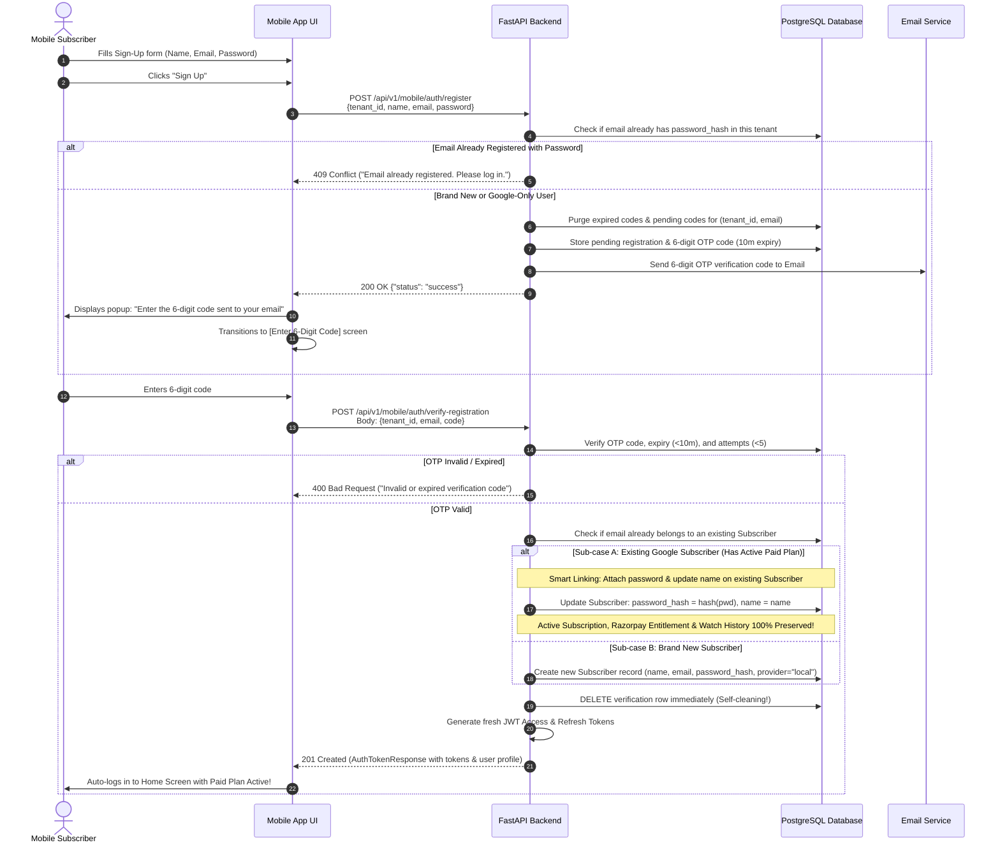
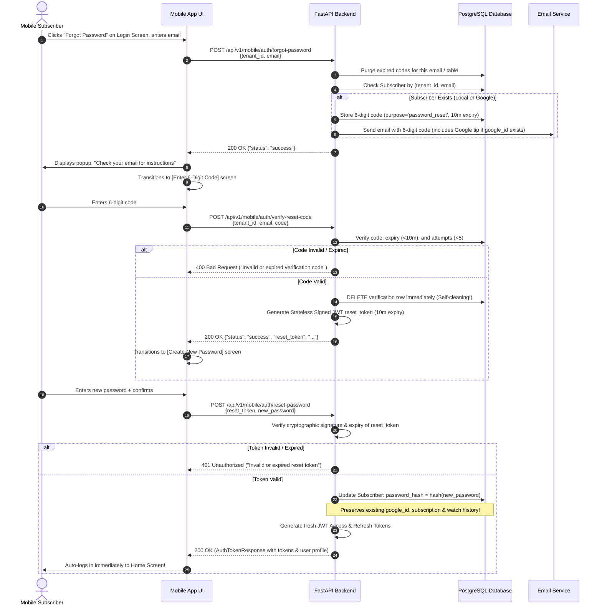
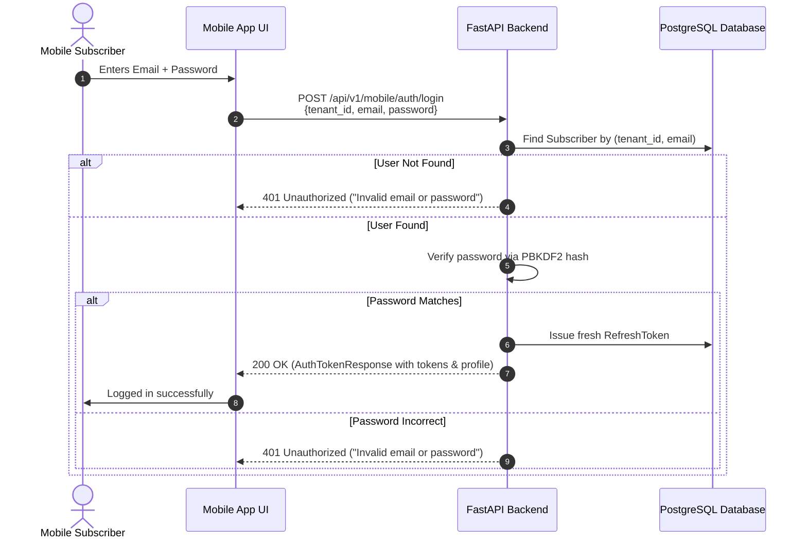

# Mobile Authentication API Specification (Email/Password, In-App OTP, Social OIDC & Anonymous Guest Sessions)

This specification defines the complete authentication and identity architecture for mobile applications (iOS & Android / Flutter & React Native), covering:

1. **Email & Password Authentication** with **In-App 6-Digit Code (OTP) Verification**.
2. **Smart Account Linking**: Safely linking passwords to accounts previously created via Google Sign-In, preserving paid subscriptions, watch history, and account identity.
3. **In-App Forgot Password Reset** with 6-digit OTP and instant auto-login.
4. **Google OpenID Connect (OIDC)** and **Facebook OAuth2** token exchanges.
5. **Anonymous Guest Sessions ("Skip Signup")** with zero-loss in-place upgrading.
6. **Multi-Tenant Creator Isolation**: All subscribers and credentials are strictly scoped to a specific Studio Creator (`tenant_id`).

---

## 1. 🏛️ Architecture Overview

```
┌──────────────────────────────────────────────────────────────────────────────────────────────────┐
│ Mobile Application (Flutter / React Native / Native iOS & Android)                               │
│                                                                                                  │
│ 1. Email/Password Sign-Up  ──► POST /api/v1/mobile/auth/register            ──► Sends 6-Digit OTP│
│ 2. In-App OTP Verification ──► POST /api/v1/mobile/auth/verify-registration ──► Issues JWT Token│
│ 3. Email/Password Login    ──► POST /api/v1/mobile/auth/login               ──► Issues JWT Token│
│ 4. Forgot Password         ──► POST /api/v1/mobile/auth/forgot-password     ──► Sends 6-Digit OTP│
│ 5. Verify Reset Code       ──► POST /api/v1/mobile/auth/verify-reset-code   ──► Reset JWT Token │
│ 6. Reset Password (In-App) ──► POST /api/v1/mobile/auth/reset-password      ──► Auto-Login Token│
│ 7. Skip Signup (Guest)     ──► POST /api/v1/mobile/auth/guest               ──► Guest JWT Token │
│ 8. Google OIDC Sign-In     ──► POST /api/v1/mobile/auth/google              ──► Google JWT Token│
│ 9. Facebook OAuth2 Sign-In ──► POST /api/v1/mobile/auth/facebook            ──► FB JWT Token    │
│ 10. Update Name (Profile)  ──► PATCH /api/v1/mobile/auth/profile             ──► Updated Profile │
│ 11. Upload Avatar Photo    ──► POST /api/v1/mobile/auth/profile/photo        ──► CDN Avatar URL  │
└──────────────────────────────────────────────────────────────────────────────────────────────────┘
                                                 │
                                                 ▼
┌──────────────────────────────────────────────────────────────────────────────────────────────────┐
│ FastAPI Backend Engine                                                                           │
│                                                                                                  │
│ 1. Multi-Tenant Guard: Enforces isolation by tenant_id on all operations                         │
│ 2. Cryptographic Security: PBKDF2-HMAC-SHA256 (600,000 rounds) password hashing                 │
│ 3. Self-Pruning Verification: 6-digit OTP codes deleted immediately on success; expired purged  │
│ 4. Smart Account Linking: Preserves Razorpay subscriptions when Google users add passwords       │
│ 5. Session Authority: Issues 30-min Access Tokens & 60-day Rotating Refresh Tokens               │
└──────────────────────────────────────────────────────────────────────────────────────────────────┘
```

---

## 2. 🔄 End-to-End Visual Sequence Diagrams

### 2.1 Registration Flow with In-App OTP & Smart Account Linking



---

### 2.2 Forgot Password Flow (In-App 6-Digit Code & Auto-Login)



---

### 2.3 Email & Password Login Flow



---

## 3. 🛡️ Security, Data Integrity & Cleanup Rules

### 3.1 Dual-Identity & Smart Account Linking

When an email address is authenticated via both Google Sign-In and Email/Password:

- **Single Subscriber Record**: Both authentication methods map to the **same primary key (`Subscriber.id`)**.
- **Entitlement Preservation**: The user's active Razorpay subscription (`subscriptions` table), saved videos (`video_saves`), likes (`video_likes`), and playback positions (`watch_history`) remain 100% intact.
- **Bi-Directional Access**: The user can subsequently log in using **either** "Sign in with Google" OR their Email + Password.

### 3.2 Display Name Policy

- **On Registration:** `name` is **mandatory** (min 2, max 100 chars).
  - If a brand-new user registers, their profile `name` is set to this value.
  - If an existing Google user registers with email/password, their profile `name` is updated to their explicitly entered name (respecting user intent).
- **On Forgot Password:** `name` is not requested. The existing `Subscriber.name` is preserved untouched.

### 3.3 Self-Pruning Verification Engine (`verification_codes` Table)

To maintain zero table bloat without requiring background cron daemons:

1. **Immediate Deletion on Success:** The instant a user enters the correct 6-digit OTP on `/verify-registration` or `/reset-password`, the row is deleted immediately from the database (`VerificationCode.delete()`).
2. **Opportunistic Expiry Sweep on New Request:** Whenever any user requests a new OTP on `/register` or `/forgot-password`, the backend automatically purges all expired codes (`expires_at < now_utc()`) and any previous pending code for that email.
3. **Anti-Brute Force (5-Attempt Lockout):** Each incorrect OTP attempt increments `attempts`. If `attempts >= 5`, the code is permanently invalidated.
4. **Code Expiry:** Codes strictly expire after **10 minutes** from creation.
5. **Resend Cooldown:** Users must wait **60 seconds** before requesting a new OTP code for the same email.

### 3.4 Automated 7-Day Stale Guest Session Purge

Anonymous guest accounts (`provider = 'guest'`) are ephemeral sessions created when a user taps "Skip Signup". To prevent database storage accumulation from one-off app downloads:

- **7-Day Retention Limit (`STALE_GUEST_CLEANUP_DAYS = 7`)**: Any guest account whose last activity (`updated_at`) is older than 7 days is considered abandoned.
- **Automated Daily Janitor Worker**: `scheduled_stale_guest_cleanup` in `app/main.py` runs once every 24 hours in the background to purge all abandoned guest sessions in a single non-blocking query.
- **No Shared Device Conflict**: Instead of deleting guest rows immediately upon login (which could disrupt shared family tablets or multi-user test devices), the 7-day inactivity window naturally sweeps abandoned sessions safely and non-intrusively.

### 3.5 Stateless Signed Reset Token (Zero DB Overhead)

When the user successfully verifies the password reset OTP on `/verify-reset-code`:

- The OTP row in `verification_codes` is deleted immediately.
- The backend issues a cryptographically signed JWT `reset_token` containing `{ email, tenant_id, purpose: "password_reset", exp }`.
- **Zero Database Overhead**: Requires zero database reads/writes or new tables. The token is tamper-proof, verified via `JWT_SECRET_KEY`, and expires naturally after 10 minutes.
- On `/reset-password`, the backend validates the token signature, updates the password, and logs the user in.

---

## 4. 🔌 API Endpoints Specification

---

### 1. `POST /api/v1/mobile/auth/register` — Initiate Registration & Send In-App OTP

Validates registration details, saves a pending verification record, and sends a 6-digit OTP code to the user's email.

#### Request Headers

```http
Content-Type: application/json
```

#### Request Body

```json
{
  "tenant_id": 1,
  "name": "Jane Doe",
  "email": "jane.doe@example.com",
  "password": "StrongPassword123!",
  "device_info": "iPhone 15 Pro (iOS 17.4)"
}
```

#### Response Specification (`200 OK`)

```json
{
  "status": "success"
}
```

#### Error Responses

- `400 Bad Request`: Validation failure (password too short, invalid email format, name < 2 chars).
- `409 Conflict`: `{"detail": "Email already registered. Please log in."}` (if an account with this email already has a password).
- `429 Too Many Requests`: `{"detail": "Please wait 60 seconds before requesting another code."}`.

---

### 2. `POST /api/v1/mobile/auth/verify-registration` — Verify In-App OTP & Complete Registration

Verifies the 6-digit OTP code, creates or smart-links the subscriber account, deletes the OTP record immediately, and returns application JWT tokens.

#### Request Headers

```http
Content-Type: application/json
```

#### Request Body

```json
{
  "tenant_id": 1,
  "email": "jane.doe@example.com",
  "code": "482091",
  "device_info": "iPhone 15 Pro (iOS 17.4)"
}
```

#### Response Specification (`201 Created`)

```json
{
  "access_token": "eyJhbGciOiJIUzI1NiIsInR5cCI6...",
  "refresh_token": "def45689a7b8c9d0...",
  "token_type": "bearer",
  "expires_in": 1800,
  "user": {
    "id": 99,
    "name": "Jane Doe",
    "email": "jane.doe@example.com",
    "avatar_url": null,
    "provider": "local",
    "role": "subscriber",
    "created_at": "2026-08-11T19:00:00Z"
  }
}
```

#### Error Responses

- `400 Bad Request`: `{"detail": "Invalid or expired verification code."}`.
- `429 Too Many Requests`: `{"detail": "Too many failed attempts. Please request a new code."}` (triggered after 5 wrong attempts).

---

### 3. `POST /api/v1/mobile/auth/login` — Email & Password Login

Authenticates registered subscribers using their email address and password.

#### Request Headers

```http
Content-Type: application/json
```

#### Request Body

```json
{
  "tenant_id": 1,
  "email": "jane.doe@example.com",
  "password": "StrongPassword123!",
  "device_info": "iPhone 15 Pro (iOS 17.4)"
}
```

#### Response Specification (`200 OK`)

```json
{
  "access_token": "eyJhbGciOiJIUzI1NiIsInR5cCI6...",
  "refresh_token": "def45689a7b8c9d0...",
  "token_type": "bearer",
  "expires_in": 1800,
  "user": {
    "id": 99,
    "name": "Jane Doe",
    "email": "jane.doe@example.com",
    "avatar_url": null,
    "provider": "local",
    "role": "subscriber",
    "created_at": "2026-08-11T19:00:00Z"
  }
}
```

#### Error Responses

- `401 Unauthorized`: `{"detail": "Invalid email or password."}`.
- `403 Forbidden`: `{"detail": "Account is inactive. Please contact support."}`.

---

### 4. `POST /api/v1/mobile/auth/forgot-password` — Request In-App Password Reset OTP

Initiates the password reset flow by sending a 6-digit OTP code to the subscriber's email.

> [!NOTE]
> Always returns `200 OK` with a generic message even if the email does not exist, preventing email enumeration / scraping attacks.

#### Request Headers

```http
Content-Type: application/json
```

#### Request Body

```json
{
  "tenant_id": 1,
  "email": "jane.doe@example.com"
}
```

#### Response Specification (`200 OK`)

```json
{
  "status": "success"
}
```

---

### 5. `POST /api/v1/mobile/auth/verify-reset-code` — Verify In-App Reset OTP

Validates the 6-digit OTP code, deletes the OTP row immediately, and returns a 10-minute stateless signed JWT `reset_token`.

#### Request Headers

```http
Content-Type: application/json
```

#### Request Body

```json
{
  "tenant_id": 1,
  "email": "jane.doe@example.com",
  "code": "482091"
}
```

#### Response Specification (`200 OK`)

```json
{
  "status": "success",
  "reset_token": "eyJhbGciOiJIUzI1NiIsInR5cCI6IkpXVCJ9..."
}
```

#### Error Responses

- `400 Bad Request`: `{"detail": "Invalid or expired verification code."}`.
- `429 Too Many Requests`: `{"detail": "Too many failed attempts. Please request a new code."}` (triggered after 5 wrong attempts).

---

### 6. `POST /api/v1/mobile/auth/reset-password` — Set New Password via Reset Token

Validates the cryptographically signed `reset_token`, sets the new password, and returns fresh JWT tokens for instant auto-login.

#### Request Headers

```http
Content-Type: application/json
```

#### Request Body

```json
{
  "reset_token": "eyJhbGciOiJIUzI1NiIsInR5cCI6IkpXVCJ9...",
  "new_password": "NewStrongPassword456!"
}
```

#### Response Specification (`200 OK`)

```json
{
  "access_token": "eyJhbGciOiJIUzI1NiIsInR5cCI6...",
  "refresh_token": "def45689a7b8c9d0...",
  "token_type": "bearer",
  "expires_in": 1800,
  "user": {
    "id": 99,
    "name": "Jane Doe",
    "email": "jane.doe@example.com",
    "avatar_url": null,
    "provider": "local",
    "role": "subscriber",
    "created_at": "2026-08-11T19:00:00Z"
  }
}
```

#### Error Responses

- `400 Bad Request`: Validation failure (password too short).
- `401 Unauthorized`: `{"detail": "Invalid or expired reset token. Please request a new code."}`.

---

### 7. `POST /api/v1/mobile/auth/guest` — Anonymous Guest Session ("Skip Signup")

Issues an application JWT session for anonymous guest users skipping login on app launch.

#### Request Headers

```http
Content-Type: application/json
```

#### Request Body

```json
{
  "tenant_id": 1,
  "device_id": "a1b2c3d4-e5f6-7890-abcd-1234567890ef",
  "device_info": "iPhone 15 Pro (iOS 17.4)"
}
```

#### Response Specification (`200 OK`)

```json
{
  "access_token": "eyJhbGciOiJIUzI1NiIsInR5cCI6...",
  "refresh_token": "guest_def45689a7b8c9d0...",
  "token_type": "bearer",
  "expires_in": 1800,
  "user": {
    "id": 99,
    "name": "Guest User",
    "email": null,
    "avatar_url": null,
    "provider": "guest",
    "role": "guest",
    "created_at": "2026-08-11T19:00:00Z"
  }
}
```

---

### 8. `POST /api/v1/mobile/auth/google` — Sign-In with Google (OIDC)

Exchanges a Google OIDC `id_token` for application session JWT tokens.

#### Request Headers

```http
Content-Type: application/json
```

#### Request Body

```json
{
  "tenant_id": 1,
  "id_token": "eyJhbGciOiJSUzI1NiIsImtpZCI6...",
  "device_info": "iPhone 15 Pro (iOS 17.4)"
}
```

#### Response Specification (`200 OK`)

```json
{
  "access_token": "eyJhbGciOiJIUzI1NiIsInR5cCI6...",
  "refresh_token": "def45689a7b8c9d0...",
  "token_type": "bearer",
  "expires_in": 1800,
  "user": {
    "id": 99,
    "name": "Jane Doe",
    "email": "jane.doe@gmail.com",
    "avatar_url": "https://lh3.googleusercontent.com/a/AEdFT...",
    "provider": "google",
    "role": "subscriber",
    "created_at": "2026-08-11T19:00:00Z"
  }
}
```

---

### 9. `POST /api/v1/mobile/auth/facebook` — Sign-In with Facebook (OAuth 2.0)

Exchanges a Facebook OAuth `access_token` for application session JWT tokens.

#### Request Headers

```http
Content-Type: application/json
```

#### Request Body

```json
{
  "tenant_id": 1,
  "access_token": "EAABwzLIX58YBA...",
  "device_info": "Samsung Galaxy S24 (Android 14)"
}
```

#### Response Specification (`200 OK`)

```json
{
  "access_token": "eyJhbGciOiJIUzI1NiIsInR5cCI6...",
  "refresh_token": "abc123456789...",
  "token_type": "bearer",
  "expires_in": 1800,
  "user": {
    "id": 100,
    "name": "John Smith",
    "email": "john.smith@facebook.com",
    "avatar_url": "https://platform-lookaside.fbsbx.com/platform/profilepic/...",
    "provider": "facebook",
    "role": "subscriber",
    "created_at": "2026-08-11T19:30:00Z"
  }
}
```

---

### 10. `POST /api/v1/mobile/auth/refresh` — Refresh Access Token

Rotates a 60-day Refresh Token to issue a fresh 30-minute Access Token.

#### Request Body

```json
{
  "refresh_token": "def45689a7b8c9d0..."
}
```

#### Response Specification (`200 OK`)

```json
{
  "access_token": "eyJhbGciOiJIUzI1NiIsInR5cCI6...",
  "refresh_token": "new_def45689a7b8c9d0...",
  "token_type": "bearer",
  "expires_in": 1800,
  "user": {
    "id": 99,
    "name": "Jane Doe",
    "email": "jane.doe@gmail.com",
    "avatar_url": "https://lh3.googleusercontent.com/a/AEdFT...",
    "provider": "google",
    "role": "subscriber",
    "created_at": "2026-08-11T19:00:00Z"
  }
}
```

---

### 11. `POST /api/v1/mobile/auth/logout` — Revoke Session

Revokes the refresh token and terminates the subscriber's session.

#### Request Headers

```http
Authorization: Bearer <access_token>
```

#### Request Body

```json
{
  "refresh_token": "def45689a7b8c9d0..."
}
```

#### Response Specification (`200 OK`)

```json
{
  "status": "success"
}
```

---

### 12. `GET /api/v1/mobile/auth/me` — Get Subscriber Profile

Returns current subscriber identity details.

#### Request Headers

```http
Authorization: Bearer <access_token>
```

#### Response Specification (`200 OK`)

```json
{
  "id": 99,
  "name": "Jane Doe",
  "email": "jane.doe@gmail.com",
  "avatar_url": "https://lh3.googleusercontent.com/a/AEdFT...",
  "provider": "google",
  "role": "subscriber",
  "created_at": "2026-08-11T19:00:00Z"
}
```

---

### 13. `PATCH /api/v1/mobile/auth/profile` — Update Subscriber Name

Updates the display name of the authenticated subscriber.

#### Request Headers

```http
Authorization: Bearer <access_token>
Content-Type: application/json
```

#### Security & Access Rules
- **Guard**: `CurrentSubscriber` (Zero IDOR: `user_id` extracted from JWT context).
- **Guest Restriction**: Anonymous guest users (`role == "guest"`) are rejected with `403 Forbidden` (`"Guest accounts cannot update profile details. Please register or sign in."`).

#### Request Body Specification

```json
{
  "name": "Jane Smith"
}
```

| Field  | Type     | Required | Validation Rules                  | Description                      |
| :----- | :------- | :------: | :-------------------------------- | :------------------------------- |
| `name` | `string` | **Yes**  | Min 2 chars, max 100 chars, trim | New display name for subscriber  |

#### Response Specification (`200 OK`)

Returns the updated subscriber profile:

```json
{
  "id": 99,
  "name": "Jane Smith",
  "email": "jane.doe@gmail.com",
  "avatar_url": "https://lh3.googleusercontent.com/a/AEdFT...",
  "provider": "local",
  "role": "subscriber",
  "created_at": "2026-08-11T19:00:00Z"
}
```

---

### 14. `POST /api/v1/mobile/auth/profile/photo` — Upload Profile Picture (Avatar)

Uploads a new avatar photo to Bunny Cloud Storage with CDN cache-busting, updates `subscribers.avatar_url`, and automatically removes the previous custom avatar from Bunny Storage.

#### Request Headers

```http
Authorization: Bearer <access_token>
Content-Type: multipart/form-data
```

#### Security & Access Rules
- **Guard**: `CurrentSubscriber` (`user_id` from JWT context).
- **Guest Restriction**: Anonymous guest users (`role == "guest"`) are rejected with `403 Forbidden`.
- **Validation**: Enforces allowed extensions (`jpg`, `jpeg`, `png`, `webp`) and maximum size (`MAX_AVATAR_SIZE_MB`, 2MB).
- **Cloud Path**: Stored in Bunny Cloud Storage under `assets/avatars/subscribers/subscriber_{user_id}_{timestamp}.{ext}`.

#### Request Body (`multipart/form-data`)

- `photo` (File, required): Binary image file (`JPG`, `PNG`, or `WEBP`, max 2MB).

#### Response Specification (`200 OK`)

```json
{
  "id": 99,
  "name": "Jane Smith",
  "email": "jane.doe@gmail.com",
  "avatar_url": "https://talentsea77999.b-cdn.net/assets/avatars/subscribers/subscriber_99_1785056000.jpg",
  "provider": "local",
  "role": "subscriber",
  "created_at": "2026-08-11T19:00:00Z"
}
```

---

## 15. 📧 Transactional Email Templates & Expected Delivery Output

The platform dispatches multipart (HTML + Plaintext) transactional emails via standard SMTP (`smtplib`). When SMTP credentials are not configured in `.env`, the system automatically logs codes to the server console in Developer Mode.

---

### 15.1 Registration Verification OTP Email

Dispatched when a subscriber signs up via `POST /api/v1/mobile/auth/register`.

* **Subject**: `<Studio Name> — Verification Code: 482910`
* **From**: `Content Talent <contenttalent@gmail.com>`
* **To**: `<subscriber_email>`

#### Visual / HTML Email Preview (Rendered in Gmail / Apple Mail / Outlook)

```
┌─────────────────────────────────────────────────────────────┐
│                                                             │
│                    Welcome to Content Talent!               │
│                                                             │
│       Use the verification code below to complete your      │
│                     account registration:                   │
│                                                             │
│       ┌─────────────────────────────────────────────┐       │
│       │                                             │       │
│       │                 4 8 2 9 1 0                 │       │
│       │                                             │       │
│       └─────────────────────────────────────────────┘       │
│                                                             │
│             ⏰ This code expires in 10 minutes.             │
│                                                             │
│  ─────────────────────────────────────────────────────────  │
│  If you did not initiate this request, you can safely        │
│  ignore this email.                                         │
│  © Content Talent. All rights reserved.                     │
└─────────────────────────────────────────────────────────────┘
```

> [!NOTE]
> **Smart Linking Banner**: If the email matches an existing Google subscriber (`is_linked_account=True`), the following notice automatically renders below the code box:
> `ℹ️ This verification will link password login to your existing account while preserving all your active subscriptions and watch history.`

#### Plaintext Fallback Output

```text
Welcome to Content Talent!

Your verification code is: 482910

Please enter this 6-digit code in the app to complete your account verification.
This code will expire in 10 minutes.

If you did not request this verification code, please ignore this email.
```

---

### 15.2 Password Reset OTP Email

Dispatched when a subscriber initiates password reset via `POST /api/v1/mobile/auth/forgot-password`.

* **Subject**: `<Studio Name> — Password Reset Code: 719304`
* **From**: `Content Talent <contenttalent@gmail.com>`
* **To**: `<subscriber_email>`

#### Visual / HTML Email Preview (Rendered in Gmail / Apple Mail / Outlook)

```
┌─────────────────────────────────────────────────────────────┐
│                                                             │
│                     Reset Your Password                     │
│                                                             │
│       We received a request to reset the password for       │
│       your Content Talent account. Use the code below:      │
│                                                             │
│       ┌─────────────────────────────────────────────┐       │
│       │                                             │       │
│       │                 7 1 9 3 0 4                 │       │
│       │                                             │       │
│       └─────────────────────────────────────────────┘       │
│                                                             │
│             ⏰ This code expires in 10 minutes.             │
│                                                             │
│  ─────────────────────────────────────────────────────────  │
│  If you did not request a password reset, no further action │
│  is required. Your account is safe.                         │
│  © Content Talent. All rights reserved.                     │
└─────────────────────────────────────────────────────────────┘
```

> [!NOTE]
> **Google Sign-In Awareness**: If the subscriber originally signed up with Google (`has_google_linked=True`), the following notice automatically renders below the code box:
> `ℹ️ You originally signed in using Google. Setting a password will allow you to sign in using either Google or your email and password.`

#### Plaintext Fallback Output

```text
Hello from Content Talent,

We received a request to reset your password.

Your password reset code is: 719304

Please enter this 6-digit code in the app to reset your password.
This code will expire in 10 minutes.

If you did not request a password reset, please ignore this email. Your account remains completely secure.
```


