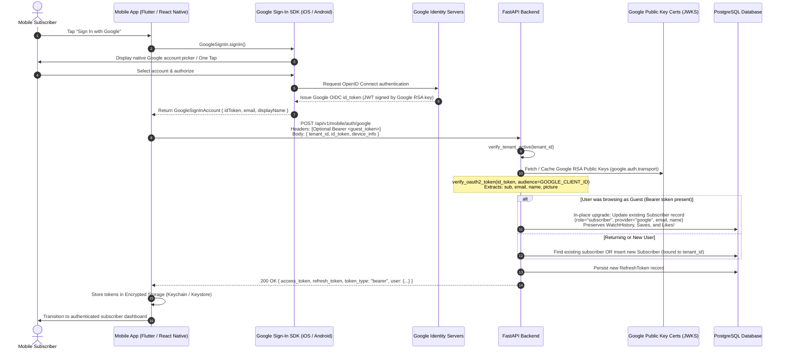

# Mobile Social & Guest Authentication API Specification (Google OIDC, Facebook OAuth2 & Anonymous Guest Sessions)

This specification defines the industry-standard **OAuth 2.0, OpenID Connect (OIDC), and Anonymous Guest Session** authentication endpoints for mobile applications (iOS & Android / Flutter & React Native).

---

## 1. 🏛️ Architecture Overview

The system uses a **Native SDK Token Exchange & Anonymous Device Session Architecture** with mandatory **Multi-Tenant Creator Isolation**:

1. **Registered Subscribers**: The mobile app performs native authentication via Google/Facebook SDKs, obtains cryptographically verifiable identity tokens, and exchanges them with the FastAPI backend for long-lived application sessions bound to a specific Admin Creator (`tenant_id`).
2. **Anonymous Guests ("Skip Signup")**: When a user taps "Skip Signup", the app generates a unique hardware `device_id` and calls `POST /api/v1/mobile/auth/guest` with `tenant_id` to receive an Anonymous Subscriber Token.

```
┌──────────────────────────────────────────────────────────────────────────────────────────┐
│ Mobile Application                                                                       │
│ 1. Taps "Skip Signup" OR Signs in via Native Google / Facebook SDK                       │
│ 2. Sends Auth Request to Backend with mandatory tenant_id                               │
│         │                                                                                │
│         │ 1. POST /api/v1/mobile/auth/guest    { tenant_id, device_id }   ──► Guest Token│
│         │ 2. POST /api/v1/mobile/auth/google   { tenant_id, id_token }    ──► Google Tok │
│         │ 3. POST /api/v1/mobile/auth/facebook { tenant_id, access_token} ──► FB Token   │
│         ▼                                                                                │
┌──────────────────────────────────────────────────────────────────────────────────────────┐
│ FastAPI Backend                                                                          │
│ 1. Cryptographically verifies OIDC id_token (Google) or queries Graph API (FB)          │
│ 2. Extracts verified user identity (sub, email, name, avatar_url)                        │
│ 3. Performs User Auto-Provisioning bound to tenant_id in Database                        │
│ 4. Issues Application JWT Access Token containing user_id & tenant_id                   │
└──────────────────────────────────────────────────────────────────────────────────────────┘
```

---

## 2. 🔄 Google OIDC Authentication Flow & Client Architecture

### 2.1 Visual Sequence Diagram



---

### 2.2 Google Client ID Architecture & Audience Matching Rules

In Google Cloud Console, credentials are created under the **same project**:

1. **Web Application Client ID**:
   - Used by the FastAPI backend (`GOOGLE_CLIENT_ID` in `.env`).
   - Example: `123456789-web.apps.googleusercontent.com`
2. **Android Client ID**:
   - Linked to the Android Package Name (e.g., `com.creator.ottapp`) and the keystore SHA-1 certificate fingerprint.
3. **iOS Client ID**:
   - Linked to the iOS Bundle Identifier (e.g., `com.creator.ottapp`).

> [!IMPORTANT]
> **The Golden Rule for Mobile Client Code**:
> The mobile app MUST configure its Google SDK with the **Web Client ID** as the `serverClientId` (Flutter) or `webClientId` (React Native).
>
> - If omitted, Google issues an `id_token` with `aud = Android/iOS Client ID`.
> - The backend will reject this with `HTTP 401 Unauthorized: Token audience does not match` because it expects `aud == GOOGLE_CLIENT_ID` (the Web Client ID).

| Component           | Client ID Used                                               | Configuration Location                 |
| :------------------ | :----------------------------------------------------------- | :------------------------------------- |
| **Android App**     | Android Client ID (SHA-1) + Web Client ID (`serverClientId`) | Google Cloud Console & Mobile SDK Code |
| **iOS App**         | iOS Client ID (Bundle ID) + Web Client ID (`serverClientId`) | `Info.plist` & Mobile SDK Code         |
| **FastAPI Backend** | Web Client ID                                                | `.env` (`GOOGLE_CLIENT_ID=...`)        |

---

### 2.3 Server Cryptographic Verification & In-Place Guest Upgrade Mechanics

1. **RSA Signature Verification**:
   The backend uses `google.oauth2.id_token.verify_oauth2_token` to validate the token against Google's public certificates (`https://www.googleapis.com/oauth2/v3/certs`).
   - Certificates are cached in memory via `google.auth.transport.requests.Request()`.
   - Verification and payload decoding run **locally with zero network overhead per user**.
2. **Verified Payload Claims Extracted**:
   - `sub`: Unique, permanent Google account ID (persisted as `provider_id`).
   - `email`: Verified Google email address.
   - `name`: User profile display name.
   - `picture`: Profile avatar image URL.
3. **In-Place Account Upgrade**:
   - If an active `guest_token` was provided in the `Authorization` header, the existing `Subscriber` record is updated directly:
     ```python
     subscriber.email = verified_email
     subscriber.name = verified_name
     subscriber.avatar_url = verified_picture
     subscriber.provider = "google"
     subscriber.provider_id = google_sub_id
     subscriber.role = "subscriber"
     subscriber.save()
     ```
   - **Zero Data Loss**: Watch history, playlist saves, and liked videos are seamlessly retained.

---

## 3. 🔌 API Endpoints Specification

### 1. `POST /api/v1/mobile/auth/guest` — Anonymous Guest Session ("Skip Signup")

Issues an application JWT session for anonymous guest users skipping social login on app launch.

#### Request Headers

```http
Content-Type: application/json
```

#### Request Body

```json
{
  "tenant_id": 1,
  "device_id": "a1b2c3d4-e5f6-7890-abcd-1234567890ef",
  "device_info": "iPhone 15 Pro (iOS 17.4)"
}
```

#### Response Specification (`200 OK`)

```json
{
  "access_token": "eyJhbGciOiJIUzI1NiIsInR5cCI6...",
  "refresh_token": "guest_def45689a7b8c9d0...",
  "token_type": "bearer",
  "expires_in": 1800,
  "user": {
    "id": 99,
    "name": "Guest User",
    "email": null,
    "avatar_url": null,
    "provider": "guest",
    "role": "guest",
    "created_at": "2026-08-11T19:00:00Z"
  }
}
```

---

### 2. `POST /api/v1/mobile/auth/google` — Sign-In with Google (OIDC) & Account Upgrade

Exchanges a Google OIDC `id_token` for application session JWT tokens.
_(If header `Authorization: Bearer <guest_access_token>` is included, the backend automatically upgrades the existing guest account into a permanent Google subscriber account, preserving watch history and saved videos!)_

#### Request Headers

```http
Authorization: Bearer <guest_access_token>  (Optional: Include if upgrading an active Guest session)
Content-Type: application/json
```

#### Request Body

```json
{
  "tenant_id": 1,
  "id_token": "eyJhbGciOiJSUzI1NiIsImtpZCI6...",
  "device_info": "iPhone 15 Pro (iOS 17.4)"
}
```

#### Response Specification (`200 OK`)

```json
{
  "access_token": "eyJhbGciOiJIUzI1NiIsInR5cCI6...",
  "refresh_token": "def45689a7b8c9d0...",
  "token_type": "bearer",
  "expires_in": 1800,
  "user": {
    "id": 99,
    "name": "Jane Doe",
    "email": "jane.doe@gmail.com",
    "avatar_url": "https://lh3.googleusercontent.com/a/AEdFT...",
    "provider": "google",
    "role": "subscriber",
    "created_at": "2026-08-11T19:00:00Z"
  }
}
```

---

### 3. `POST /api/v1/mobile/auth/facebook` — Sign-In with Facebook (OAuth 2.0) & Account Upgrade

Exchanges a Facebook OAuth `access_token` for application session JWT tokens.
_(If header `Authorization: Bearer <guest_access_token>` is included, the backend automatically upgrades the existing guest account into a permanent Facebook subscriber account!)_

#### Request Headers

```http
Authorization: Bearer <guest_access_token>  (Optional: Include if upgrading an active Guest session)
Content-Type: application/json
```

#### Request Body

```json
{
  "tenant_id": 1,
  "access_token": "EAABwzLIX58YBA...",
  "device_info": "Samsung Galaxy S24 (Android 14)"
}
```

#### Response Specification (`200 OK`)

```json
{
  "access_token": "eyJhbGciOiJIUzI1NiIsInR5cCI6...",
  "refresh_token": "abc123456789...",
  "token_type": "bearer",
  "expires_in": 1800,
  "user": {
    "id": 100,
    "name": "John Smith",
    "email": "john.smith@facebook.com",
    "avatar_url": "https://platform-lookaside.fbsbx.com/platform/profilepic/...",
    "provider": "facebook",
    "role": "subscriber",
    "created_at": "2026-08-11T19:30:00Z"
  }
}
```

---

### 4. `POST /api/v1/mobile/auth/refresh` — Refresh Access Token

Rotates a 60-day Refresh Token to issue a fresh 30-minute Access Token.

#### Request Body

```json
{
  "refresh_token": "def45689a7b8c9d0..."
}
```

#### Response Specification (`200 OK`)

```json
{
  "access_token": "eyJhbGciOiJIUzI1NiIsInR5cCI6...",
  "refresh_token": "new_def45689a7b8c9d0...",
  "token_type": "bearer",
  "expires_in": 1800,
  "user": {
    "id": 99,
    "name": "Jane Doe",
    "email": "jane.doe@gmail.com",
    "avatar_url": "https://lh3.googleusercontent.com/a/AEdFT...",
    "provider": "google",
    "role": "subscriber",
    "created_at": "2026-08-11T19:00:00Z"
  }
}
```

---

### 5. `POST /api/v1/mobile/auth/logout` — Revoke Session

Revokes the refresh token and terminates the subscriber's session.

#### Request Headers

```http
Authorization: Bearer <access_token>
```

#### Request Body

```json
{
  "refresh_token": "def45689a7b8c9d0..."
}
```

#### Response Specification (`200 OK`)

```json
{
  "status": "success"
}
```

---

### 6. `GET /api/v1/mobile/auth/me` — Get Subscriber Profile

Returns current subscriber identity details.

#### Request Headers

```http
Authorization: Bearer <access_token>
```

#### Response Specification (`200 OK`)

```json
{
  "id": 99,
  "name": "Jane Doe",
  "email": "jane.doe@gmail.com",
  "avatar_url": "https://lh3.googleusercontent.com/a/AEdFT...",
  "provider": "google",
  "role": "subscriber",
  "created_at": "2026-08-11T19:00:00Z"
}
```
